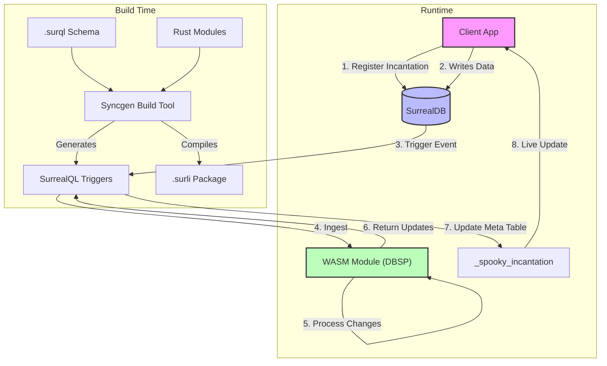

# Spooky 👻

```
     .-.
    |o o|   S P O O K Y
    | O |
    '~^~'
```

**Spooky** is a reactive, local-first application framework built on top of **SurrealDB**. It enables **Scalable Live Queries** (Incremental View Maintenance) by offloading complex state management and query processing to specialized WASM modules, orchestrating data flow via generated SurrealQL triggers.

It bridges the gap between the database and the client, allowing for "Incantations" (LIVE queries) that update incrementally and efficiently, even for complex joins and aggregations that SurrealDB's native Live Queries might struggle with at scale.

## System Architecture

The system relies on three core pillars: **Syncgen**, **Modules**, and **Incantations**.



---

### 1. Syncgen 🛠️

**Syncgen** is the build-time orchestrator. It is a generated CLI tool that parses your database schema and compiles your reactive modules.

#### Responsibilities

1.  **Type Generation**:
    - Parses `.surql` files and generates **TypeScript** and **Dart** interfaces.
    - Ensures strict type safety across the full stack.

2.  **Module Compilation**:
    - Automatically detects Rust projects in the `modules/` directory.
    - Compiles them to `wasm32-wasip1`.
    - Bundles them into optimized `.surli` files (ZSTD-compressed TAR archives) ready for SurrealDB ingestion.

3.  **SurrealQL Event Injection ("Spooky Action")**:
    - This is the most critical feature. Syncgen rewrites your schema to inject intelligent **Triggers** on every table (`CREATE`, `UPDATE`, `DELETE`).
    - **Intrinsic Hashing**: It injects logic to calculate a deterministic `BLAKE3` hash for every record based on its fields.
    - **DBSP Hook**: It injects calls to `mod::dbsp::ingest` to forward all data changes to the WASM module.

#### Generated Schema Example

When you define a `thread` table, Syncgen generates something like this behind the scenes:

```sql
DEFINE EVENT OVERWRITE _spooky_thread_mutation ON TABLE thread
WHEN $before != $after AND $event != "DELETE" THEN {
    -- 1. Construct Plain Object
    LET $plain_after = { id: <string>$after.id, title: $after.title, ... };

    -- 2. Call WASM Module
    LET $dbsp_ok = mod::dbsp::ingest('thread', $event, <string>$after.id, $plain_after);

    -- 3. Update Incantations based on WASM output
    FOR $u IN $dbsp_ok.updates {
        UPDATE _spooky_incantation SET Hash = $u.result_hash, Tree = $u.tree WHERE Id = $u.query_id;
    };
};
```

---

### 2. Modules (DBSP) 🧠

The **Module** is the reactive engine running directly inside SurrealDB. It uses **DBSP (Database Stream Processor)** concepts to perform Incremental View Maintenance (IVM).

#### Key Components

- **WASM Runtime**: The module runs as a lightweight, sandboxed WASM binary.
- **State Persistence**: It uses a special table `_spooky_module_state` to persist the entire state of the dataflow graph between transaction events. This allows it to be "stateful" across stateless WASM invocations.

#### How It Works

1.  **Input**: Receives `(Table, Operation, RecordID, Data)`.
2.  **Processing**:
    - The module maintains a directed acyclic graph (DAG) of operators (Filter, Map, Join, Aggregate).
    - When data enters, it flows through the graph. Only the affected parts of the defined Views are re-computed.
3.  **Output**:
    - It identifies which **Incantations** (Queries) are affected.
    - It returns the new **Hash** (version) and **Radix Tree** (content map) for those specific queries.

---

### 3. Incantations 🔮

**Incantations** are the registry of active "Live Queries". Instead of subscribing to a raw table, clients subscribe to an _Incantation_.

#### The `_spooky_incantation` Table

This system table acts as the synchronization primitive between Server and Client.

| Field      | Description                                                                                                                                        |
| :--------- | :------------------------------------------------------------------------------------------------------------------------------------------------- |
| **`Id`**   | `Hash(Query + Params)`. Deterministic ID for the query.                                                                                            |
| **`Hash`** | `XOR Sum` of all record Hashes in the result set. If this changes, the view is dirty.                                                              |
| **`Tree`** | A **Radix Tree** (or Merkle Tree) containing the IDs of all matching records. Allows clients to verify data integrity and fetch deltas efficiency. |
| **`TTL`**  | Time-To-Live. Unused incantations are automatically garbage collected by the module to save memory.                                                |

#### The Lifecycle

1.  **Registration**:
    - Client calculates `QueryHash` locally.
    - Client performs `UPSERT` on `_spooky_incantation`.
    - Client subscribes via `db.live('_spooky_incantation')`.

2.  **Reactivity**:
    - When the WASM module detects a change in the query result (e.g., a new post matches `WHERE active = true`), it updates the `Hash` in this table.
    - The Client receives the update notification instantly.

3.  **Synchronization**:
    - The Client checks `NewHash != OldHash`.
    - If changed, the Client can either re-fetch the query or use the `Tree` to fetch only missing items (Delta Sync).

4.  **Garbage Collection**:
    - Clients must send a "Heartbeat" (update `LastActiveAt`) periodically (e.g., at 90% of TTL).
    - If an Incantation expires, a `DELETE` event triggers `mod::dbsp::unregister_query`, freeing WASM resources.

---

## Technical Deep Dive

### Hashing Strategy & Determinism

Spooky relies heavily on **XOR Homomorphic Hashing**.

- **Property**: `Hash(Set A) XOR Hash(Set B) = Hash(Set A ∪ Set B)` (if disjoint) or `Hash(A) XOR Hash(A) = 0`.
- **Usage**: This allows us to calculate the hash of a View incrementally.
  - Running Hash `H = H_prev XOR Hash(OldRecord) XOR Hash(NewRecord)`.
  - This is $O(1)$ regardless of the dataset size.

### The Radix Tree

The `Tree` field returned by the module is a compressed representation of the result set.

- **Structure**: It groups Record IDs by common prefixes.
- **Benefit**: Large result sets (e.g., 10k items) can be represented by a relatively small tree structure.
- **Sync**: Clients can compare their local tree with the remote tree to identify exactly which IDs are missing or removed without fetching the entire list.

---

## Directory Structure

```
spooky/
├── apps/
│   └── syncgen/          # The Build Tool & Code Generator
├── modules/              # Rust WASM Modules
│   └── dbsp/             # Core DBSP Logic
├── packages/
│   └── core/             # Client SDK (TypeScript)
└── tests/                # System Tests
```
