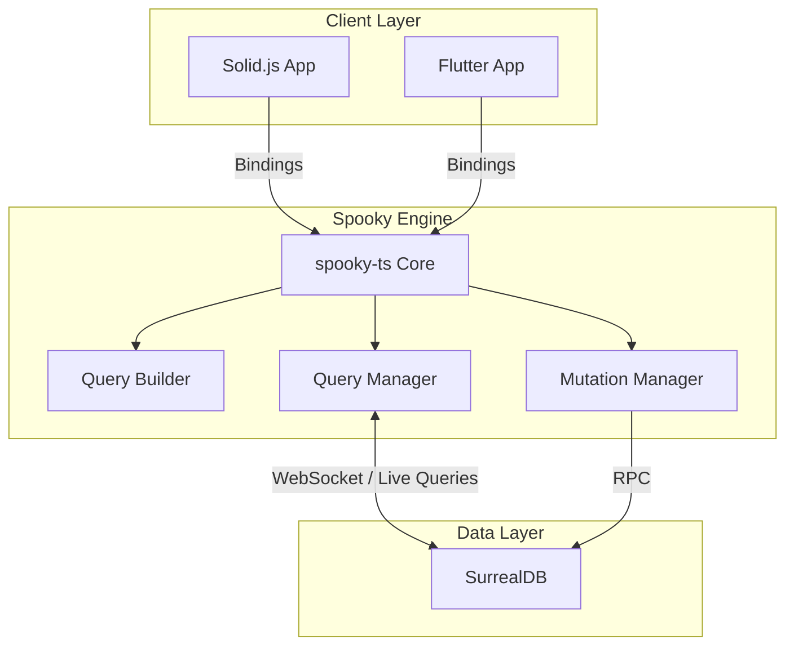
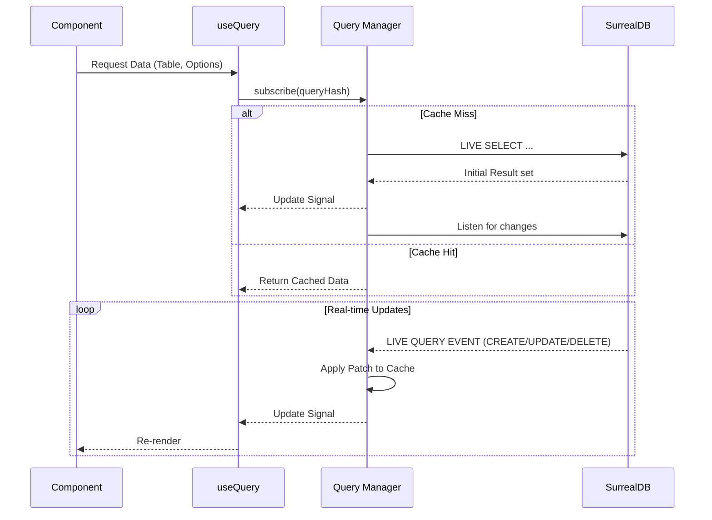
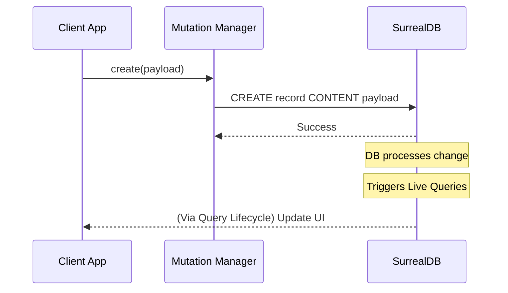

# Spooky Sync Engine

Spooky is a modern, offline-first synchronization engine designed for real-time collaboration. It targets **Solid.js** for web and **Flutter** for mobile, utilizing **SurrealDB** as the unified backend and source of truth.

## 🏗 Architecture Overview

Spooky sits between your client application and SurrealDB, abstracting away the complexities of real-time data synchronization, query management, and type safety.



## 🧩 Core Components

### 1. `spooky-ts` (The Core)
The heart of the engine. It manages the connection to SurrealDB, handles authentication, and coordinates queries and mutations.
- **`SpookyInstance`**: The main entry point.
- **`QueryManager`**: Handles subscriptions to live queries, deduplicates identical queries, and manages the cache.
- **`MutationManager`**: Handles data modifications (Create, Update, Delete) and ensures they are propagated to the server.

### 2. `query-builder`
A powerful, type-safe query builder that allows you to construct complex SurrealDB queries using a fluent API. It leverages TypeScript generics to ensure that your queries are valid against your schema.

### 3. `client-solid`
Provides Solid.js specific bindings (like `useQuery`) to easily integrate Spooky into your Solid.js applications. It uses Solid's fine-grained reactivity to update the UI efficiently when data changes.

## 🔄 Data Flow

### Query Lifecycle
When a component requests data, Spooky checks if a live query is already active. If not, it establishes a new one.



### Mutation Flow
Mutations are straightforward but trigger the reactive loop via the database.



## 🚀 Getting Started

### Prerequisites
- Node.js & pnpm
- SurrealDB running locally

### Installation
```bash
pnpm install
```

### Running the Landing Page
```bash
pnpm --filter "landing-page" dev
```
Visit `http://localhost:4321`

## 📂 Repository Layout

- **`packages/spooky-ts`**: Core logic.
- **`packages/query-builder`**: Type-safe query construction.
- **`packages/client-solid`**: Solid.js integration.
- **`apps/landing-page`**: Documentation and marketing site.

---
*Status: Active Development. APIs are subject to change.*
