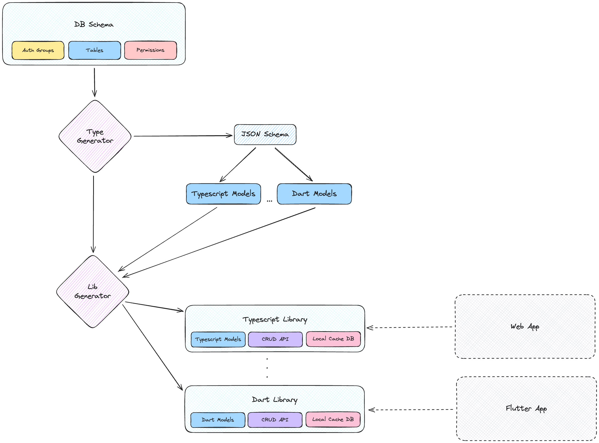

## Spooky Sync Engine (WIP)

Spooky is a work-in-progress sync engine focused on real-time collaboration and offline-first apps. The initial targets are a Solid.js web client and a Flutter mobile client, with a shared data layer powered by SurrealDB.

### Status

- Active development; APIs and schema are evolving
- Landing page prototype lives in `apps/landing-page`

### Goals

- Unified schema in SurrealDB as the source of truth
- Automatic, type-safe client libraries for TypeScript (web/Solid.js) and Dart (Flutter)
- Offline-first with conflict resolution and background sync
- Authentication-agnostic permission model

### Tech Stack

- SurrealDB (data model, permissions, sync substrate)
- Rust (SyncGen core and tooling)
- Solid.js (web client target)
- Flutter (mobile client target)
- Type generation → TypeScript + Dart
- Astro + Tailwind (marketing site in `apps/landing-page`)

---

### Client Library Generation

The engine derives types and client libraries from a single schema. The high-level flow:

1. Define schema, auth scopes, and permissions in SurrealDB
2. Generate an intermediate JSON schema
3. Produce language-specific models and helper APIs
4. Package per-platform libraries (TypeScript, Dart)



---

### Getting Started (Landing Page)

1. Install pnpm and dependencies:
   - `pnpm install`
2. Run the landing page:
   - `pnpm --filter "landing-page" dev`
   - App runs at `http://localhost:4321`

### Repository Layout

```
apps/
  landing-page/           # Astro + Tailwind landing site
packages/                 # Future shared packages (generators, clients)
example/schema/           # Example SurrealDB schema (experimental)
image.png                 # Client library generation diagram
```

### Notes

- Schema and generation tooling are under active design; expect breaking changes.
- Solid.js and Flutter clients will be developed in parallel once the core generation path stabilizes.
