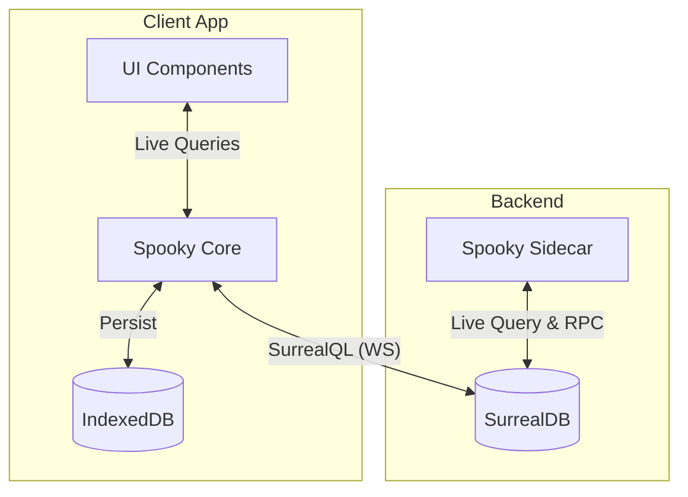

import CodeBlock from '../../components/ui/CodeBlock.astro';

Spooky operates on a "Sidecar" architecture to enable its powerful synchronization capabilities.

## High Level Overview

The system is composed of three main parts around a central database:

1.  **The Database**: Standard SurrealDB. The central hub.
2.  **The Client**: Connects directly to SurrealDB using the standard SurrealQL protocol.
3.  **The Sidecar**: A background service that monitors the database and performs heavy computational tasks (hashing, integrity).

## Why a Sidecar?

Even though the client connects directly to SurrealDB, the Sidecar is essential for the **Spooky Protocol**:

### 1. Integrity & Hashing

The Sidecar listens to changes in the database and computes the Merkle Tree hashes required for the sync engine to work. It writes these hashes back to the `_spooky_*` system tables.

### 2. Async Processing

It handles tasks that are too heavy for the database functions or the client, ensuring that your application remains snappy while data consistency is guaranteed in the background.
