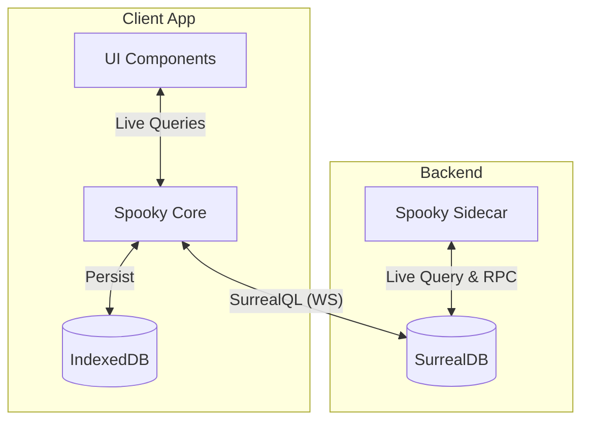
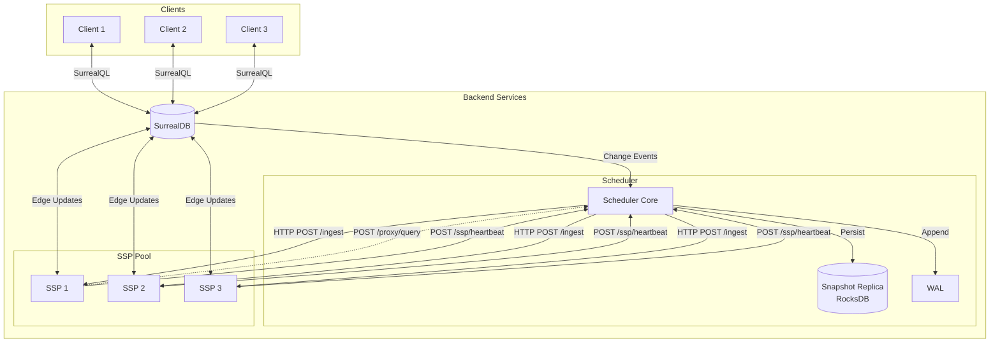
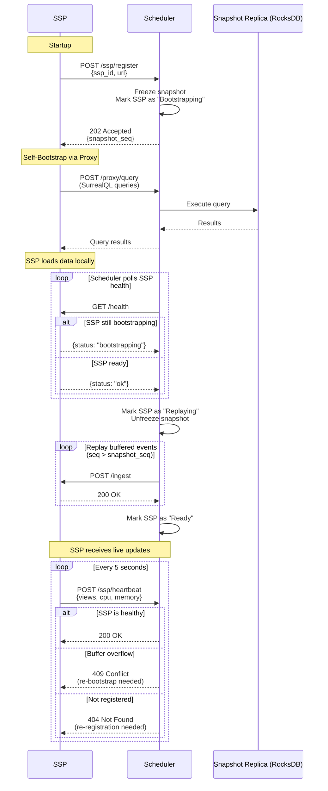
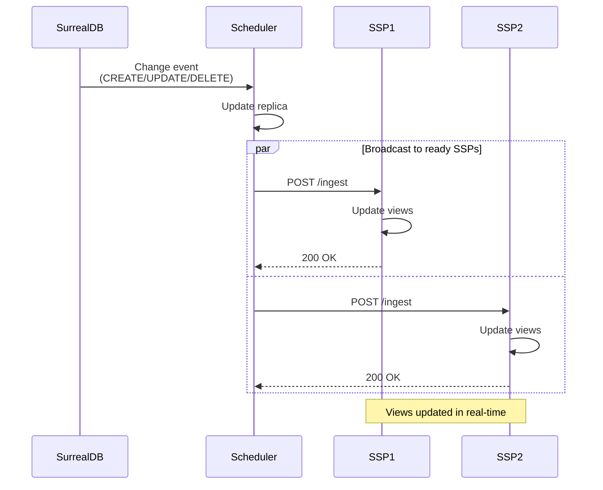
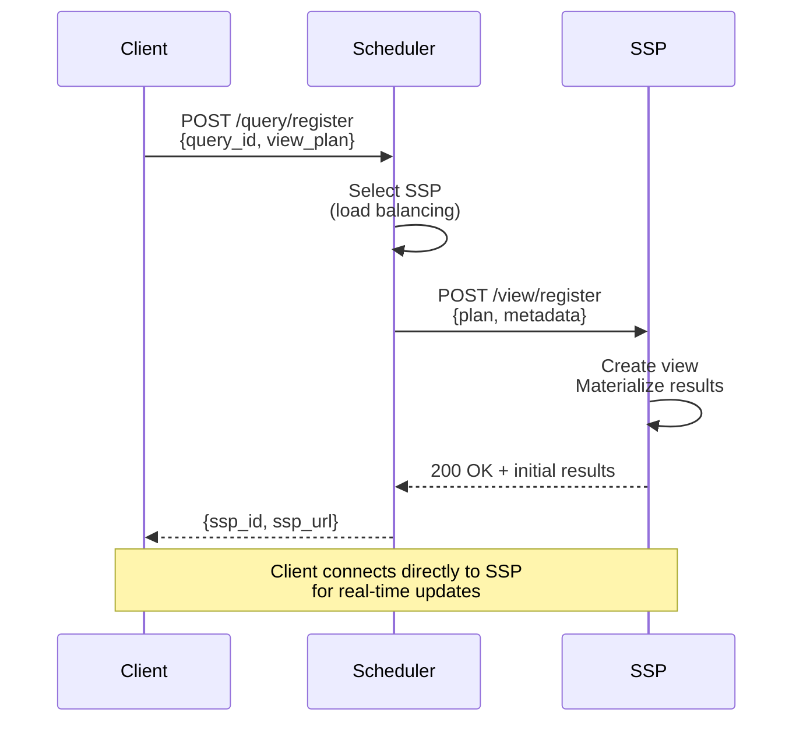

import CodeBlock from '../../components/ui/CodeBlock.astro';

Spooky operates on a "Sidecar" architecture to enable its powerful synchronization capabilities.

## High Level Overview

The system is composed of three main parts around a central database:

1.  **The Database**: Standard SurrealDB. The central hub.
2.  **The Client**: Connects directly to SurrealDB using the standard SurrealQL protocol.
3.  **The Sidecar**: A background service that monitors the database and performs heavy computational tasks (hashing, integrity).


```mermaid
graph TD
    subgraph client_app [Client App]
        UI[UI Components]
        LocalDB[(IndexedDB)]
        WASM[Spooky Core]

        UI <-->|Live Queries| WASM
        WASM <-->|Persist| LocalDB
    end

    subgraph backend_sys [Backend]
        Sidecar[Spooky Sidecar]
        DB[(SurrealDB)]
    end

    WASM <-->|"SurrealQL (WS)"| DB
    Sidecar <-->|"Live Query & RPC"| DB
```

## Why a Sidecar?

Even though the client connects directly to SurrealDB, the Sidecar is essential for the **Spooky Protocol**:

### 1. Integrity & Hashing

The Sidecar listens to changes in the database and computes the Merkle Tree hashes required for the sync engine to work. It writes these hashes back to the `_spooky_*` system tables.

### 2. Async Processing

It handles tasks that are too heavy for the database functions or the client, ensuring that your application remains snappy while data consistency is guaranteed in the background.

---

## Distributed Architecture

For production deployments, Spooky supports a distributed architecture with multiple SSP instances coordinated by a central Scheduler:


```mermaid
graph TD
    subgraph clients [Clients]
        C1[Client 1]
        C2[Client 2]
        C3[Client 3]
    end

    subgraph backend [Backend Services]
        DB[(SurrealDB)]

        subgraph sched [Scheduler]
            Scheduler[Scheduler Core]
            Replica[(Snapshot Replica<br/>RocksDB)]
            WAL[WAL]
        end

        subgraph ssps [SSP Pool]
            SSP1[SSP 1]
            SSP2[SSP 2]
            SSP3[SSP 3]
        end
    end

    C1 <-->|SurrealQL| DB
    C2 <-->|SurrealQL| DB
    C3 <-->|SurrealQL| DB

    DB -->|Change Events| Scheduler
    Scheduler -->|Persist| Replica
    Scheduler -->|Append| WAL
    Scheduler -->|HTTP POST /ingest| SSP1
    Scheduler -->|HTTP POST /ingest| SSP2
    Scheduler -->|HTTP POST /ingest| SSP3

    SSP1 -.->|POST /proxy/query| Scheduler
    SSP1 -->|POST /ssp/heartbeat| Scheduler
    SSP2 -->|POST /ssp/heartbeat| Scheduler
    SSP3 -->|POST /ssp/heartbeat| Scheduler

    SSP1 <-->|Edge Updates| DB
    SSP2 <-->|Edge Updates| DB
    SSP3 <-->|Edge Updates| DB
```

### Components

**Scheduler** (Port 9667 by default)
- Central coordinator for all SSP instances
- Maintains a persistent **Snapshot Replica** (RocksDB-backed embedded SurrealDB) of database state
- Writes all events to a **Write-Ahead Log (WAL)** for crash recovery
- Distributes data updates to all SSPs via HTTP
- Exposes **proxy endpoints** (`/proxy/query`, `/proxy/signin`, `/proxy/use`) so SSPs can self-bootstrap by querying the snapshot directly
- Manages SSP lifecycle: `Bootstrapping` → `Replaying` → `Ready`
- Assigns queries to SSPs using load balancing strategies
- See [Scheduler API Reference](/docs/scheduler-api)

**SSP (Spooky Sidecar Processor)** (Port 8667 by default)
- Stateful service maintaining materialized views
- Executes backend functions and jobs
- Registers with scheduler on startup
- Self-bootstraps by querying the scheduler's proxy endpoints (no chunk push needed)
- Sends periodic heartbeats with `views` count for health monitoring
- See [SSP API Reference](/docs/ssp-api)

---

## SSP Lifecycle

When an SSP starts up with scheduler integration enabled:


```mermaid
sequenceDiagram
    participant SSP
    participant Scheduler
    participant Replica as Snapshot Replica (RocksDB)

    Note over SSP: Startup

    SSP->>Scheduler: POST /ssp/register<br/>{ssp_id, url}
    Scheduler->>Scheduler: Freeze snapshot<br/>Mark SSP as "Bootstrapping"
    Scheduler-->>SSP: 202 Accepted<br/>{snapshot_seq}

    Note over SSP: Self-Bootstrap via Proxy

    SSP->>Scheduler: POST /proxy/query<br/>(SurrealQL queries)
    Scheduler->>Replica: Execute query
    Replica-->>Scheduler: Results
    Scheduler-->>SSP: Query results

    Note over SSP: SSP loads data locally

    loop Scheduler polls SSP health
        Scheduler->>SSP: GET /health
        alt SSP still bootstrapping
            SSP-->>Scheduler: {status: "bootstrapping"}
        else SSP ready
            SSP-->>Scheduler: {status: "ok"}
        end
    end

    Scheduler->>Scheduler: Mark SSP as "Replaying"<br/>Unfreeze snapshot

    loop Replay buffered events (seq > snapshot_seq)
        Scheduler->>SSP: POST /ingest
        SSP-->>Scheduler: 200 OK
    end

    Scheduler->>Scheduler: Mark SSP as "Ready"

    Note over SSP,Scheduler: SSP receives live updates

    loop Every 5 seconds
        SSP->>Scheduler: POST /ssp/heartbeat<br/>{views, cpu, memory}
        alt SSP is healthy
            Scheduler-->>SSP: 200 OK
        else Buffer overflow
            Scheduler-->>SSP: 409 Conflict<br/>(re-bootstrap needed)
        else Not registered
            Scheduler-->>SSP: 404 Not Found<br/>(re-registration needed)
        end
    end
```

### Bootstrap Process

1. **Registration**: SSP sends its ID and URL to the scheduler
2. **Freeze**: Scheduler freezes the snapshot replica and marks SSP as `Bootstrapping`
3. **Proxy Query**: SSP self-bootstraps by querying the scheduler's `POST /proxy/query` endpoint (executes SurrealQL against the frozen snapshot)
4. **Health Poll**: Scheduler polls the SSP's `GET /health` endpoint every `ssp_poll_interval_ms` (default 3s) until the SSP reports ready
5. **Unfreeze & Replay**: Scheduler unfreezes the snapshot, marks SSP as `Replaying`, and replays all buffered events with `seq > snapshot_seq`
6. **Ready**: Once replay completes, scheduler marks SSP as `Ready`
7. **Live Updates**: SSP now receives real-time updates via `/ingest` endpoint

### Health Monitoring

- SSPs send heartbeats every 5 seconds (configurable) with `views` count, CPU, and memory usage
- Scheduler marks SSPs as stale after 15 seconds without heartbeat (configurable)
- Stale SSPs are removed from the pool
- Maximum buffer size per SSP: 10,000 messages (configurable via `max_buffer_per_ssp`)
- Queries are reassigned to healthy SSPs

---

## Load Balancing

The scheduler supports multiple load balancing strategies for query assignment:

### Round Robin
Distributes queries evenly across all SSPs in rotation.

### Least Queries
Assigns queries to the SSP with the fewest active queries.

### Least Load
Assigns queries to the SSP with the lowest combined CPU and memory usage.

Configure via `load_balance` in `spooky.yml` or `SPOOKY_SCHEDULER_LOAD_BALANCE` environment variable.

---

## Communication Patterns

### Data Ingestion Flow


```mermaid
sequenceDiagram
    participant DB as SurrealDB
    participant Scheduler
    participant SSP1
    participant SSP2

    DB->>Scheduler: Change event<br/>(CREATE/UPDATE/DELETE)
    Scheduler->>Scheduler: Update replica

    par Broadcast to ready SSPs
        Scheduler->>SSP1: POST /ingest
        SSP1->>SSP1: Update views
        SSP1-->>Scheduler: 200 OK
    and
        Scheduler->>SSP2: POST /ingest
        SSP2->>SSP2: Update views
        SSP2-->>Scheduler: 200 OK
    end

    Note over SSP1,SSP2: Views updated in real-time
```

### Query Registration Flow


```mermaid
sequenceDiagram
    participant Client
    participant Scheduler
    participant SSP

    Client->>Scheduler: POST /query/register<br/>{query_id, view_plan}
    Scheduler->>Scheduler: Select SSP<br/>(load balancing)
    Scheduler->>SSP: POST /view/register<br/>{plan, metadata}
    SSP->>SSP: Create view<br/>Materialize results
    SSP-->>Scheduler: 200 OK + initial results
    Scheduler-->>Client: {ssp_id, ssp_url}

    Note over Client,SSP: Client connects directly to SSP<br/>for real-time updates
```

---

## Horizontal Scaling

The distributed architecture supports horizontal scaling:

### Adding SSPs

1. Start a new SSP instance with `SCHEDULER_URL` configured
2. SSP automatically registers with scheduler
3. Scheduler bootstraps the SSP with current replica state
4. New queries are distributed across all healthy SSPs

### Removing SSPs

1. Stop the SSP instance (graceful shutdown)
2. Scheduler detects missing heartbeats
3. SSP marked as stale and removed from pool
4. Active queries reassigned to remaining SSPs

### Failure Recovery

- SSP failures are detected via heartbeat timeout
- Queries automatically reassigned to healthy SSPs
- Job execution failures trigger retries on different SSPs
- Client reconnection handles SSP unavailability

---

## Deployment Modes

### Single SSP (Development)

```yaml
# No scheduler needed
SURREALDB_ADDR=localhost:8000
LISTEN_ADDR=0.0.0.0:8667
```

Simple setup for development and testing. Client connects directly to SSP.

### Multiple SSPs (Production)

```yaml
# Scheduler
SPOOKY_SCHEDULER_INGEST_PORT=9667
SPOOKY_SCHEDULER_DB_URL=surrealdb:8000/rpc
SPOOKY_SCHEDULER_REPLICA_DB_PATH=./data/replica
SPOOKY_SCHEDULER_WAL_PATH=./data/event_wal.log

# SSP instances
SCHEDULER_URL=http://scheduler:9667
SSP_ID=ssp-01  # Unique per instance
```

Production setup with high availability and load distribution.

For detailed deployment instructions, see the [Deployment Guide](/docs/deployment).
