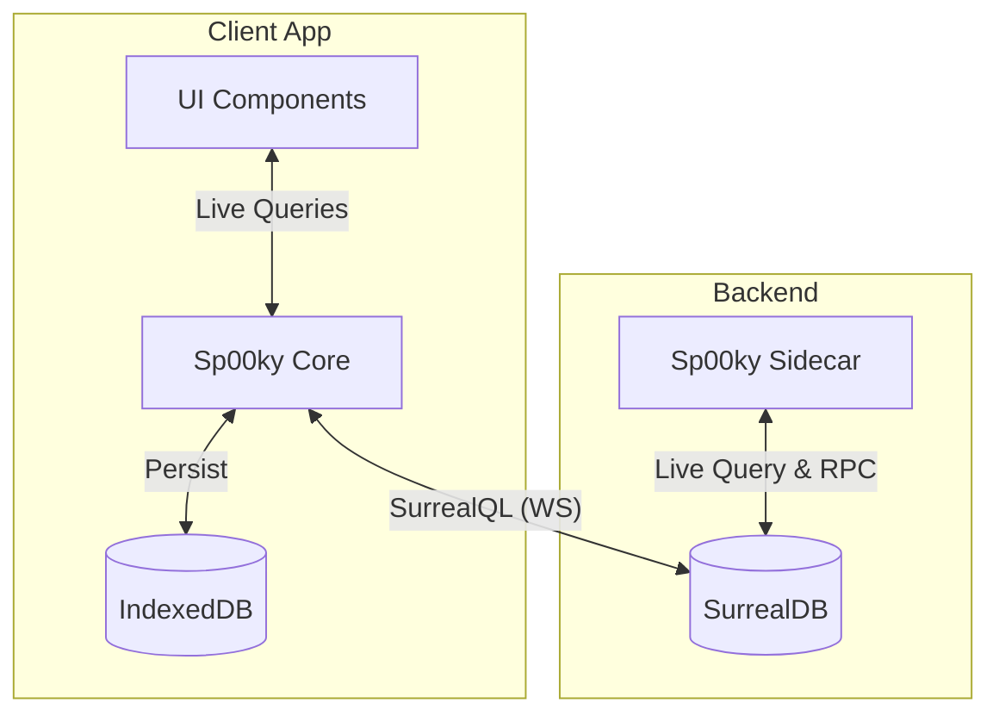
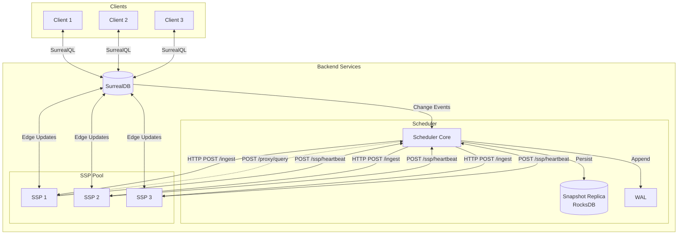
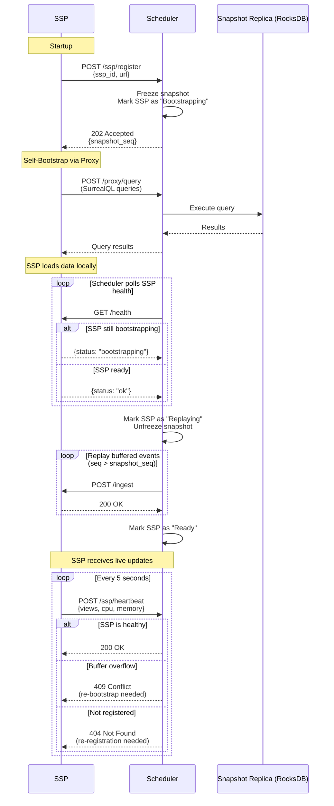
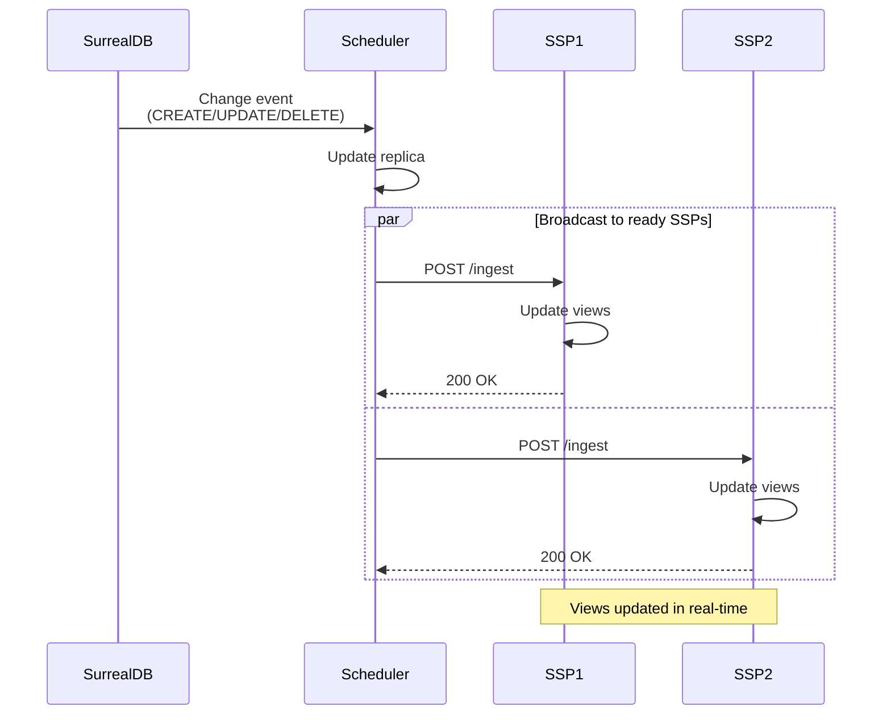
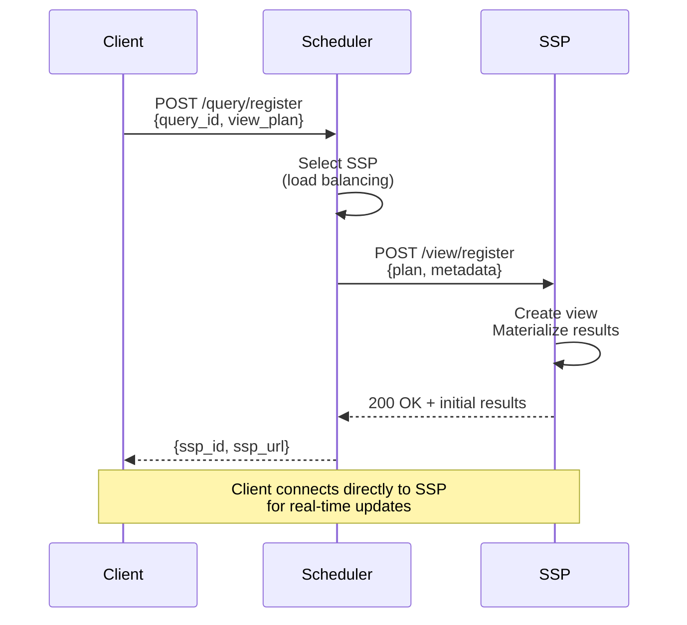

import CodeBlock from '../../components/ui/CodeBlock.astro';

Sp00ky operates on a "Sidecar" architecture to enable its powerful synchronization capabilities.

## High Level Overview

The system is composed of three main parts around a central database:

1.  **The Database**: Standard SurrealDB. The central hub.
2.  **The Client**: Connects directly to SurrealDB using the standard SurrealQL protocol.
3.  **The Sidecar**: A background service that monitors the database and performs heavy computational tasks (hashing, integrity).


```mermaid
graph TD
    subgraph client_app [Client App]
        UI[UI Components]
        LocalDB[(IndexedDB)]
        WASM[Sp00ky Core]

        UI <-->|Live Queries| WASM
        WASM <-->|Persist| LocalDB
    end

    subgraph backend_sys [Backend]
        Sidecar[Sp00ky Sidecar]
        DB[(SurrealDB)]
    end

    WASM <-->|"SurrealQL (WS)"| DB
    Sidecar <-->|"Live Query & RPC"| DB
```

## Why a Sidecar?

Even though the client connects directly to SurrealDB, the Sidecar is essential for the **Sp00ky Protocol**:

### 1. Incremental View Computation

The SSP runs a DBSP circuit per registered query. When SurrealDB's schema events forward row CREATE / UPDATE / DELETE notifications to the SSP's `/ingest` endpoint, the circuit incrementally computes which views the change affects and writes the resulting per-user edges into `_00_list_ref_user_<id>` (or the legacy `_00_list_ref`). Clients then read those edges over a LIVE subscription instead of re-running the source query.

### 2. Backend Job Execution

It runs backend jobs declared in `sp00ky.yml` (e.g. AI agent steps, scheduled tasks). The same DBSP machinery routes the trigger row through to the configured backend so a job runner can pick it up.

### 3. Integrity Checks

The SSP also computes per-table content hashes that the scheduler can compare against its persisted replica during bootstrap and through `spky verify`, so cluster nodes detect drift before serving stale data.

---

## Distributed Architecture

For production deployments, Sp00ky supports a distributed architecture with multiple SSP instances coordinated by a central Scheduler:


```mermaid
graph TD
    subgraph clients [Clients]
        C1[Client 1]
        C2[Client 2]
        C3[Client 3]
    end

    subgraph backend [Backend Services]
        DB[(SurrealDB)]

        subgraph sched [Scheduler]
            Scheduler[Scheduler Core]
            Replica[(Snapshot Replica<br/>RocksDB)]
            WAL[WAL]
        end

        subgraph ssps [SSP Pool]
            SSP1[SSP 1]
            SSP2[SSP 2]
            SSP3[SSP 3]
        end
    end

    C1 <-->|SurrealQL| DB
    C2 <-->|SurrealQL| DB
    C3 <-->|SurrealQL| DB

    DB -->|Change Events| Scheduler
    Scheduler -->|Persist| Replica
    Scheduler -->|Append| WAL
    Scheduler -->|HTTP POST /ingest| SSP1
    Scheduler -->|HTTP POST /ingest| SSP2
    Scheduler -->|HTTP POST /ingest| SSP3

    SSP1 -.->|POST /proxy/query| Scheduler
    SSP1 -->|POST /ssp/heartbeat| Scheduler
    SSP2 -->|POST /ssp/heartbeat| Scheduler
    SSP3 -->|POST /ssp/heartbeat| Scheduler

    SSP1 <-->|Edge Updates| DB
    SSP2 <-->|Edge Updates| DB
    SSP3 <-->|Edge Updates| DB
```

### Components

**Scheduler** (Port 9667 by default)
- Central coordinator for all SSP instances
- Maintains a persistent **Snapshot Replica** (RocksDB-backed embedded SurrealDB) of database state
- Writes all events to a **Write-Ahead Log (WAL)** for crash recovery
- Distributes data updates to all SSPs via HTTP
- Exposes **proxy endpoints** (`/proxy/query`, `/proxy/signin`, `/proxy/use`) so SSPs can self-bootstrap by querying the snapshot directly
- Manages SSP lifecycle: `Bootstrapping` → `Replaying` → `Ready`
- Assigns queries to SSPs using load balancing strategies
- See [Scheduler API Reference](/docs/scheduler-api)

**SSP (Sp00ky Sidecar Processor)** (Port 8667 by default)
- Stateful service maintaining materialized views
- Executes backend functions and jobs
- Registers with scheduler on startup
- Self-bootstraps by querying the scheduler's proxy endpoints (no chunk push needed)
- Sends periodic heartbeats with `views` count for health monitoring
- See [SSP API Reference](/docs/ssp-api)

---

## SSP Lifecycle

When an SSP starts up with scheduler integration enabled:


```mermaid
sequenceDiagram
    participant SSP
    participant Scheduler
    participant Replica as Snapshot Replica (RocksDB)

    Note over SSP: Startup

    SSP->>Scheduler: POST /ssp/register<br/>{ssp_id, url}
    Scheduler->>Scheduler: Freeze snapshot<br/>Mark SSP as "Bootstrapping"
    Scheduler-->>SSP: 202 Accepted<br/>{snapshot_seq}

    Note over SSP: Self-Bootstrap via Proxy

    SSP->>Scheduler: POST /proxy/query<br/>(SurrealQL queries)
    Scheduler->>Replica: Execute query
    Replica-->>Scheduler: Results
    Scheduler-->>SSP: Query results

    Note over SSP: SSP loads data locally

    loop Scheduler polls SSP health
        Scheduler->>SSP: GET /health
        alt SSP still bootstrapping
            SSP-->>Scheduler: {status: "bootstrapping"}
        else SSP ready
            SSP-->>Scheduler: {status: "ok"}
        end
    end

    Scheduler->>Scheduler: Mark SSP as "Replaying"<br/>Unfreeze snapshot

    loop Replay buffered events (seq > snapshot_seq)
        Scheduler->>SSP: POST /ingest
        SSP-->>Scheduler: 200 OK
    end

    Scheduler->>Scheduler: Mark SSP as "Ready"

    Note over SSP,Scheduler: SSP receives live updates

    loop Every 5 seconds
        SSP->>Scheduler: POST /ssp/heartbeat<br/>{views, cpu, memory}
        alt SSP is healthy
            Scheduler-->>SSP: 200 OK
        else Buffer overflow
            Scheduler-->>SSP: 409 Conflict<br/>(re-bootstrap needed)
        else Not registered
            Scheduler-->>SSP: 404 Not Found<br/>(re-registration needed)
        end
    end
```

### Bootstrap Process

1. **Registration**: SSP sends its ID and URL to the scheduler
2. **Freeze**: Scheduler freezes the snapshot replica and marks SSP as `Bootstrapping`
3. **Proxy Query**: SSP self-bootstraps by querying the scheduler's `POST /proxy/query` endpoint (executes SurrealQL against the frozen snapshot)
4. **Health Poll**: Scheduler polls the SSP's `GET /health` endpoint every `ssp_poll_interval_ms` (default 3s) until the SSP reports ready
5. **Unfreeze & Replay**: Scheduler unfreezes the snapshot, marks SSP as `Replaying`, and replays all buffered events with `seq > snapshot_seq`
6. **Ready**: Once replay completes, scheduler marks SSP as `Ready`
7. **Live Updates**: SSP now receives real-time updates via `/ingest` endpoint

### Health Monitoring

- SSPs send heartbeats every 5 seconds (configurable) with `views` count, CPU, and memory usage
- Scheduler marks SSPs as stale after 15 seconds without heartbeat (configurable)
- Stale SSPs are removed from the pool
- Maximum buffer size per SSP: 10,000 messages (configurable via `max_buffer_per_ssp`)
- Queries are reassigned to healthy SSPs

---

## Load Balancing

The scheduler supports multiple load balancing strategies for query assignment:

### Round Robin
Distributes queries evenly across all SSPs in rotation.

### Least Queries
Assigns queries to the SSP with the fewest active queries.

### Least Load
Assigns queries to the SSP with the lowest combined CPU and memory usage.

Configure via the scheduler's `load_balance` field in its config (default `LeastQueries`).

---

## Communication Patterns

### Data Ingestion Flow


```mermaid
sequenceDiagram
    participant DB as SurrealDB
    participant Scheduler
    participant SSP1
    participant SSP2

    DB->>Scheduler: Change event<br/>(CREATE/UPDATE/DELETE)
    Scheduler->>Scheduler: Update replica

    par Broadcast to ready SSPs
        Scheduler->>SSP1: POST /ingest
        SSP1->>SSP1: Update views
        SSP1-->>Scheduler: 200 OK
    and
        Scheduler->>SSP2: POST /ingest
        SSP2->>SSP2: Update views
        SSP2-->>Scheduler: 200 OK
    end

    Note over SSP1,SSP2: Views updated in real-time
```

The SSP responds `200` to `/ingest` immediately and finishes the
view-fan-out work asynchronously. This matters because SurrealDB
runs the schema mutation event that called `http::post` **inside**
the originating transaction; if the SSP's own follow-up
`UPDATE _00_list_ref_user_<id>` committed before that parent
transaction did, another session's LIVE notification on the per-user
edge would race ahead of the source row's visibility. The SSP's
deferred task waits for the row's `_00_version` to become readable
on its own connection (a clean proxy for "parent transaction is
committed") before bumping the per-user edge.

### Edge-Update Batching

The SSP does not write one transaction per record. View deltas — from
both per-ingest steps and the initial snapshot computed at query
registration — are pushed to a coalescing service that buffers them over
a short window and writes **all** of their `_00_list_ref` edges (primary
window edges **and** subquery child edges) in a **single** SurrealDB
`BEGIN…COMMIT` transaction. Without this, a burst of updates (a bulk
import, a sync backfill, or a fresh client registering several queries at
once) produced one transaction per record, so SurrealDB fired a `LIVE`
notification per record and a connecting client streamed its whole window
over seconds of serialized round-trips. Batching collapses that into a
few `LIVE` deliveries.

The window is set by `SPKY_SSP_QUERY_UPDATE_THROTTLE_MS` (default `100`;
`0` disables batching and flushes each update immediately). The buffer
also flushes early once it crosses an internal size cap, and flushes any
remainder on shutdown. On the client, the in-browser Stream Processor has
the analogous `streamDebounceTime` (default `50`ms — see
[Configuration](/docs/configuration)), which coalesces the resulting
per-query stream updates before they reach `useQuery`.

### Per-User `_00_list_ref` Tables

Each registered view stores a per-user materialized edge in
`_00_list_ref_user_<auth_id>`. The auth id segment is hardcoded
into the table's `PERMISSIONS FOR select WHERE $auth.id = user:<id>`
rule, so a record-token client subscribing to its own dedicated
table matches at LIVE-notification time without any cross-session
permission lookup. This works around the SurrealDB v3 LIVE
permission gap, where cross-session LIVE deliveries on a
permission-gated table can be silently dropped even when the
subscriber's expression would pass for the new row.

The mode is configured via `refMode` in `sp00ky.yml`
(or `SPKY_SSP_REF_MODE` on the SSP):

- `dedicated` (default): per-user `_00_list_ref_user_<id>` tables;
  no cross-session permission evaluation at LIVE time. The SSP
  pre-emptively creates the user's table when it receives the
  `user` CREATE ingest event, so the client's first LIVE
  subscription after sign-in succeeds on the first try. The
  `liveRetryCount` getter on the client returns `0` on a clean
  bootstrap and is exposed for regression-guard tests.
- `single`: legacy shared `_00_list_ref` with a
  `WHERE auth_id = $auth.id` rule. Same-session writes propagate;
  cross-session LIVE notifications hit the v3 permission gap.

When a `user` record is deleted upstream, the SSP receives the
`user` DELETE ingest event and drops the matching
`_00_list_ref_user_<id>` table so dedicated schema state doesn't
accumulate over time.

### Query Registration Flow


```mermaid
sequenceDiagram
    participant Client
    participant Scheduler
    participant SSP

    Client->>Scheduler: POST /query/register<br/>{query_id, view_plan}
    Scheduler->>Scheduler: Select SSP<br/>(load balancing)
    Scheduler->>SSP: POST /view/register<br/>{plan, metadata}
    SSP->>SSP: Create view<br/>Materialize results
    SSP-->>Scheduler: 200 OK + initial results
    Scheduler-->>Client: {ssp_id, ssp_url}

    Note over Client,SSP: Client connects directly to SSP<br/>for real-time updates
```

---

## Horizontal Scaling

The distributed architecture supports horizontal scaling:

### Adding SSPs

1. Start a new SSP instance with `SPKY_SCHEDULER_URL` configured
2. SSP automatically registers with scheduler
3. Scheduler bootstraps the SSP with current replica state
4. New queries are distributed across all healthy SSPs

### Removing SSPs

1. Stop the SSP instance (graceful shutdown)
2. Scheduler detects missing heartbeats
3. SSP marked as stale and removed from pool
4. Active queries reassigned to remaining SSPs

### Failure Recovery

- SSP failures are detected via heartbeat timeout
- Queries automatically reassigned to healthy SSPs
- Job execution failures trigger retries on different SSPs
- Client reconnection handles SSP unavailability

---

## Deployment Modes

### Single SSP (Development)

```bash
# No scheduler needed — one SSP, one SurrealDB.
SPKY_DB_URL=http://localhost:8666
SPKY_SSP_LISTEN_ADDR=0.0.0.0:8667
SPKY_SSP_REF_MODE=dedicated   # or 'single' for the legacy shared _00_list_ref
```

Simple setup for development and testing. The Sp00ky CLI's `spky dev` wires this up automatically using values from `sp00ky.yml`.

### Multiple SSPs (Production)

```bash
# Scheduler — host/port and DB credentials come from its YAML config plus
# a handful of optional env overrides.
SPKY_DB_WS=ws://surrealdb:8000/rpc
SPKY_DB_NS=main
SPKY_DB_NAME=app
SPKY_SCHEDULER_ID=scheduler-01
SPKY_SNAPSHOT_UPDATE_INTERVAL_SECS=10

# SSP instances
SPKY_SCHEDULER_URL=http://scheduler:9667
SPKY_SSP_ID=ssp-01
SPKY_SSP_LISTEN_ADDR=0.0.0.0:8667
SPKY_SSP_ADVERTISE_ADDR=10.100.1.30:8667
SPKY_SSP_REF_MODE=dedicated
```

Production setup with high availability and load distribution.

For detailed deployment instructions, see the [Deployment Guide](/docs/deployment).
