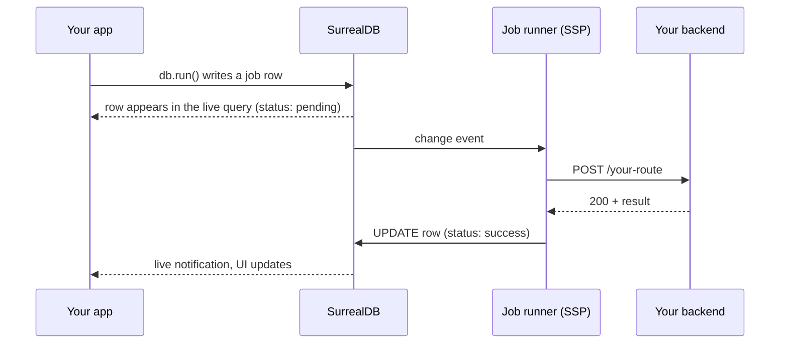

import CodeBlock from '../../../components/ui/CodeBlock.astro';
import Note from '../../../components/ui/Note.astro';
import CardGrid from '../../../components/ui/CardGrid.astro';
import LinkCard from '../../../components/ui/LinkCard.astro';

A **backend** is your own HTTP service (any language, any framework) registered in `sp00ky.yml`
and described by an OpenAPI spec. You call it from the client like this:

<CodeBlock code={runCode} lang="typescript" />

Note what's missing: no URL, no `fetch`, no error handling for a dropped connection, no loading
flag. `db.run()` doesn't make an HTTP request.

## The outbox model

`db.run()` **writes a row** to a table in SurrealDB. Sp00ky's job runner picks that row up and makes
the HTTP call to your service on the server side, then writes the result back onto the same row.

The row is an ordinary synced record, so **job state is application state**. You subscribe to it the
same way you subscribe to anything else, and the progress spinner in your UI is just a live query.

<CodeBlock code={statusCode} lang="tsx" />

## Why go through the database

| | Direct HTTP call | Sp00ky outbox |
| --- | --- | --- |
| Offline | Fails | Queued locally, sent when back online |
| Retry on failure | You write it | Configurable, with backoff |
| Timeouts | You write it | Per-backend, optionally per-call |
| Progress in the UI | Component state | A live row, visible in every tab and device |
| Survives a page reload | No | Yes. The row is still there |
| Cancel a running job | Hard | `spky jobs kill`, or set a field |
| Auditability | Logs, if you kept them | Every call is a row you can query |

The trade-off is that calls are **asynchronous by design**. `db.run()` resolves when the row is
written, not when your backend replies. If you need a synchronous request/response, call your
service directly with `fetch`. Sp00ky doesn't stop you, you just lose everything in the right-hand
column.

<Note>
  The same machinery powers [Jobs](/docs/jobs), [Schedules](/docs/jobs/schedules) and
  [Workflows](/docs/jobs/workflows). A schedule creates job rows on a cadence; a workflow runs a DAG
  of them. Learn the job row and you know all three.
</Note>

## Other app types

`apps:` in `sp00ky.yml` holds more than backends. Every entry has a `type`:

| Type | What it is |
| --- | --- |
| `backend` | An HTTP service invoked through the outbox. This page. |
| `frontend` | Your web app. Deployed as a Docker image, or as a static SPA on Cloudflare Workers. |
| `docker` | A prebuilt image run alongside the stack, a mail catcher, a cache, a third-party service. Usually `scope: devOnly`. |

## Next

<CardGrid>
  <LinkCard
    href="/docs/backend/add"
    title="Add a backend"
    icon="server"
    description="Scaffold the outbox table, write the OpenAPI spec, call your first route."
  />
  <LinkCard
    href="/docs/backend/options"
    title="Backend options"
    icon="config"
    description="Auth, timeouts, environment variables, external hosting."
  />
  <LinkCard
    href="/docs/jobs"
    title="Jobs"
    icon="jobs"
    description="Watch, retry and kill the rows your backend calls produce."
  />
  <LinkCard
    href="/docs/dev/servers"
    title="Dev servers & sidecars"
    icon="terminal"
    description="Have spky dev start your backend alongside the stack."
  />
</CardGrid>

export const runCode = `await db.run('api', '/spookify', { id: thread.id });`;

export const statusCode = `// the job row is a normal reactive query
const jobs = useQuery(db, () =>
  db.query('job')
    .where({ status: 'pending' })
    .build()
);

<Show when={jobs.data()?.length}>Working…</Show>`;
