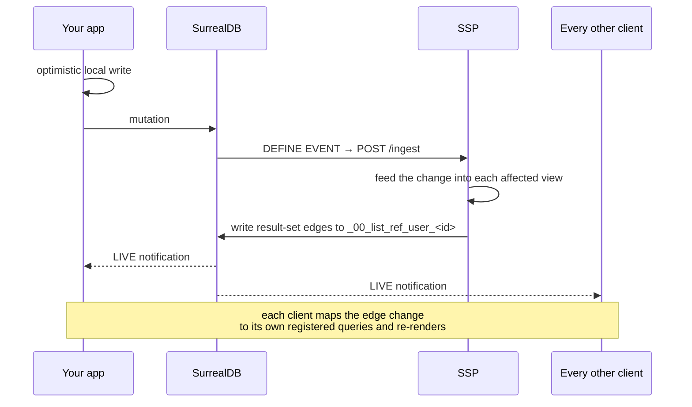

import CodeBlock from '../../components/ui/CodeBlock.astro';
import Note from '../../components/ui/Note.astro';
import CardGrid from '../../components/ui/CardGrid.astro';
import LinkCard from '../../components/ui/LinkCard.astro';

Three ideas carry the whole system:

1. **Your schema is the source of truth.** Types, sync rules and permissions are all derived from it.
2. **Queries are maintained, not re-run.** A sidecar keeps each registered query's result set up to
   date incrementally, and tells clients only what changed.
3. **Server calls go through the database.** A backend invocation is a row, which makes it
   offline-safe, retryable and observable for free.

## The pieces

| Piece | What it is |
| --- | --- |
| **SurrealDB** | The database, and the hub. Your client talks to it directly. Always external to Sp00ky. |
| **SSP** (Sp00ky Stream Processor) | A Rust sidecar holding an incremental view per registered query. Also runs background jobs. |
| **Scheduler** | Optional cluster layer: manages a pool of SSPs, bootstraps them from a snapshot, balances queries. Not needed in `mode: singlenode`. |
| **Client SDK** | Local cache, optimistic writes, and a Rust→WASM processor that decides which of your queries a change touched. |

## Schema in, everything out

<CodeBlock code={pipelineCode} lang="bash" />

`spky generate` reads your `.surql` files and emits typed clients. `spky dev` and `spky deploy` also
install a `DEFINE EVENT` on every synced table, so SurrealDB itself notifies the SSP whenever a row
changes. Nothing polls.

## What happens when data changes

Step by step:

1. **You write.** The mutation is applied to the local store first, so the UI updates before any
   network round trip, then queued for the server.
2. **SurrealDB notifies the SSP.** The generated `DEFINE EVENT` POSTs the changed row to the SSP's
   `/ingest` endpoint. This is a push, not a subscription.
3. **The SSP updates its views incrementally.** Each registered query is compiled into a dataflow
   circuit. A changed row produces a *delta* for the views it affects. No query is re-executed.
4. **The result set is written back as edges.** For each affected query, the SSP updates
   `_00_list_ref_user_<id>`, a tiny per-user table recording which records are currently in which
   query's result.
5. **Clients get one notification.** Every client holds a single
   `LIVE SELECT * FROM _00_list_ref_user_<id>` subscription. A membership change fires it, the
   client works out which `queryHash` values are affected, and the matching `useQuery` callbacks
   run.

<Note>
  There is no same-origin fast path. A change reaches the tab next to you the same way it reaches a
  phone on another continent, through SurrealDB's LIVE notification. Predictable, at the cost of one
  WebSocket per tab.
</Note>

### Why the edge table

Sending the full result of every query to every client on every write would not scale. Sending
membership deltas on a tiny system table does. The LIVE notification says *what changed
membership*; the client then reads content from its local store and pulls only what it's missing.

## Why a sidecar at all

SurrealDB has LIVE queries of its own, but they fire per-table, not per-query-result. Answering
"did *this user's filtered, sorted, joined, paginated* query change?" is the hard part, and the SSP
exists to answer it incrementally instead of by re-running everything.

The sidecar also earns its keep two more ways: it runs [background jobs](/docs/jobs), and it
performs integrity checks between the local and remote view of the data.

## Backend calls are rows

The same insight applies to server-side work. `db.run()` doesn't make an HTTP request. It writes a
row to an outbox table. The SSP's job runner picks it up, calls your service, and writes the result
back onto the row.

<CodeBlock code={outboxCode} lang="typescript" />

Because the row is an ordinary synced record, job state *is* application state: your progress
spinner is a live query, the work survives a page reload, and a failed call retries without you
writing retry code. See [What is a backend](/docs/backend).

## Offline is the same code path

The local store is authoritative for reads. A query paints from cache on the first frame, whether or
not the network is up. Writes queue locally and drain when connectivity returns. There is no
separate "offline mode" to enable, being offline just means the queue is longer.

## Next

<CardGrid>
  <LinkCard
    href="/docs/quickstart"
    title="Quickstart"
    icon="rocket"
    description="See all of this working in about five minutes."
  />
  <LinkCard
    href="/docs/client/queries"
    title="Reactive queries"
    icon="live"
    description="The API you'll actually spend your time in."
  />
  <LinkCard
    href="/docs/reference/architecture"
    title="Architecture"
    icon="layers"
    description="Circuits, bootstrap, load balancing, failure recovery."
  />
  <LinkCard
    href="/docs/reference/performance"
    title="Performance"
    icon="gauge"
    description="Measured latency and throughput, and how to reproduce them."
  />
</CardGrid>

export const pipelineCode = `schema.surql
   │
   ├── spky generate ──▶ schema.gen.ts / schema.gen.dart   (your types)
   ├── spky migrate  ──▶ tables + permissions in SurrealDB
   └── spky dev      ──▶ DEFINE EVENT on every synced table (change push)`;

export const outboxCode = `await db.run('api', '/spookify', { id: thread.id });
// ↳ writes a row to the 'job' table
// ↳ the SSP job runner POSTs http://your-api/spookify
// ↳ the response lands in that row's \`result\` field
// ↳ your live query on 'job' re-renders`;
