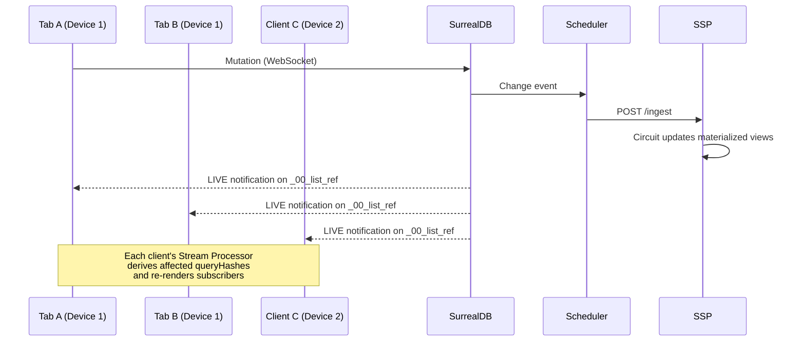

import CodeBlock from '../../components/ui/CodeBlock.astro';
import Note from '../../components/ui/Note.astro';

export const code4 = `// Build a query - returns a query object, not the results
const query = db.query('user')
  .where({ age: { $gt: 18 } })
  .orderBy('created_at', 'desc')
  .limit(10)
  .build();

// Execute with useQuery hook (reactive)
const usersQuery = useQuery(db, () => query);
const users = usersQuery.data();`;

export const code3 = `// Fetch threads with their authors (1:1)
const threadsQuery = db.query('thread')
  .related('author')
  .orderBy('created_at', 'desc')
  .limit(10)
  .build();

// Use in a component with useQuery
const threads = useQuery(db, () => threadsQuery);

// Access related data
threads.data()?.forEach(thread => {
  console.log(thread.title);
  console.log(thread.author?.username); // Automatically typed!
});`;

export const code2 = `const post = posts[0];

// ✅ TypeScript knows this is available
console.log(post.author.username);

// ❌ Error: Property 'email' does not exist on type 'User' (we only selected username/avatar)
console.log(post.author.email);`;

export const code1 = `import { useQuery } from '@spooky-sync/client-solid';
import { For } from 'solid-js';
import { db } from './db';

function UserList() {
  // Build query
  const query = db.query('user')
    .orderBy('created_at', 'desc')
    .limit(20)
    .build();
  
  // Hook automatically subscribes to updates
  const usersResult = useQuery(db, () => query);
  
  return (
    <ul>
      <For each={usersResult.data() || []}>
        {(user) => <li>{user.username}</li>}
      </For>
    </ul>
  );
}`;

A **reactive query** in Sp00ky is a query you declare once and forget about. As soon as the underlying data changes — whether the change happens in the same component, another tab, another device, or a backend job — the query result is updated and your UI re-renders automatically. You never write a refetch, a subscription teardown, or an invalidation rule.

## How it works in theory

Reactivity in Sp00ky is driven by an end-to-end pipeline made of four coordinated pieces: the **Scheduler**, one or more **Streaming Processors (SSPs)**, **SurrealDB** as the system of record, and a client-side **Stream Processor** running in the browser. Every reactive query follows the same five-stage lifecycle:

1. **Build.** You compose a query with the fluent API (`db.query('table').where(...).build()`). This produces a plan — not a request.
2. **Register.** `useQuery` hashes the plan into a stable `queryHash`, registers it with the local client, and subscribes a callback to that hash. The plan is also propagated to the Scheduler, which assigns it to an SSP.
3. **Materialize.** The assigned SSP compiles the plan into an incrementally-maintained view inside its in-memory circuit, executes it once to produce initial results, and marks the view live.
4. **Propagate.** When a write lands in SurrealDB, the Scheduler observes the change event and fans it out to every SSP over HTTP `/ingest`. Each SSP feeds the change into its circuit, which emits deltas for any affected views.
5. **Notify.** SurrealDB pushes a `LIVE` notification on the `_00_list_ref` system table to every connected client over WebSocket. Each client's Stream Processor re-derives which registered `queryHash` values are affected, reads fresh data from the local store, and invokes the `useQuery` callback. Your component re-renders.

The key property: every stage is *incremental*. The Scheduler does not re-broadcast full snapshots, the SSP circuit does not re-run full queries, and the client Stream Processor does not re-evaluate unrelated subscriptions.

## The Fluent Query API

The `db.query()` method provides a fluent interface to construct queries. It is fully type-safe based on your schema.

<CodeBlock
  code={code4}
  lang="typescript"
/>

## Relationships

Sp00ky makes fetching related data simple with the `.related()` method. It automatically handles the underlying graph traversals or joins.

### Unified Query Syntax

Whether you are fetching a simple 1:1 link, a 1:N collection, or traversing a complex N:M graph, the syntax remains the same. Sp00ky uses your schema definition to determine how to fetch the data.

<CodeBlock
  code={code3}
  lang="typescript"
/>

<Note>
  **Magic behind the scenes:** You don't need to manually specify graph paths (e.g., `->liked->post`) or join conditions. Sp00ky inspects your `schema.surql` to understand that `liked` is a relation table connecting users to posts, and generates the correct query automatically.
</Note>

## Type Safety

When you use `.related()`, the return type of your query is automatically adjusted.

- **Without `.related()`**: the field is a `string` (Record ID).
- **With `.related()`**: the field becomes the full related object with selected fields.

<CodeBlock
  code={code2}
  lang="typescript"
/>

This ensures you can never accidentally access a property on a relation that hasn't been fetched. TypeScript catches the error at compile time.

## Using `useQuery`

For reactive applications, Sp00ky provides hooks that automatically update your component when the data changes.

<CodeBlock
  code={code1}
  lang="typescript"
/>

Under the hood, `useQuery` calls `subscribe(queryHash, callback, { immediate: true })`. The `immediate: true` flag fires the callback synchronously with whatever is already in the local store so the first render has data; subsequent invocations come from Stream Processor deltas. UPDATE events are debounced by `streamDebounceTime` (default 100ms, configurable — see [Configuration](/docs/configuration)); CREATE and DELETE fire immediately. Subscriptions are torn down automatically on component unmount.

---

## Behind the scenes: the Spooky Scheduler

The Scheduler is a **Rust** service (`apps/scheduler/`) that acts as the central coordinator for the reactive pipeline. It owns three things:

- A **Snapshot Replica** — an embedded SurrealDB instance backed by RocksDB that mirrors the authoritative database and is used to bootstrap new SSPs without hammering the primary.
- A **Write-Ahead Log** — every change event is appended to the WAL before being fanned out, giving the system crash-recovery and replay semantics.
- An **SSP Pool** — a live registry of Streaming Processor workers with per-worker health (heartbeats every 5s; stale after 15s). Queries are assigned to SSPs via a pluggable load-balancing strategy: Round Robin, Least Queries, or Least Load.

When an SSP dies mid-flight, the Scheduler's monitors detect the missed heartbeats and reassign affected queries to healthy workers, so reactive subscriptions keep flowing without manual intervention. See [Architecture](/docs/architecture) and the [Scheduler API](/docs/scheduler-api) for full details.

## Behind the scenes: Streaming Processors (SSP)

A Streaming Processor (`apps/ssp/`) is a **Rust** worker that holds live materialized views in memory. Each view is compiled from a registered query plan into an **incremental circuit**: a dataflow graph that consumes record-level CREATE/UPDATE/DELETE events and emits only the *delta* for each view, rather than re-executing the query from scratch.

An SSP goes through three lifecycle stages:

- **Bootstrapping** — on startup, the SSP registers with the Scheduler and self-bootstraps by issuing SurrealQL queries against the Scheduler's snapshot replica via `POST /proxy/query`.
- **Replaying** — once loaded, the SSP replays buffered events that landed during bootstrap so it catches up to the live sequence.
- **Ready** — the SSP now accepts `POST /ingest` calls in real time, routes each change through its circuit, and updates every affected view.

Registered view plans are persisted in the `_00_query` system table, so they survive restarts and can be re-registered across the pool. See the [SSP API Reference](/docs/ssp-api) for the full protocol.

---

## Live sync across tabs, windows, and clients

Sp00ky does not use `BroadcastChannel`, `SharedWorker`, or `ServiceWorker` to coordinate tabs. Sync is **server-mediated**, and it takes the same path whether the two participants are two tabs on the same laptop or two devices on opposite sides of the planet.

Every `SyncedDb` instance — one per tab — opens its own WebSocket to SurrealDB and issues a single `LIVE SELECT * FROM _00_list_ref` subscription. `_00_list_ref` is a system table that records, for each registered query, which records are currently in its result set. Any change to that membership — a new row enters the result, an existing row leaves — produces a LIVE notification that every subscribed client receives.

A few consequences worth internalizing:

- **There is no "same-origin fast path."** A mutation in Tab A reaches Tab B the same way it reaches Client C — via SurrealDB's LIVE notification. This keeps the semantics predictable but means every tab pays for its own WebSocket.
- **LIVE notifications signal membership, not content.** When a client receives a LIVE event, its sync layer reconciles version arrays (`localArray` vs `remoteArray`) to pull any content changes. This separation means big record updates don't have to ride on the LIVE channel itself.
- **Local writes are optimistic.** A mutation is applied to the local store immediately and enqueued to the server. When the server confirms and the LIVE notification comes back, the local state is reconciled.

## Performance

Sp00ky's reactive pipeline is built from pieces chosen for throughput:

- **Rust Scheduler and Rust SSP.** Both services are native Rust binaries. Change-event fan-out, view maintenance, and load balancing run without a GC.
- **Rust → WASM Stream Processor on the client.** The component that decides which local `queryHash` values changed after an ingest is a WebAssembly module compiled from Rust (`@spooky-sync/ssp-wasm`), not JavaScript interpreting deltas.
- **WebSockets via SurrealDB LIVE queries.** There is no HTTP polling layer and no secondary pub/sub broker on the hot path — clients talk directly to SurrealDB using its native WebSocket protocol, and invalidation piggy-backs on `LIVE SELECT`.
- **Incremental everywhere.** Neither the server-side circuit nor the client-side processor re-evaluate a query from scratch on each change; only the affected portions of each view are recomputed.

<Note>
  Concrete latency and throughput metrics — server-side fan-out, end-to-end round-trip across tabs and devices, and client-side deltas per second — will be published in a future update.
</Note>

---

## How this compares to other realtime frameworks

Sp00ky's distinguishing combination is **(a)** a Rust Scheduler + SSP pool that maintains materialized views *incrementally on the server*, **(b)** a Rust→WASM Stream Processor that mirrors that incremental model *on the client*, and **(c)** SurrealDB LIVE queries over WebSocket as the invalidation bus. Most frameworks in the space implement one or two of these; none combine all three.

| Framework | Reactivity model | Local storage | Transport | Notable difference from Sp00ky |
|---|---|---|---|---|
| **Firebase / Firestore** | Server-side listeners; client cache syncs per document/collection | IndexedDB / in-memory cache | gRPC / WebSocket | Proprietary cloud; no self-hosted incremental view layer; developers don't register server-side views directly. |
| **Supabase Realtime** | Postgres logical replication broadcast on channels; client typically refetches affected rows | None by default (app-defined) | WebSocket | No server-side materialized view workers; no in-browser WASM processor; reactivity is row-level broadcast, not view-level deltas. |
| **Convex** | Reactive queries re-run server-side per subscriber on every write | Client cache | WebSocket | Closed, managed backend; reactive queries are re-executed rather than maintained by an incremental circuit. |
| **Replicache / Zero** (Rocicorp) | Client-side sync engine with server-authoritative mutations; Zero evaluates queries client-side against a replicated cache | IndexedDB | Custom sync protocol over WebSocket | Closest philosophical match. Differs by using its own sync protocol instead of SurrealDB LIVE, and does not ship a Rust/WASM incremental view circuit. |
| **Electric SQL** | Postgres → shape-based replication into client SQLite / PGlite | SQLite / PGlite | HTTP long-poll / WebSocket | Shape-scoped rather than query-scoped; no server-side incremental view workers. |
| **PowerSync** | Operational-log sync into client SQLite | SQLite | WebSocket | Similar local-first posture; no server-side materialization layer; sync unit is tables/buckets, not queries. |
| **RxDB** | Reactive queries evaluated against the local store; replication is a plugin | IndexedDB / others | Plugin-defined | Reactivity is purely client-side; no server-side incremental view engine coordinating clients. |

The framing above is about *architectural differences*, not about which tool is better. Pick Sp00ky when you want server-side incremental views plus a matching client-side processor over a single WebSocket to SurrealDB; pick an alternative when their different trade-offs fit your stack better.
