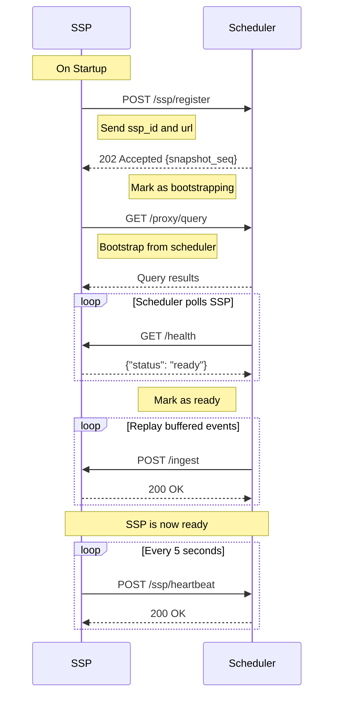

import CodeBlock from '../../../components/ui/CodeBlock.astro';

The SSP (Sp00ky Sidecar Processor) is a stateful service that maintains materialized views and executes backend functions.

## Base URL

Default: `http://localhost:8667`

Configure via: `SPKY_SSP_LISTEN_ADDR` environment variable (form `host:port`).

## Authentication

All endpoints (except `/health`, `/version`, and `/info`) require authentication via the `Authorization` header:

```
Authorization: Bearer <SPKY_AUTH_SECRET>
```

Set via `SPKY_AUTH_SECRET` environment variable. When unset, the middleware accepts any bearer token and is intended for dev only.

---

## Data Ingestion

### POST /ingest

Process a single record update and propagate changes to affected views.

**Authentication:** Required

**Request Body:**

```json
{
  "table": "users",
  "op": "CREATE",
  "id": "user:123",
  "record": {
    "name": "Alice",
    "email": "alice@example.com"
  }
}
```

**Fields:**
- `table` (string, required) - Table name
- `op` (string, required) - Operation: `CREATE`, `UPDATE`, or `DELETE`
- `id` (string, required) - Record ID
- `record` (object, required) - Record data. For tables generated by
  the Sp00ky CLI's schema event, `record._00_rv` carries the row's
  content version (bumped inside the source transaction). The SSP
  polls `_00_version` for that record before issuing the per-user
  edge update, so list_ref bumps never race ahead of the source
  row's visibility on other connections.

**Response:**
- `200 OK` - Record accepted. Returned **immediately** after the
  in-memory DBSP step; the database fan-out
  (`UPDATE _00_list_ref_user_<id>`, view-metric persistence) runs in
  a background task so the caller's transaction (the schema event
  that invoked `http::post`) can commit without waiting on it. Side
  effects: when `table = "user"` and `op = "CREATE"`, the SSP
  pre-emptively defines that user's dedicated
  `_00_list_ref_user_<id>` table (no-op in `refMode: single`); when
  `op = "DELETE"`, it drops the same table.
- `400 Bad Request` - Invalid operation or malformed request
- `401 Unauthorized` - Missing or invalid authentication
- `503 Service Unavailable` - SSP is not in Ready state (`SSP_NOT_READY`)

**Example:**

```bash
curl -X POST http://localhost:8667/ingest \
  -H "Content-Type: application/json" \
  -H "Authorization: Bearer your-secret-token" \
  -d '{
    "table": "users",
    "op": "CREATE",
    "id": "user:alice",
    "record": {"name": "Alice", "email": "alice@example.com"}
  }'
```

**Job Processing:**

If the ingested table is configured as a job table and the record has `status: "pending"`, the SSP will automatically queue and execute the job.

---

## Bootstrap

When running in scheduler mode, the SSP bootstraps itself using a **proxy-based pull** pattern rather than receiving pushed chunks:

1. SSP registers with the scheduler via `POST /ssp/register`
2. Scheduler freezes its snapshot replica and returns `snapshot_seq`
3. SSP connects to the scheduler's proxy endpoints (`POST /proxy/query`, `/proxy/signin`, `/proxy/use`) as if they were a SurrealDB instance
4. SSP executes its own SurrealQL queries to pull the data it needs
5. Once bootstrapped, SSP reports healthy via `GET /health` (returns `{"status": "ready"}`)
6. Scheduler detects readiness, replays buffered events, then promotes SSP to `Ready`

This approach is more efficient than chunk pushing because the SSP only fetches the data it actually needs, and the scheduler doesn't need to know the SSP's data requirements.

**Notes:**
- During bootstrap, the SSP's `/health` endpoint returns `{"status": "bootstrapping"}`
- The scheduler polls `/health` every `ssp_poll_interval_ms` (default: 3 seconds)
- Bootstrap must complete within `bootstrap_timeout_secs` (default: 120 seconds)
- If the scheduler's per-SSP message buffer overflows (max 10,000), the SSP must re-bootstrap

---

## View Management

### POST /view/register

Register a new view (live query) with the SSP.

**Authentication:** Required

**Request Body:**

```json
{
  "id": "query:abc123",
  "surql": "SELECT * FROM users WHERE active = true",
  "clientId": "client-456",
  "ttl": "30s",
  "params": null,
  "lastActiveAt": "2024-01-01T00:00:00Z",
  "format": null
}
```

**Fields:**
- `id` (string, required) - Unique view identifier (e.g. `query:abc123`)
- `surql` (string, required) - SurrealQL query to materialize
- `clientId` (string, required) - Client identifier
- `ttl` (string, required) - Time-to-live for the view (e.g. `"30s"`)
- `params` (object, optional) - Query parameters
- `lastActiveAt` (string, optional) - ISO 8601 timestamp of last activity
- `format` (string, optional) - Response format

**Response:**
- `200 OK` - View registered, initial results returned
- `400 Bad Request` - Invalid view registration payload
- `401 Unauthorized` - Missing or invalid authentication
- `503 Service Unavailable` - SSP is not in Ready state (`SSP_NOT_READY`)

**Example:**

```bash
curl -X POST http://localhost:8667/view/register \
  -H "Content-Type: application/json" \
  -H "Authorization: Bearer your-secret-token" \
  -d '{
    "id": "query:abc123",
    "surql": "SELECT * FROM users WHERE active = true",
    "clientId": "client-456",
    "ttl": "30s"
  }'
```

### POST /view/unregister

Unregister a view and clean up associated resources.

**Authentication:** Required

**Request Body:**

```json
{
  "id": "users_view"
}
```

**Response:**
- `200 OK` - View unregistered
- `401 Unauthorized` - Missing or invalid authentication

**Example:**

```bash
curl -X POST http://localhost:8667/view/unregister \
  -H "Content-Type: application/json" \
  -H "Authorization: Bearer your-secret-token" \
  -d '{"id": "users_view"}'
```

---

## State Management

### POST /reset

Reset all SSP state (clear all views and data).

**Authentication:** Required

**Response:**
- `200 OK` - State reset successfully
- `401 Unauthorized` - Missing or invalid authentication

**Example:**

```bash
curl -X POST http://localhost:8667/reset \
  -H "Authorization: Bearer your-secret-token"
```

**Warning:** This is a destructive operation and cannot be undone.

---

## Monitoring & Debugging

### GET /health

Health check endpoint (no authentication required).

**Response:**
- `200 OK` - SSP is ready
  ```json
  {"status": "ready"}
  ```
- `503 Service Unavailable` - SSP is not ready
  ```json
  {"status": "bootstrapping"}
  ```

Possible status values: `"bootstrapping"`, `"ready"`, `"failed"`.

**Example:**

```bash
curl http://localhost:8667/health
```

### GET /version

Get SSP version information (no authentication required).

**Response:**
- `200 OK` - Version information
  ```json
  {
    "version": "0.1.0",
    "mode": "streaming"
  }
  ```

**Example:**

```bash
curl http://localhost:8667/version
```

### GET /info

Get entity information for this SSP (no authentication required).

**Response:**
- `200 OK` - Entity list
  ```json
  [{
    "entity": "ssp",
    "id": "ssp-primary-01",
    "status": "ready",
    "views": 5,
    "ref_mode": "dedicated",
    "version": "0.0.1-canary.66",
    "uptime_seconds": 3204,
    "circuit_tables": { "thread": 12, "user": 3 },
    "circuit_hashes": { "thread": "ab12…", "user": "cd34…" },
    "bootstrap_warnings": []
  }]
  ```

`bootstrap_warnings` is non-empty when the last bootstrap loaded zero rows
for a table that upstream SurrealDB has rows in. That is the scheduler's
replica missing data (see the scheduler's `/health/snapshot` `drift`
block); views on such a table compute empty until the replica is re-cloned.

`ref_mode` reports the currently-active `_00_list_ref` storage
layout, `"dedicated"` for per-user tables, `"single"` for the
legacy shared table. e2e suites can probe this to gate
mode-specific assertions; see the `z-single-mode-smoke` spec in the
example app.

**Example:**

```bash
curl http://localhost:8667/info
```

### GET /debug/view/:view_id

Get detailed information about a specific view for debugging.

**Authentication:** Required

**Parameters:**
- `view_id` (path parameter) - View identifier

**Response:**
- `200 OK` - View details
  ```json
  {
    "view_id": "users_view",
    "cache_size": 10,
    "last_hash": "abc123",
    "format": null,
    "cache": [...],
    "subquery_tables": ["users"],
    "referenced_tables": ["users"],
    "content_generation": 5,
    "subquery_cache": {}
  }
  ```
- `404 Not Found` - View not found
- `401 Unauthorized` - Missing or invalid authentication

**Example:**

```bash
curl http://localhost:8667/debug/view/users_view \
  -H "Authorization: Bearer your-secret-token"
```

### GET /debug/deps

Get dependency map for all views.

**Authentication:** Required

**Response:**
- `200 OK` - Dependency information
  ```json
  {
    "dependency_map": {},
    "tables_in_store": ["users", "posts"],
    "view_count": 5
  }
  ```
- `401 Unauthorized` - Missing or invalid authentication

**Example:**

```bash
curl http://localhost:8667/debug/deps \
  -H "Authorization: Bearer your-secret-token"
```

### POST /log

Receive logs from clients (for remote logging).

**Authentication:** Required

**Request Body:**

```json
{
  "message": "User action completed",
  "level": "info",
  "data": {
    "user_id": "123",
    "action": "click"
  }
}
```

**Fields:**
- `message` (string, required) - Log message
- `level` (string, optional) - Log level: `error`, `warn`, `info`, `debug`, `trace` (default: `info`)
- `data` (object, optional) - Additional structured data

**Response:**
- `200 OK` - Log received
- `401 Unauthorized` - Missing or invalid authentication

**Example:**

```bash
curl -X POST http://localhost:8667/log \
  -H "Content-Type: application/json" \
  -H "Authorization: Bearer your-secret-token" \
  -d '{
    "message": "User logged in",
    "level": "info",
    "data": {"user_id": "alice"}
  }'
```

---

## Scheduler Integration

When running with a scheduler, the SSP automatically:

### Registration Flow



### Heartbeat Loop

The SSP sends periodic heartbeats to the scheduler:

**Frequency:** Every 5 seconds (default, configurable via `HEARTBEAT_INTERVAL_MS`)

**Payload:**
```json
{
  "ssp_id": "ssp-primary-01",
  "timestamp": 1707654321,
  "views": 5,
  "cpu_usage": 45.2,
  "memory_usage": 512.5
}
```

**Response Handling:**
- `200 OK` - Heartbeat accepted, continue normal operation
- `404 Not Found` - Scheduler doesn't recognize SSP, trigger re-registration
- `409 Conflict` - Buffer overflow detected, trigger re-bootstrap
- Other errors - Log warning, continue sending heartbeats

---

## Configuration

Configure the SSP via environment variables:

### Core Configuration

```bash
# Server
SPKY_SSP_LISTEN_ADDR=0.0.0.0:8667

# Authentication. When unset the auth middleware accepts any bearer
# token, which is intended for dev only.
SPKY_AUTH_SECRET=your-secret-token

# Database connection (HTTP engine; ws:// values are accepted and normalized).
# SPKY_DB_WS is read as a legacy fallback.
SPKY_DB_URL=http://127.0.0.1:8000
SPKY_DB_USER=root
SPKY_DB_PASS=root
SPKY_DB_NS=main
SPKY_DB_NAME=app

# _00_list_ref layout. See Architecture
SPKY_SSP_REF_MODE=dedicated   # or 'single'

# TTL cleanup interval (seconds, default: 60)
TTL_CLEANUP_INTERVAL_SECS=60

# Job-table runner config, JSON-encoded. Read once at startup.
SPKY_JOB_CONFIG='{"job_tables": {…}}'

# Optional knobs
SPKY_CRDT_CACHE_SIZE=10000       # in-memory CRDT cache capacity
SPKY_CRDT_FIELDS='{"thread": ["content"]}'  # override @crdt detection
SPKY_SSP_BOOTSTRAP_PAGE_SIZE=500 # rows pulled per /proxy/query page
```

### Scheduler Integration

```bash
# Scheduler URL (optional - enables scheduler integration)
SPKY_SCHEDULER_URL=http://localhost:9667

# SSP identification (defaults to ssp-<uuid> if not set)
SPKY_SSP_ID=ssp-primary-01

# Externally reachable address for this SSP (optional)
SPKY_SSP_ADVERTISE_ADDR=10.100.1.30:8667

# Heartbeat cadence (ms, default 5000)
HEARTBEAT_INTERVAL_MS=5000
```

### Job Configuration (`sp00ky.yml`)

```yaml
job_tables:
  backend_api:
    name: "Backend API"
    base_url: "https://api.example.com"
    auth_token: "your-api-token"
```

When a record is created in a job table with `status: "pending"`, the SSP will:
1. Extract the job details
2. Execute HTTP request to the backend
3. Update the job status based on response

---

## Standalone vs. Scheduler Mode

### Standalone Mode

When `SPKY_SCHEDULER_URL` is not set:
- SSP runs independently
- No registration or heartbeat
- Direct client connections only
- Useful for development and single-SSP deployments
- The SSP owns the full maintenance plane the scheduler provides in
  cluster mode (see below)

#### Standalone Maintenance Plane

A standalone SSP exposes the same backup/restore and backend-health
surface the scheduler serves on port 9667 in cluster mode:

| Endpoint | Method | Description |
| :--- | :--- | :--- |
| `/backup/create` | POST | Enqueue a backup (`{backup_id, project_slug}`), exports the main SurrealDB, gzips, uploads to S3 (`S3_*` env vars) |
| `/backup/status` | GET | Recent backup jobs + S3 reachability |
| `/backup/status/:backup_id` | GET | Single backup job status |
| `/backup/restore` | POST | Enqueue a restore (`{restore_id?, backup_id, project_slug, storage_path}`) |
| `/backup/restore/status/:restore_id` | GET | Single restore job status |
| `/backends` | PUT | Replace the backend health-check list at runtime (JSON array; same shape as `SPKY_BACKENDS`) |

Unlike the scheduler's (unauthenticated) equivalents, these routes sit
behind the SSP's bearer auth; callers must send
`Authorization: Bearer $SPKY_AUTH_SECRET`.

During a restore the SSP transitions `Ready → Bootstrapping`: `/ingest`
returns 503 and events pushed by SurrealDB `DEFINE EVENT` triggers in
that window are rejected and **not** replayed, after the restore the
state is exactly the imported dump, and the circuit is re-bootstrapped
from it. If the circuit re-bootstrap fails after the main DB was
already replaced, the SSP stays `Bootstrapping` (blocking traffic); a
process restart reruns the normal startup bootstrap and self-heals.

With a backend list configured (`SPKY_BACKENDS`, or legacy
`SPKY_SCHEDULER_BACKENDS`; poll interval
`SPKY_HEALTH_CHECK_INTERVAL_SECS`, default 15s), `GET /health` mirrors
the scheduler's aggregation, `healthy` / `degraded` / `unavailable`
plus per-status backend counts.

### Scheduler Mode

When `SPKY_SCHEDULER_URL` is set:
- SSP registers with scheduler on startup
- Receives bootstrap data from scheduler
- Sends periodic heartbeats
- Receives data updates from scheduler
- Supports horizontal scaling with multiple SSPs

---

## Performance Considerations

### View Updates

- Views are updated incrementally when records change
- Only affected views are recomputed
- Edge updates are batched and written to SurrealDB

### State Persistence

- The SSP holds materialized view state in memory only. It does not
  write a local snapshot to disk.
- On startup the SSP **self-bootstraps** by paging through the
  scheduler's `POST /proxy/query` endpoint to replay the relevant
  source rows into its in-memory circuit. The scheduler is the
  durable source of truth.

### Memory Management

- Views store materialized results in memory
- Periodic metrics report memory usage
- Consider SSP resource limits when running multiple views

---

## Troubleshooting

### SSP Not Receiving Updates

1. Check scheduler connectivity:
   ```bash
   curl http://localhost:9667/metrics
   ```
2. Verify SSP appears in scheduler metrics with `state: "ready"`
3. Check SSP logs for heartbeat success messages
4. Verify authentication tokens match

### Bootstrap Failures

1. Check scheduler logs for bootstrap errors
2. Verify SSP `/health` endpoint is accessible from the scheduler
3. Verify the scheduler's proxy endpoints (`/proxy/query`) are reachable from the SSP
4. Check database connectivity from scheduler
5. Increase `bootstrap_timeout_secs` if bootstrap is timing out

### High Memory Usage

1. Review number of registered views
2. Check view complexity (joins, filters)
3. Monitor records per view via `/debug/view/:view_id`
4. Consider horizontal scaling with additional SSPs

### Job Execution Issues

1. Verify job table configuration in `sp00ky.yml`
2. Check job status updates in database
3. Review SSP logs for job execution errors
4. Verify backend API connectivity and authentication
