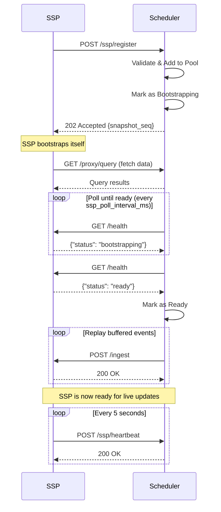

import CodeBlock from '../../components/ui/CodeBlock.astro';

The Scheduler is the central orchestrator that manages SSP sidecars and coordinates data distribution.

## Base URL

Default: `http://localhost:9667`

Configure via environment variables:
- `SPOOKY_SCHEDULER_INGEST_HOST` - Host to bind to (default: `0.0.0.0`)
- `SPOOKY_SCHEDULER_INGEST_PORT` - Port to bind to (default: `9667`)

## Authentication

Currently, the Scheduler API does not require authentication. Implement network-level security (firewalls, VPCs) to protect these endpoints.

---

## Data Ingestion

### POST /ingest

Ingest a record change from the database. This endpoint receives database events and broadcasts them to all ready SSP sidecars.

**Request Body:**

```json
{
  "table": "users",
  "op": "CREATE",
  "id": "user:123",
  "record": {
    "name": "Alice",
    "email": "alice@example.com"
  }
}
```

**Fields:**
- `table` (string, required) - Table name
- `op` (string, required) - Operation: `CREATE`, `UPDATE`, or `DELETE`
- `id` (string, required) - Record ID
- `record` (object, required) - Record data

**Response:**
- `200 OK` - Successfully ingested and broadcast to SSPs
- `400 Bad Request` - Invalid operation or malformed request
- `500 Internal Server Error` - Failed to apply to replica or broadcast
- `503 Service Unavailable` - Scheduler is in `Cloning` state

**Example:**

```bash
curl -X POST http://localhost:9667/ingest \
  -H "Content-Type: application/json" \
  -d '{
    "table": "users",
    "op": "CREATE",
    "id": "user:alice",
    "record": {"name": "Alice", "email": "alice@example.com"}
  }'
```

---

## Proxy Endpoints

SSPs use these endpoints during bootstrap to query the scheduler's snapshot replica directly, instead of receiving pushed chunks.

### POST /proxy/query

Execute a SurrealQL query against the scheduler's frozen snapshot replica. SSPs use this to self-bootstrap by pulling the data they need.

**Request Body:**

```json
{
  "query": "SELECT * FROM users"
}
```

**Response:**
- `200 OK` - Query results from the snapshot replica
- `400 Bad Request` - Invalid query
- `500 Internal Server Error` - Query execution failed

**Example:**

```bash
curl -X POST http://localhost:9667/proxy/query \
  -H "Content-Type: application/json" \
  -d '{"query": "SELECT * FROM users"}'
```

### POST /proxy/signin

No-op endpoint for SurrealDB client compatibility during SSP bootstrap. Returns success without performing authentication.

**Response:**
- `200 OK` - Always succeeds

### POST /proxy/use

No-op endpoint for SurrealDB client compatibility during SSP bootstrap. Returns success without changing namespace/database context.

**Response:**
- `200 OK` - Always succeeds

---

## View Management

### POST /view/register

Register a new view (live query) with the scheduler. The scheduler will assign it to an SSP using the configured load balancing strategy.

**Request Body:**

```json
{
  "id": "incantation:abc123",
  "surql": "SELECT * FROM users WHERE active = true",
  "clientId": "client-456",
  "ttl": "30s",
  "params": null,
  "lastActiveAt": "2024-01-01T00:00:00Z",
  "format": null
}
```

**Fields:**
- `id` (string, required) - Unique view identifier (e.g. `incantation:abc123`)
- `surql` (string, required) - SurrealQL query to materialize
- `clientId` (string, required) - Client identifier
- `ttl` (string, required) - Time-to-live for the view (e.g. `"30s"`)
- `params` (object, optional) - Query parameters
- `lastActiveAt` (string, optional) - ISO 8601 timestamp of last activity
- `format` (string, optional) - Response format

**Response:**
- `200 OK` - View registered and assigned to an SSP
  ```json
  {
    "query_id": "incantation:abc123",
    "ssp_id": "ssp-primary-01",
    "assigned_at": 1707654321
  }
  ```
- `503 Service Unavailable` - No SSPs available

**Example:**

```bash
curl -X POST http://localhost:9667/view/register \
  -H "Content-Type: application/json" \
  -d '{
    "id": "incantation:abc123",
    "surql": "SELECT * FROM users WHERE active = true",
    "clientId": "client-456",
    "ttl": "30s"
  }'
```

### POST /view/unregister

Unregister a view from its assigned SSP.

**Request Body:**

```json
{
  "id": "incantation:abc123"
}
```

**Response:**
- `200 OK` - View unregistered successfully
- `404 Not Found` - View not found

---

## SSP Lifecycle Management

### POST /ssp/register

Register a new SSP sidecar with the scheduler. The scheduler will immediately mark the SSP as bootstrapping and begin sending replica data asynchronously.

**Request Body:**

```json
{
  "ssp_id": "ssp-primary-01",
  "url": "http://localhost:8667"
}
```

**Fields:**
- `ssp_id` (string, required) - Unique identifier for the SSP
- `url` (string, required) - HTTP URL of the SSP (must start with http:// or https://)

**Response:**
- `202 Accepted` - Registration accepted, bootstrap starting
  ```json
  { "snapshot_seq": 123 }
  ```
- `400 Bad Request` - Invalid SSP ID (empty) or invalid URL format

**Flow:**
1. SSP sends registration request
2. Scheduler validates and adds SSP to pool
3. Scheduler marks SSP as "bootstrapping"
4. SSP bootstraps itself from the scheduler's `/proxy/query` endpoint
5. Scheduler polls SSP `/health` until it reports `ready`
6. Once ready, scheduler replays buffered events to SSP

**Example:**

```bash
curl -X POST http://localhost:9667/ssp/register \
  -H "Content-Type: application/json" \
  -d '{
    "ssp_id": "ssp-primary-01",
    "url": "http://localhost:8667"
  }'
```

### POST /ssp/heartbeat

Send a heartbeat from an SSP to maintain health status.

**Request Body:**

```json
{
  "ssp_id": "ssp-primary-01",
  "timestamp": 1707654321,
  "views": 5,
  "cpu_usage": 45.2,
  "memory_usage": 512.5
}
```

**Fields:**
- `ssp_id` (string, required) - SSP identifier
- `timestamp` (number, required) - Unix timestamp in seconds
- `views` (number, required) - Number of active views
- `cpu_usage` (number, optional) - CPU usage percentage
- `memory_usage` (number, optional) - Memory usage in MB

**Response:**
- `200 OK` - Heartbeat accepted
- `404 Not Found` - SSP not registered (SSP should re-register)
- `409 Conflict` - Buffer overflow detected (SSP should re-bootstrap)

**Example:**

```bash
curl -X POST http://localhost:9667/ssp/heartbeat \
  -H "Content-Type: application/json" \
  -d '{
    "ssp_id": "ssp-primary-01",
    "timestamp": 1707654321,
    "views": 5,
    "cpu_usage": 45.2,
    "memory_usage": 512.5
  }'
```

---

## Job Scheduling

### POST /job/dispatch

Dispatch a job to be executed on an SSP.

**Request Body:**

```json
{
  "job_id": "job:123",
  "table": "job",
  "payload": {
    "path": "/api/process",
    "body": {"data": "value"}
  }
}
```

**Fields:**
- `job_id` (string, required) - Job record ID
- `table` (string, required) - Job table name
- `payload` (object, required) - Job payload data

**Response:**
- `200 OK` - Job dispatched, returns the assigned SSP ID string
- `503 Service Unavailable` - No SSPs available

### POST /job/result

Report job execution results from an SSP back to the scheduler.

**Request Body:**

```json
{
  "job_id": "job:123",
  "status": "completed",
  "result": {"output": "processed"},
  "error": null
}
```

**Fields:**
- `job_id` (string, required) - Job record ID
- `status` (string, required) - Job status: `pending`, `running`, `completed`, or `failed`
- `result` (object, optional) - Job result data
- `error` (string, optional) - Error message if failed

**Response:**
- `200 OK` - Result recorded

---

## Monitoring

### GET /metrics

Get scheduler metrics and SSP pool status.

**Response:**

```json
{
  "scheduler": {
    "total_ssps": 2,
    "ready_ssps": 2,
    "total_queries": 10,
    "running_jobs": 3,
    "uptime_seconds": 3600
  },
  "ssps": [
    {
      "id": "ssp-primary-01",
      "query_count": 5,
      "views": 3,
      "cpu_usage": 45.2,
      "memory_usage": 512.5,
      "last_heartbeat_seconds_ago": 2
    }
  ]
}
```

**Example:**

```bash
curl http://localhost:9667/metrics
```

### GET /health

Health check endpoint.

**Response:**
- `200 OK` - At least one SSP is ready
  ```json
  {"status": "healthy"}
  ```
- `503 Service Unavailable` - No SSPs are ready
  ```json
  {"status": "unavailable"}
  ```

**Example:**

```bash
curl http://localhost:9667/health
```

### GET /info

Get entity information for the scheduler and all registered SSPs.

**Response:**
- `200 OK` - Entity list
  ```json
  [
    { "entity": "scheduler", "id": "scheduler-abc", "status": "ready", "views": 8 },
    { "entity": "ssp", "id": "ssp-01", "status": "ready", "views": 3 }
  ]
  ```

**Example:**

```bash
curl http://localhost:9667/info
```

---

## Bootstrap Flow

When an SSP registers, the following poll-based bootstrap process occurs:



### Message Buffering

While an SSP is bootstrapping, the scheduler buffers incoming messages:
- Maximum buffer size: 10,000 messages per SSP (configurable via `max_buffer_per_ssp`)
- Buffer exists both globally (event_buffer) and per-SSP
- If buffer overflows: SSP marked for re-bootstrap, buffer cleared
- Heartbeat returns `409 Conflict` when buffer overflow occurs

---

## Configuration

Configure the scheduler via `spooky.yml` or environment variables:

```yaml
# Database connection
db:
  url: "localhost:8000/rpc"
  namespace: "spooky"
  database: "spooky"
  username: "root"
  password: "root"

# Load balancing strategy
load_balance: "least_queries"  # Options: round_robin, least_queries, least_load

# SSP heartbeat monitoring
heartbeat_interval_ms: 5000
heartbeat_timeout_ms: 15000

# Bootstrap configuration
bootstrap_chunk_size: 1000
bootstrap_timeout_secs: 120

# Replica storage
replica_db_path: "./data/replica"

# WAL (Write-Ahead Log)
wal_path: "./data/event_wal.log"

# Server configuration
ingest_host: "0.0.0.0"
ingest_port: 9667

# SSP polling and buffering
ssp_poll_interval_ms: 3000
max_buffer_per_ssp: 10000

# Snapshot update interval (seconds)
snapshot_update_interval_secs: 300

# Job tables (tables that trigger job execution)
job_tables:
  - "job"
```

**Environment Variables:**

- `SCHEDULER_ID` - Unique scheduler identifier (defaults to `scheduler-<uuid>`)
- `SPOOKY_SCHEDULER_DB_URL` - Database URL (default: `localhost:8000/rpc`)
- `SPOOKY_SCHEDULER_DB_NAMESPACE` - Database namespace
- `SPOOKY_SCHEDULER_DB_DATABASE` - Database name
- `SPOOKY_SCHEDULER_LOAD_BALANCE` - Load balance strategy
- `SPOOKY_SCHEDULER_HEARTBEAT_INTERVAL_MS` - Heartbeat interval
- `SPOOKY_SCHEDULER_HEARTBEAT_TIMEOUT_MS` - Heartbeat timeout
- `SPOOKY_SCHEDULER_BOOTSTRAP_CHUNK_SIZE` - Bootstrap chunk size
- `SPOOKY_SCHEDULER_BOOTSTRAP_TIMEOUT_SECS` - Bootstrap timeout (default: `120`)
- `SPOOKY_SCHEDULER_INGEST_HOST` - HTTP server host
- `SPOOKY_SCHEDULER_INGEST_PORT` - HTTP server port
- `SPOOKY_SCHEDULER_REPLICA_DB_PATH` - RocksDB snapshot replica path (default: `./data/replica`)
- `SPOOKY_SCHEDULER_WAL_PATH` - Write-ahead log path (default: `./data/event_wal.log`)
- `SPOOKY_SCHEDULER_SSP_POLL_INTERVAL_MS` - SSP health poll interval during bootstrap (default: `3000`)
- `SPOOKY_SCHEDULER_MAX_BUFFER_PER_SSP` - Max buffered messages per SSP (default: `10000`)
- `SPOOKY_SCHEDULER_SNAPSHOT_UPDATE_INTERVAL_SECS` - Snapshot update interval (default: `300`)

---

## Error Handling

### Common Status Codes

- `200 OK` - Request successful
- `202 Accepted` - Request accepted for async processing
- `400 Bad Request` - Invalid request format or parameters
- `404 Not Found` - Resource not found (e.g., unregistered SSP)
- `409 Conflict` - State conflict (e.g., buffer overflow)
- `500 Internal Server Error` - Server error
- `503 Service Unavailable` - No SSPs available

### SSP Health Monitoring

The scheduler monitors SSP health via heartbeats:
- SSPs should send heartbeats every 5 seconds (configurable)
- Scheduler marks SSPs as stale after 15 seconds without heartbeat (configurable)
- Stale SSPs are removed from the pool
- Queries assigned to stale SSPs are reassigned to healthy SSPs
