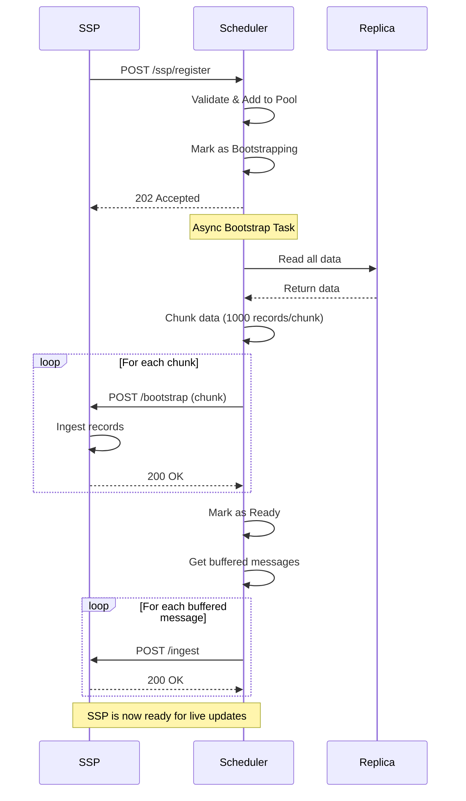

import CodeBlock from '../../components/ui/CodeBlock.astro';

The Scheduler is the central orchestrator that manages SSP sidecars and coordinates data distribution.

## Base URL

Default: `http://localhost:9667`

Configure via environment variables:
- `SPOOKY_SCHEDULER_INGEST_HOST` - Host to bind to (default: `0.0.0.0`)
- `SPOOKY_SCHEDULER_INGEST_PORT` - Port to bind to (default: `9667`)

## Authentication

Currently, the Scheduler API does not require authentication. Implement network-level security (firewalls, VPCs) to protect these endpoints.

---

## Data Ingestion

### POST /ingest

Ingest a record change from the database. This endpoint receives database events and broadcasts them to all ready SSP sidecars.

**Request Body:**

```json
{
  "table": "users",
  "op": "CREATE",
  "id": "user:123",
  "record": {
    "name": "Alice",
    "email": "alice@example.com"
  }
}
```

**Fields:**
- `table` (string, required) - Table name
- `op` (string, required) - Operation: `CREATE`, `UPDATE`, or `DELETE`
- `id` (string, required) - Record ID
- `record` (object, required) - Record data

**Response:**
- `200 OK` - Successfully ingested and broadcast to SSPs
- `400 Bad Request` - Invalid operation or malformed request
- `500 Internal Server Error` - Failed to apply to replica or broadcast

**Example:**

```bash
curl -X POST http://localhost:9667/ingest \
  -H "Content-Type: application/json" \
  -d '{
    "table": "users",
    "op": "CREATE",
    "id": "user:alice",
    "record": {"name": "Alice", "email": "alice@example.com"}
  }'
```

---

## Query Management

### POST /query/register

Register a new query with the scheduler. The scheduler will assign it to an SSP using the configured load balancing strategy.

**Request Body:**

```json
{
  "query_id": "query-123",
  "view_plan": {
    "id": "users_view",
    "tables": ["users"],
    "filter": {}
  },
  "metadata": {
    "user_id": "client-456"
  }
}
```

**Response:**
- `200 OK` - Query registered successfully
  ```json
  {
    "ssp_id": "ssp-primary-01",
    "ssp_url": "http://localhost:8667"
  }
  ```
- `503 Service Unavailable` - No SSPs available

**Example:**

```bash
curl -X POST http://localhost:9667/query/register \
  -H "Content-Type: application/json" \
  -d '{
    "query_id": "query-123",
    "view_plan": {"id": "users_view", "tables": ["users"]},
    "metadata": {"user_id": "client-456"}
  }'
```

### POST /query/unregister

Unregister a query from its assigned SSP.

**Request Body:**

```json
{
  "query_id": "query-123"
}
```

**Response:**
- `200 OK` - Query unregistered successfully
- `404 Not Found` - Query not found

---

## SSP Lifecycle Management

### POST /ssp/register

Register a new SSP sidecar with the scheduler. The scheduler will immediately mark the SSP as bootstrapping and begin sending replica data asynchronously.

**Request Body:**

```json
{
  "ssp_id": "ssp-primary-01",
  "url": "http://localhost:8667"
}
```

**Fields:**
- `ssp_id` (string, required) - Unique identifier for the SSP
- `url` (string, required) - HTTP URL of the SSP (must start with http:// or https://)

**Response:**
- `202 Accepted` - Registration accepted, bootstrap starting
- `400 Bad Request` - Invalid SSP ID (empty) or invalid URL format

**Flow:**
1. SSP sends registration request
2. Scheduler validates and adds SSP to pool
3. Scheduler marks SSP as "bootstrapping"
4. Scheduler spawns async task to send bootstrap chunks
5. Once bootstrap completes, scheduler marks SSP as "ready"
6. Buffered messages are replayed to SSP

**Example:**

```bash
curl -X POST http://localhost:9667/ssp/register \
  -H "Content-Type: application/json" \
  -d '{
    "ssp_id": "ssp-primary-01",
    "url": "http://localhost:8667"
  }'
```

### POST /ssp/heartbeat

Send a heartbeat from an SSP to maintain health status.

**Request Body:**

```json
{
  "ssp_id": "ssp-primary-01",
  "timestamp": 1707654321,
  "active_queries": 5,
  "cpu_usage": 45.2,
  "memory_usage": 512.5
}
```

**Fields:**
- `ssp_id` (string, required) - SSP identifier
- `timestamp` (number, required) - Unix timestamp in seconds
- `active_queries` (number, required) - Number of active queries/views
- `cpu_usage` (number, optional) - CPU usage percentage
- `memory_usage` (number, optional) - Memory usage in MB

**Response:**
- `200 OK` - Heartbeat accepted
- `404 Not Found` - SSP not registered (SSP should re-register)
- `409 Conflict` - Buffer overflow detected (SSP should re-bootstrap)

**Example:**

```bash
curl -X POST http://localhost:9667/ssp/heartbeat \
  -H "Content-Type: application/json" \
  -d '{
    "ssp_id": "ssp-primary-01",
    "timestamp": 1707654321,
    "active_queries": 5,
    "cpu_usage": 45.2,
    "memory_usage": 512.5
  }'
```

---

## Job Scheduling

### POST /job/schedule

Schedule a job to be executed on an SSP.

**Request Body:**

```json
{
  "job_id": "job:123",
  "table": "job",
  "record": {
    "id": "job:123",
    "status": "pending",
    "path": "/api/process",
    "body": {"data": "value"}
  }
}
```

**Response:**
- `200 OK` - Job scheduled successfully
- `503 Service Unavailable` - No SSPs available

---

## Monitoring

### GET /metrics

Get scheduler metrics and SSP pool status.

**Response:**

```json
{
  "scheduler": {
    "uptime_seconds": 3600,
    "replica_records": 1000,
    "replica_tables": 3
  },
  "ssp_pool": {
    "total_ssps": 2,
    "ready_ssps": 2,
    "bootstrapping_ssps": 0
  },
  "ssps": [
    {
      "id": "ssp-primary-01",
      "url": "http://localhost:8667",
      "state": "ready",
      "query_count": 5,
      "active_jobs": 2,
      "connected_seconds": 3550,
      "last_heartbeat_seconds": 2
    }
  ],
  "queries": {
    "total": 10,
    "by_ssp": {
      "ssp-primary-01": 5,
      "ssp-primary-02": 5
    }
  },
  "jobs": {
    "total": 3,
    "by_ssp": {
      "ssp-primary-01": 2,
      "ssp-primary-02": 1
    }
  }
}
```

**Example:**

```bash
curl http://localhost:9667/metrics
```

---

## Bootstrap Flow

When an SSP registers, the following bootstrap process occurs:



### Message Buffering

While an SSP is bootstrapping, the scheduler buffers incoming messages:
- Maximum buffer size: 1000 messages per SSP
- If buffer overflows: SSP marked for re-bootstrap, buffer cleared
- Heartbeat returns `409 Conflict` when buffer overflow occurs

---

## Configuration

Configure the scheduler via `spooky.yml` or environment variables:

```yaml
# Database connection
db:
  url: "ws://localhost:8000"
  namespace: "spooky"
  database: "spooky"
  username: "root"
  password: "root"

# Load balancing strategy
load_balance: "least_queries"  # Options: round_robin, least_queries, least_load

# SSP heartbeat monitoring
heartbeat_interval_ms: 5000
heartbeat_timeout_ms: 15000

# Bootstrap configuration
bootstrap_chunk_size: 1000

# Replica storage
replica_db_path: "./data/replica.db"
replica_keep_versions: 10

# Server configuration
ingest_host: "0.0.0.0"
ingest_port: 9667

# Job tables (tables that trigger job execution)
job_tables:
  - "job"
```

**Environment Variables:**

- `SPOOKY_SCHEDULER_DB_URL` - Database WebSocket URL
- `SPOOKY_SCHEDULER_DB_NAMESPACE` - Database namespace
- `SPOOKY_SCHEDULER_DB_DATABASE` - Database name
- `SPOOKY_SCHEDULER_LOAD_BALANCE` - Load balance strategy
- `SPOOKY_SCHEDULER_HEARTBEAT_INTERVAL_MS` - Heartbeat interval
- `SPOOKY_SCHEDULER_HEARTBEAT_TIMEOUT_MS` - Heartbeat timeout
- `SPOOKY_SCHEDULER_BOOTSTRAP_CHUNK_SIZE` - Bootstrap chunk size
- `SPOOKY_SCHEDULER_INGEST_HOST` - HTTP server host
- `SPOOKY_SCHEDULER_INGEST_PORT` - HTTP server port

---

## Error Handling

### Common Status Codes

- `200 OK` - Request successful
- `202 Accepted` - Request accepted for async processing
- `400 Bad Request` - Invalid request format or parameters
- `404 Not Found` - Resource not found (e.g., unregistered SSP)
- `409 Conflict` - State conflict (e.g., buffer overflow)
- `500 Internal Server Error` - Server error
- `503 Service Unavailable` - No SSPs available

### SSP Health Monitoring

The scheduler monitors SSP health via heartbeats:
- SSPs should send heartbeats every 5 seconds (configurable)
- Scheduler marks SSPs as stale after 15 seconds without heartbeat (configurable)
- Stale SSPs are removed from the pool
- Queries assigned to stale SSPs are reassigned to healthy SSPs
