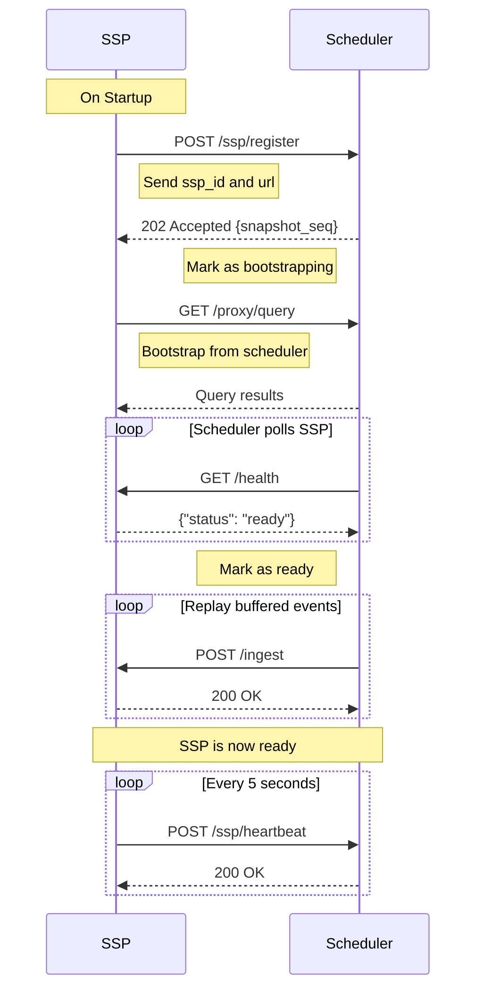

import CodeBlock from '../../components/ui/CodeBlock.astro';

The SSP (Spooky Sidecar Processor) is a stateful service that maintains materialized views and executes backend functions.

## Base URL

Default: `http://localhost:8667`

Configure via: `LISTEN_ADDR` environment variable

## Authentication

All endpoints (except `/health`, `/version`, and `/info`) require authentication via the `Authorization` header:

```
Authorization: Bearer <SPOOKY_AUTH_SECRET>
```

Set via `SPOOKY_AUTH_SECRET` environment variable.

---

## Data Ingestion

### POST /ingest

Process a single record update and propagate changes to affected views.

**Authentication:** Required

**Request Body:**

```json
{
  "table": "users",
  "op": "CREATE",
  "id": "user:123",
  "record": {
    "name": "Alice",
    "email": "alice@example.com"
  }
}
```

**Fields:**
- `table` (string, required) - Table name
- `op` (string, required) - Operation: `CREATE`, `UPDATE`, or `DELETE`
- `id` (string, required) - Record ID
- `record` (object, required) - Record data

**Response:**
- `200 OK` - Record ingested and views updated
- `400 Bad Request` - Invalid operation or malformed request
- `401 Unauthorized` - Missing or invalid authentication
- `503 Service Unavailable` - SSP is not in Ready state (`SSP_NOT_READY`)

**Example:**

```bash
curl -X POST http://localhost:8667/ingest \
  -H "Content-Type: application/json" \
  -H "Authorization: Bearer your-secret-token" \
  -d '{
    "table": "users",
    "op": "CREATE",
    "id": "user:alice",
    "record": {"name": "Alice", "email": "alice@example.com"}
  }'
```

**Job Processing:**

If the ingested table is configured as a job table and the record has `status: "pending"`, the SSP will automatically queue and execute the job.

---

## Bootstrap

### POST /bootstrap

Receive bootstrap data chunks from the scheduler during initial SSP registration.

**Authentication:** Required

**Request Body:**

```json
{
  "chunk_index": 0,
  "total_chunks": 5,
  "table": "users",
  "records": [
    ["user:1", {"name": "Alice", "email": "alice@example.com"}],
    ["user:2", {"name": "Bob", "email": "bob@example.com"}]
  ]
}
```

**Fields:**
- `chunk_index` (number, required) - Zero-based chunk index
- `total_chunks` (number, required) - Total number of chunks
- `table` (string, required) - Table name for these records
- `records` (array, required) - Array of `[record_id, record_data]` tuples

**Response:**
- `200 OK` - Chunk processed successfully
- `401 Unauthorized` - Missing or invalid authentication

**Example:**

```bash
curl -X POST http://localhost:8667/bootstrap \
  -H "Content-Type: application/json" \
  -H "Authorization: Bearer your-secret-token" \
  -d '{
    "chunk_index": 0,
    "total_chunks": 1,
    "table": "users",
    "records": [
      ["user:alice", {"name": "Alice"}],
      ["user:bob", {"name": "Bob"}]
    ]
  }'
```

**Notes:**
- Bootstrap is called by the scheduler during SSP registration
- The SSP processes each chunk sequentially
- After all chunks are received, the SSP is marked as "ready" by the scheduler
- Buffered messages are then replayed to bring the SSP fully up to date

---

## View Management

### POST /view/register

Register a new view (live query) with the SSP.

**Authentication:** Required

**Request Body:**

```json
{
  "id": "incantation:abc123",
  "surql": "SELECT * FROM users WHERE active = true",
  "clientId": "client-456",
  "ttl": "30s",
  "params": null,
  "lastActiveAt": "2024-01-01T00:00:00Z",
  "format": null
}
```

**Fields:**
- `id` (string, required) - Unique view identifier (e.g. `incantation:abc123`)
- `surql` (string, required) - SurrealQL query to materialize
- `clientId` (string, required) - Client identifier
- `ttl` (string, required) - Time-to-live for the view (e.g. `"30s"`)
- `params` (object, optional) - Query parameters
- `lastActiveAt` (string, optional) - ISO 8601 timestamp of last activity
- `format` (string, optional) - Response format

**Response:**
- `200 OK` - View registered, initial results returned
- `400 Bad Request` - Invalid view registration payload
- `401 Unauthorized` - Missing or invalid authentication
- `503 Service Unavailable` - SSP is not in Ready state (`SSP_NOT_READY`)

**Example:**

```bash
curl -X POST http://localhost:8667/view/register \
  -H "Content-Type: application/json" \
  -H "Authorization: Bearer your-secret-token" \
  -d '{
    "id": "incantation:abc123",
    "surql": "SELECT * FROM users WHERE active = true",
    "clientId": "client-456",
    "ttl": "30s"
  }'
```

### POST /view/unregister

Unregister a view and clean up associated resources.

**Authentication:** Required

**Request Body:**

```json
{
  "id": "users_view"
}
```

**Response:**
- `200 OK` - View unregistered
- `401 Unauthorized` - Missing or invalid authentication

**Example:**

```bash
curl -X POST http://localhost:8667/view/unregister \
  -H "Content-Type: application/json" \
  -H "Authorization: Bearer your-secret-token" \
  -d '{"id": "users_view"}'
```

---

## State Management

### POST /reset

Reset all SSP state (clear all views and data).

**Authentication:** Required

**Response:**
- `200 OK` - State reset successfully
- `401 Unauthorized` - Missing or invalid authentication

**Example:**

```bash
curl -X POST http://localhost:8667/reset \
  -H "Authorization: Bearer your-secret-token"
```

**Warning:** This is a destructive operation and cannot be undone.

---

## Monitoring & Debugging

### GET /health

Health check endpoint (no authentication required).

**Response:**
- `200 OK` - SSP is ready
  ```json
  {"status": "ready"}
  ```
- `503 Service Unavailable` - SSP is not ready
  ```json
  {"status": "bootstrapping"}
  ```

Possible status values: `"bootstrapping"`, `"ready"`, `"failed"`.

**Example:**

```bash
curl http://localhost:8667/health
```

### GET /version

Get SSP version information (no authentication required).

**Response:**
- `200 OK` - Version information
  ```json
  {
    "version": "0.1.0",
    "mode": "streaming"
  }
  ```

**Example:**

```bash
curl http://localhost:8667/version
```

### GET /info

Get entity information for this SSP (no authentication required).

**Response:**
- `200 OK` - Entity list
  ```json
  [{ "entity": "ssp", "id": "ssp-primary-01", "status": "ready", "views": 5 }]
  ```

**Example:**

```bash
curl http://localhost:8667/info
```

### GET /debug/view/:view_id

Get detailed information about a specific view for debugging.

**Authentication:** Required

**Parameters:**
- `view_id` (path parameter) - View identifier

**Response:**
- `200 OK` - View details
  ```json
  {
    "view_id": "users_view",
    "cache_size": 10,
    "last_hash": "abc123",
    "format": null,
    "cache": [...],
    "subquery_tables": ["users"],
    "referenced_tables": ["users"],
    "content_generation": 5,
    "subquery_cache": {}
  }
  ```
- `404 Not Found` - View not found
- `401 Unauthorized` - Missing or invalid authentication

**Example:**

```bash
curl http://localhost:8667/debug/view/users_view \
  -H "Authorization: Bearer your-secret-token"
```

### GET /debug/deps

Get dependency map for all views.

**Authentication:** Required

**Response:**
- `200 OK` - Dependency information
  ```json
  {
    "dependency_map": {},
    "tables_in_store": ["users", "posts"],
    "view_count": 5
  }
  ```
- `401 Unauthorized` - Missing or invalid authentication

**Example:**

```bash
curl http://localhost:8667/debug/deps \
  -H "Authorization: Bearer your-secret-token"
```

### POST /log

Receive logs from clients (for remote logging).

**Authentication:** Required

**Request Body:**

```json
{
  "message": "User action completed",
  "level": "info",
  "data": {
    "user_id": "123",
    "action": "click"
  }
}
```

**Fields:**
- `message` (string, required) - Log message
- `level` (string, optional) - Log level: `error`, `warn`, `info`, `debug`, `trace` (default: `info`)
- `data` (object, optional) - Additional structured data

**Response:**
- `200 OK` - Log received
- `401 Unauthorized` - Missing or invalid authentication

**Example:**

```bash
curl -X POST http://localhost:8667/log \
  -H "Content-Type: application/json" \
  -H "Authorization: Bearer your-secret-token" \
  -d '{
    "message": "User logged in",
    "level": "info",
    "data": {"user_id": "alice"}
  }'
```

---

## Scheduler Integration

When running with a scheduler, the SSP automatically:

### Registration Flow



### Heartbeat Loop

The SSP sends periodic heartbeats to the scheduler:

**Frequency:** Every 5 seconds (default, configurable via `HEARTBEAT_INTERVAL_MS`)

**Payload:**
```json
{
  "ssp_id": "ssp-primary-01",
  "timestamp": 1707654321,
  "views": 5,
  "cpu_usage": 45.2,
  "memory_usage": 512.5
}
```

**Response Handling:**
- `200 OK` - Heartbeat accepted, continue normal operation
- `404 Not Found` - Scheduler doesn't recognize SSP, trigger re-registration
- `409 Conflict` - Buffer overflow detected, trigger re-bootstrap
- Other errors - Log warning, continue sending heartbeats

---

## Configuration

Configure the SSP via environment variables:

### Core Configuration

```bash
# Server
LISTEN_ADDR=0.0.0.0:8667

# Authentication
SPOOKY_AUTH_SECRET=your-secret-token

# Database connection
SURREALDB_ADDR=127.0.0.1:8000
SURREALDB_USER=root
SURREALDB_PASS=root
SURREALDB_NS=test
SURREALDB_DB=test

# Job configuration
SPOOKY_CONFIG_PATH=spooky.yml

# TTL cleanup interval (seconds, default: 60)
TTL_CLEANUP_INTERVAL_SECS=60
```

### Scheduler Integration

```bash
# Scheduler URL (optional - enables scheduler integration)
SCHEDULER_URL=http://localhost:9667

# SSP identification (defaults to ssp-<uuid> if not set)
SSP_ID=ssp-primary-01

# Externally reachable address for this SSP (optional)
ADVERTISE_ADDR=http://ssp-01.example.com:8667

# Heartbeat configuration
HEARTBEAT_INTERVAL_MS=5000
```

### Job Configuration (`spooky.yml`)

```yaml
job_tables:
  backend_api:
    name: "Backend API"
    base_url: "https://api.example.com"
    auth_token: "your-api-token"
```

When a record is created in a job table with `status: "pending"`, the SSP will:
1. Extract the job details
2. Execute HTTP request to the backend
3. Update the job status based on response

---

## Standalone vs. Scheduler Mode

### Standalone Mode

When `SCHEDULER_URL` is not set:
- SSP runs independently
- No registration or heartbeat
- Direct client connections only
- Useful for development and single-SSP deployments

### Scheduler Mode

When `SCHEDULER_URL` is set:
- SSP registers with scheduler on startup
- Receives bootstrap data from scheduler
- Sends periodic heartbeats
- Receives data updates from scheduler
- Supports horizontal scaling with multiple SSPs

---

## Performance Considerations

### View Updates

- Views are updated incrementally when records change
- Only affected views are recomputed
- Edge updates are batched and written to SurrealDB

### State Persistence

- State is automatically saved with debouncing
- On startup, state is loaded from disk

### Memory Management

- Views store materialized results in memory
- Periodic metrics report memory usage
- Consider SSP resource limits when running multiple views

---

## Troubleshooting

### SSP Not Receiving Updates

1. Check scheduler connectivity:
   ```bash
   curl http://localhost:9667/metrics
   ```
2. Verify SSP appears in scheduler metrics with `state: "ready"`
3. Check SSP logs for heartbeat success messages
4. Verify authentication tokens match

### Bootstrap Failures

1. Check scheduler logs for bootstrap errors
2. Verify SSP `/bootstrap` endpoint is accessible
3. Check database connectivity from scheduler
4. Increase `bootstrap_chunk_size` if chunks are too large

### High Memory Usage

1. Review number of registered views
2. Check view complexity (joins, filters)
3. Monitor records per view via `/debug/view/:view_id`
4. Consider horizontal scaling with additional SSPs

### Job Execution Issues

1. Verify job table configuration in `spooky.yml`
2. Check job status updates in database
3. Review SSP logs for job execution errors
4. Verify backend API connectivity and authentication
