# Spooky Stream Processor (SSP) Server

The **SSP Server** (`apps/ssp`) is the specialized sidecar responsible for real-time stream processing, managing live views, and maintaining the graph-based cache in SurrealDB.

It acts as a bridge between SurrealDB's raw data events and the reactive `_spooky_query` graph.

## 🧠 Architecture & Communication Flow

The server maintains a **single persistent WebSocket connection** to SurrealDB for maximum efficiency.

```mermaid
sequenceDiagram
    participant Clients
    participant SSP as SSP Server (Sidecar)
    participant Engine as DBSP Engine (In-Memory)
    participant DB as SurrealDB

    Note over SSP, DB: persistent WebSocket connection (Shared Arc)

    %% Ingestion Flow
    rect rgb(20, 20, 20)
        Note right of Clients: 1. Data Change
        Clients->>SSP: POST /ingest (Payload)

        activate SSP
        SSP->>Engine: Ingest Record
        Engine-->>SSP: Computed Deltas (StreamingUpdate[])

        Note right of SSP: Batching Strategy
        SSP->>SSP: Batch all deltas into SINGLE transaction

        SSP->>DB: BEGIN TRANSACTION<br/>RELATE/UPDATE/DELETE edges<br/>COMMIT
        DB-->>SSP: OK

        SSP-->>Clients: 200 OK
        deactivate SSP
    end

    %% Registration Flow
    rect rgb(30, 25, 25)
        Note right of Clients: 2. View Registration
        Clients->>SSP: POST /view/register

        activate SSP
        SSP->>Engine: Register View
        Engine-->>SSP: Initial Snapshot (StreamingUpdate)

        SSP->>DB: UPSERT Metadata (1 Request)
        SSP->>DB: Transaction: Create Initial Edges (1 Request)

        SSP-->>Clients: 200 OK
        deactivate SSP
    end
```



## 🔌 Connection & Authentication

### 1. Database Connection

SSP establishes a **single, multiplexed WebSocket connection** to SurrealDB at startup. This connection is wrapped in an `Arc<Surreal<Client>>` to allow zero-copy sharing across all request handlers, ensuring high throughput and low resource usage.

- **Request**: `Connect + Signin + Use NS/DB`
- **Why**: Avoids handshake overhead for every ingestion request.

### 2. Sidecar Authentication

The SSP API itself is protected via a **Bearer Token** middleware.

- **Header**: `Authorization: Bearer <SPOOKY_AUTH_SECRET>`
- **Env Var**: `SPOOKY_AUTH_SECRET` must be set in the environment.

## ⚙️ Core Workflows & Performance

### Record Ingestion (`POST /ingest`)

This is the hottest path. Optimizations include:

1.  **In-Memory Processing**: The DBSP engine computes deltas in microseconds.
2.  **Batched Edge Updates**: If a single record change triggers 50 downstream view updates, SSP collects **all** resulting edge operations (`RELATE`, `UPDATE`, `DELETE`) and executes them in **one single database transaction**.
    - **Metric**: **1 Ingest Request = 1 DB Round-trip** (regardless of cascading complexity).

### View Registration (`POST /view/register`)

When a client subscribes to a live query:

1.  **Preparation**: SSP parses the query and parameters.
2.  **Engine Registration**: The engine registers the query and computes the _initial state_.
3.  **Metadata Upsert**: Saves view metadata (`clientId`, `ttl`, `sql`) to `_spooky_query`.
4.  **Initial Population**: Takes the initial snapshot and bulk-inserts edges in a single transaction.
    - **Metric**: **1 Registration = 2 DB Round-trips** (1 Metadata + 1 Edges).

## 💾 Persistence & Background Saving

SSP uses an asynchronous, debounced persistence strategy to ensure durability without blocking the main ingest loop.

### Mechanism

- **State File**: `data/spooky_state.json` (Configurable via `SPOOKY_PERSISTENCE_FILE`).
- **Trigger**: Every `ingest`, `register`, `unregister`, or `reset` marks the state as "dirty".
- **Debounce**: The background saver waits for **2 seconds** of inactivity before writing to disk. This prevents disk thrashing during high-load bursts.
- **Shutdown**: On `SIGINT` or `SIGTERM`, the server performs a forced synchronous save to ensure no data is lost.

```rust
// apps/ssp/src/background_saver.rs
// Simplified Logic:
loop {
    notify.notified().await;
    sleep(Duration::from_millis(2000)).await; // Debounce
    save_now(); // Dump memory to JSON
}
```

## 🚀 API Reference

### `POST /ingest`

Feed a data change into the engine.

```json
{
  "table": "user",
  "op": "CREATE",
  "id": "user:123",
  "record": { ... }
}
```

### `POST /view/register`

Register a live query.

```json
{
  "id": "hash...",
  "sql": "SELECT * FROM user",
  "params": {},
  "clientId": "uuid...",
  "ttl": "1h",
  "lastActiveAt": "..."
}
```

### `POST /view/unregister`

Remove a live query and clean up edges.

```json
{ "id": "hash..." }
```

### `POST /reset`

Wipe in-memory state and `_spooky_list_ref` edges. Useful for development/testing.
