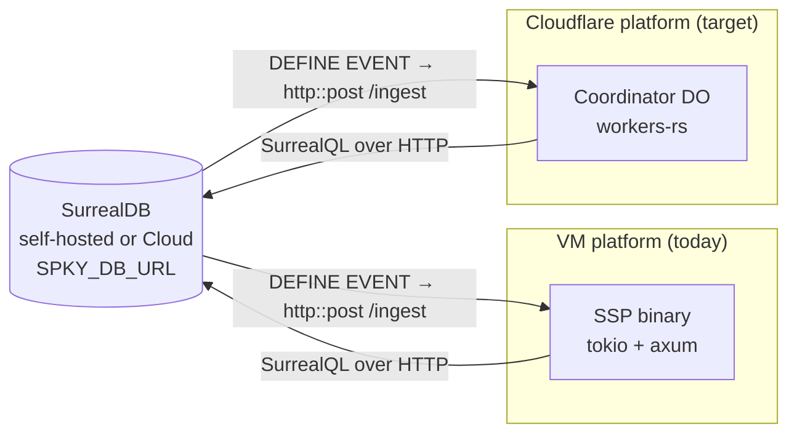
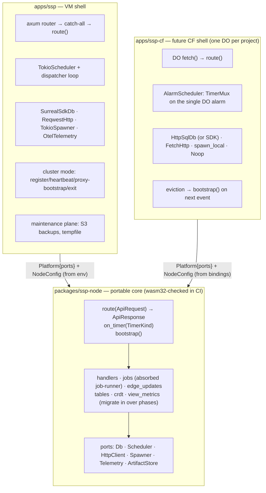
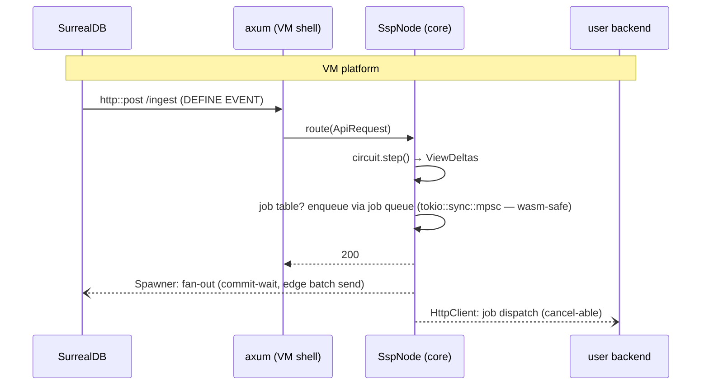
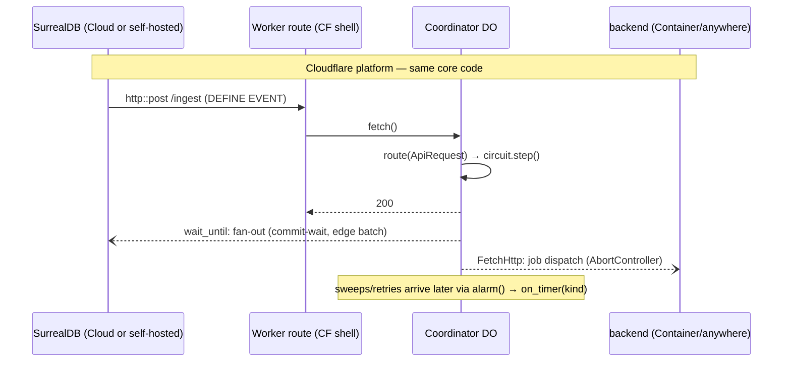

# Platform Architecture: One Data Plane, Two Runtimes

The SSP data plane runs on **either** a VM (the current tokio/axum binary) **or**
Cloudflare Workers (a workers-rs Durable Object) — and switching platform means
swapping an adapter layer, nothing else. This document is the design for that
boundary: what is portable, what isn't, the port traits that separate them, and
the migration path from today's code to the finished split.

Status: **phases 0–3 landed + handler migration underway** (`packages/ssp-node`
with `SspNode::route`, VM adapters, timer dispatcher, wasm gate). Migrated
routes: `/version`, `/log`, `/reset`, `/job/kill|retry|recover` — they already
compile for wasm32. Remaining in the shell: `/ingest`, `/view/*`,
`/crdt/apply`, `/debug/*`, `/health`, `/info`, `/backends`, `/backup/*`.

---

## 1. Why a platform boundary

Three earlier decisions make the SSP the natural portable unit:

- **The database is always external.** Every deployment gets a connection
  string (`SPKY_DB_URL`) — a self-hosted SurrealDB container, SurrealDB Cloud,
  anything reachable over HTTP. There is no embedded database on any platform,
  so the DB never constrains where the SSP runs.
- **Change detection is HTTP push, not a subscription.** The CLI-generated
  schema defines `DEFINE EVENT … http::post($sp00ky_endpoint + '/ingest')` on
  every table (`apps/cli/src/sp00ky.rs`). SurrealDB pushes each mutation to the
  SSP over plain HTTP — which works identically toward a VM port or a Workers
  route. No WebSockets exist anywhere in the data plane (all SDK connections
  use the HTTP engine).
- **The scheduler does not port.** `apps/scheduler` is the optional VM-only
  scale-out layer (multi-SSP registration, snapshot bootstrap, load balancing,
  fan-out). The unit that runs on Cloudflare is the **standalone SSP** — which,
  since the standalone-maintenance refactor, is fully self-sufficient (jobs,
  backups, backend health, `/health` aggregation). On Cloudflare it becomes one
  Durable Object per project (the "Coordinator").



## 2. The shape of the problem

The DBSP circuit — the actual sync engine — is already pure and wasm-proven
(`packages/ssp` runs in browsers via `packages/ssp-wasm`). What binds the SSP
to a VM is concentrated in the shell around it. Inventory of every
platform-coupled site (line numbers as of this writing):

| # | Site | Location | Kind |
|---|---|---|---|
| 1 | Job runner mpsc consumer | `packages/job-runner/src/runner.rs:66` | long-lived consumer task |
| 2 | Job retry backoff | `runner.rs:237` (spawn+sleep→re-send) | one-shot delayed |
| 3 | Job recovery sweep | `apps/ssp/src/lib.rs` (interval; standalone-only) | periodic |
| 4 | Edge-update flusher | `edge_updates.rs` (`select!` rx + interval) | consumer + periodic |
| 5 | TTL cleanup | `lib.rs` | periodic |
| 6 | DB token re-signin | `maintenance/src/db.rs::spawn_periodic_resignin` | periodic |
| 7 | Backend health monitor | `maintenance/src/backend_health.rs` | periodic |
| 8 | Bootstrap task (retry + sleep) | `lib.rs` | one-shot with sleeps |
| 9 | Heartbeat | `lib.rs` | periodic — **cluster-only, not ported** |
| 10 | Delayed job enqueue | `lib.rs` (spawn+sleep) | one-shot delayed |
| 11 | Ingest fan-out (commit-wait + edge send + metrics) | `lib.rs` | fire-and-forget, in-request |
| 12 | list_ref delete cleanups ×2 | `lib.rs` | fire-and-forget |
| 13 | Backup/restore workers | `maintenance` (tempfile + rust-s3) | VM-only for now |

Plus: axum types threaded through ~20 route handlers, `std::env` reads inside
handlers, `std::process::exit` self-heal paths, and `opentelemetry-otlp`
(tonic — not wasm-buildable).

Two facts shrink the problem dramatically:

- **`tokio::sync` is wasm32-safe.** `RwLock`, `mpsc`, `watch`, `Notify` all
  compile and run on wasm. Only `tokio::{spawn, time, net}` are off-limits.
  The circuit's `Arc<RwLock<Circuit>>` and the job queue survive unchanged.
- **Every `process::exit` is cluster-mode-only** (registration/heartbeat/hash
  verification against the scheduler). The portable standalone core needs no
  exit semantics — that glue stays in the VM shell forever.

## 3. Design: event-driven core + async ports

The core (`packages/ssp-node`) is **event-driven with exactly three
entrypoints** and never schedules itself:

```rust
impl SspNode {
    async fn route(&self, req: ApiRequest) -> ApiResponse;   // every HTTP entry
    async fn on_timer(&self, kind: TimerKind);               // every wakeup (re-arms itself)
    async fn bootstrap(&self) -> Result<(), BootstrapError>; // init / re-init
}
```

Everything platform-specific crosses a small set of **async port traits**
(§4). A shell implements the ports, bundles them into a
[`Platform`](../packages/ssp-node/src/platform.rs), and drives the three
entrypoints from its own runtime.

**Sans-io was considered and rejected.** A pure `handle() -> Vec<Effect>` core
is the theoretical ideal, but the SSP's handlers perform *data-dependent
multi-round-trip I/O* — bootstrap's keyset-paged table scan, the
commit-wait poll with backoff, register's ensure-tables → prepare → snapshot →
write sequence. Reifying those as resumable effect state machines means
rewriting the whole shell in one shot; async traits express the same logic
directly and migrate incrementally. The genuinely hard part (the circuit) is
already pure — what remains is I/O plumbing.

**The `?Send` wrinkle.** workers-rs futures wrap `JsFuture` and are `!Send`;
tokio wants `Send` so it can move futures across threads. Every port trait is
therefore declared with cfg-gated bounds:

```rust
#[cfg_attr(not(target_arch = "wasm32"), async_trait::async_trait)]
#[cfg_attr(target_arch = "wasm32", async_trait::async_trait(?Send))]
pub trait Db: MaybeSendSync { … }

// MaybeSendSync = `Send + Sync` on native, no bounds on wasm32.
```

## 4. The ports

Defined in `packages/ssp-node/src/ports/`. Five traits, one deferred trait,
and two plain structs that are deliberately *not* traits.

| Port | Core contract | VM adapter (`apps/ssp/src/adapters/`) | CF adapter (future `apps/ssp-cf`) |
|---|---|---|---|
| `Db` | `query(surql, binds) -> Vec<Json>` + `version()`; results use `into_json_value()` flattening | `SurrealSdkDb` over the SDK's HTTP engine | SDK-on-wasm (spike S1) **or** ~150-line `HttpSqlDb` against `POST /sql` |
| `Scheduler` | `schedule(TimerKind, at_epoch_ms)` one-shot, replace-on-reschedule; `cancel`; bounded `sleep` | `TokioScheduler`: one sleeping task per timer → mpsc → shell dispatcher | `AlarmScheduler`: [`TimerMux`](../packages/ssp-node/src/timers.rs) persisted in DO storage, muxed onto the single DO alarm |
| `HttpClient` | `send(OutboundRequest, Option<CancelWatch>)`, cancel **wins** the race | `ReqwestHttp` (reqwest + biased `select!`) | `Fetch` + `AbortController` |
| `Spawner` | fire-and-forget tails ONLY (ingest fan-out, cleanups, consumer start) | `TokioSpawner` | `spawn_local` / `ctx.wait_until` |
| `Telemetry` | counter / histogram / gauge facade | `OtelTelemetry` (wraps existing OTel instruments; OTLP/tonic stays in the shell) | `NoopTelemetry` → Workers Analytics later |
| `ArtifactStore` *(deferred)* | put/get/list/delete blobs | maintenance keeps tempfile + rust-s3 | R2 later; CF free tier punts backups to SurrealDB Cloud |
| `NodeConfig` *(struct)* | ALL config, constructor-injected; core reads env **zero** times | built from env (`load_config()`) | built from Worker bindings |
| Clock *(no trait)* | `web_time` (`Instant`/`SystemTime` drop-ins, proven in ssp-wasm); `ssp_node::now_epoch_ms()` | — | — |

### 4.1 Why `Db` is ours and not the surrealdb SDK

The SDK's wasm32 story is an unverified spike (S1). Making the SDK the
boundary bets the whole port on it; owning a narrow trait
(`query → flattened JSON`) makes a hand-rolled HTTP `/sql` adapter a drop-in
fallback. The JSON-flattening convention (`Value::into_json_value()`:
RecordIds/Datetimes as plain strings, no tagged enums) lives in one place —
`SurrealSdkDb::flatten_first` — shared by the port impl and the bootstrap
path so they can never drift.

### 4.2 Cancellation without `tokio_util`

`CancellationToken` + `DashMap` (today's `JobControl`) are not wasm-safe.
The portable pair is `CancelHandle`/`CancelWatch` over `tokio::sync::watch`
(wasm-safe), preserving exact semantics: `HttpClient::send` races the request
against the watch with cancel-wins ordering, mirroring the job runner's
`select! { biased; cancel.cancelled(), send_fut }` kill path. `JobControl`
itself becomes `Arc<std::sync::Mutex<ControlInner>>` in Phase 2 — on the
single-threaded DO the mutex never contends; on the VM nothing changes.

## 5. Component view



**The symmetry that makes this safe: DO eviction ≡ VM process restart.** Both
lose in-memory state (circuit, in-flight jobs) and both are healed the same
way — `bootstrap()` rebuilds the circuit from the external DB, and the
recovery sweep re-picks pending job rows whose deadline checks live **in
SurrealQL, not host time**. No new durability mechanism is needed for
Cloudflare; the design rule is to keep it that way (never compare deadlines
against host clocks — always `time::now()` in the query).

## 6. Request flow: ingest on each platform





## 7. Timers: many logical, one physical

A Durable Object has exactly **one** alarm. The node has eight logical timer
kinds. `TimerKind` (serde, durable) + `TimerMux` (pure, unit-tested today in
`packages/ssp-node/src/timers.rs`) bridge the gap:

```mermaid
flowchart LR
    subgraph Logical["TimerKind (durable data)"]
        A[JobRecoverySweep]
        B[TtlCleanup]
        C[EdgeFlush]
        D[BackendHealth]
        E[DbResignin]
        F["DelayedJob{id}"]
        G["JobRetry{id}"]
        H["BootstrapRetry{attempt}"]
    end
    MUX["TimerMux<br/>(kind → due_at) table<br/>replace-on-reschedule<br/>persisted in DO storage"]
    ALARM["DO set_alarm(next_deadline)"]
    Logical --> MUX --> ALARM
    ALARM -- "alarm() fires" --> POP["pop_due(now) → on_timer(kind) each<br/>handlers re-arm → re-set alarm"]
```



| TimerKind | Replaces (VM site #, §2) | Re-arm cadence | Status |
|---|---|---|---|
| `JobRecoverySweep` | 3 | `JOB_RECOVERY_INTERVAL_SECS` | ✅ dispatcher |
| `TtlCleanup` | 5 | `ttl_cleanup_interval_secs` | ✅ dispatcher |
| `BackendHealth` | 7 | `health_check_interval_secs` | ✅ dispatcher |
| `DbResignin` | 6 | `RESIGNIN_INTERVAL_SECS` | ✅ dispatcher |
| `EdgeFlush` | 4 | — | superseded, see below |
| `DelayedJob{id}` | 10 | one-shot | `Spawner` + port `sleep` (sweep backstop) |
| `JobRetry{id}` | 2 | one-shot per backoff step | `Spawner` + port `sleep` (sweep backstop) |
| `BootstrapRetry{attempt}` | 8 | one-shot per attempt | shell bootstrap task |

Recurring behavior is **not** a scheduler feature — a periodic task re-arms
its own kind inside `on_timer`. On the VM, the shell's **timer dispatcher**
(one task draining the `TokioScheduler` mpsc) plays the role of `on_timer`:
match on the kind, run the sweep, re-arm. The CF shell replays the identical
kinds from its single DO alarm.

**Edge flush (site 4) resolved without a timer kind:** the flusher's consumer
loop is already portable (channel receives are `tokio::sync`), so its 100 ms
window now rides `Scheduler::sleep` inside the loop — pinned across receives
so a steady stream can't starve the flush. No alarm involved on either
platform, which also retires spike S3's granularity concern for the common
case (the DO variant spawns the same loop via `wait_until`/`spawn_local`).

**Delayed jobs / retry backoff** stay `Spawner` + port-`sleep` one-shots
rather than durable timers: a lost sleep (crash, eviction) is healed by the
recovery sweep, whose due-checks live in SurrealQL — the durable `DelayedJob`/
`JobRetry` kinds remain reserved for a CF shell that prefers alarms over
long-lived `wait_until` futures.

## 8. Crate layout & the shared HTTP surface

| Crate | Role |
|---|---|
| `packages/ssp-node` **(landed)** | portable core: ports, `NodeConfig`, `TimerKind`+`TimerMux`, `ApiRequest/Response` + `RouteId`; handler logic migrates in over the phases |
| `packages/ssp`, `ssp-protocol` | already pure; core deps |
| `packages/job-runner` | absorbed into `ssp-node::jobs` in Phase 2 (`apps/ssp` is its only consumer; avoids a dep cycle — ingest needs `JobEntry`, the runner needs the ports) |
| `packages/maintenance` | VM-only maintenance plane; re-plumbed onto `ArtifactStore` later |
| `apps/ssp` | VM shell: axum + `src/adapters/*` + cluster-mode glue + OTLP + maintenance wiring + env→`NodeConfig` |
| `apps/scheduler` | VM-only scale-out; untouched |
| `apps/ssp-cf` *(future)* | workers-rs DO shell; **not** a workspace member (workers-rs doesn't build natively) — portability is enforced meanwhile by the gate below |

**Portability gate:** `scripts/check-portability.sh` →
`cargo check -p ssp-node --target wasm32-unknown-unknown`. Green from day one
(including the full `ssp` circuit). Run it in CI on every change.

**Shared route table.** Both shells expose the same ~20 routes. The table
lives once, in the core (`ssp_node::RouteId::match_path`), including the
auth split (bearer vs public+CORS). The VM shell migrates by mounting the core
as an axum **catch-all fallback**: migrated routes fall through to
`node.route()`, unmigrated ones stay on their axum handlers — every
intermediate commit is green, and at the end the axum layer is a thin
byte-shuffler. Auth becomes a compare against `NodeConfig.auth_secret`
(killing today's per-request `env::var`).

## 9. Migration phases (each ends green)

| Phase | Work | Status |
|---|---|---|
| 0 | `ssp-node` skeleton: ports, `TimerKind`+`TimerMux`, `NodeConfig`, `RouteId`, VM adapters wired onto `AppState`, wasm gate | ✅ landed |
| 1 | Config/telemetry/Db behind ports: kill remaining in-handler `env::var`s, route handler DB calls through `Platform.db` | ✅ landed (config + job-path DB calls; remaining handler DB calls move with Phase 4) |
| 2 | Absorb job-runner into `ssp-node::jobs`; rework `JobControl` (std Mutex + watch); job dispatch via `HttpClient` | ✅ landed |
| 3 | Convert the interval loops + spawn+sleep sites to the Scheduler/Spawner ports (VM timer dispatcher replaces per-loop tasks; edge flush via port-sleep) | ✅ landed |
| 4 | Move handlers into the core (axum catch-all fallback) | ✅ DONE — every SSP route incl. `/ingest` lives in `SspNode::route`. The shell axum router is empty (pure `node_fallback` adapter). Shared DB-helper layer (`tables`/`edges`/`crdt`/`view_metrics`) ported onto the `Db` port + mem-db validated. `/backup/*` stays VM-only (maintenance plane). |
| 5 | Spikes S1–S3, then `apps/ssp-cf`: DO shell + `AlarmScheduler` + `FetchHttp` + deploy pipeline | |
| 6 | Maintenance on `ArtifactStore` (R2) if CF-side backups are ever needed | |

## 10. Spikes & risks

**Spikes (gate Phase 5):**

- **S1 — surrealdb SDK on wasm32.** The SDK's HTTP engine over reqwest's fetch
  backend inside a DO. Pass → `Db` adapter is a thin wrapper; fail → write
  `HttpSqlDb` (~150 lines against `POST /sql` + NS/DB headers).
- **S2 — SurrealDB Cloud outbound `http::post`.** The change-push relies on
  `DEFINE EVENT … http::post()` egress. Self-hosted: `--allow-net`. Cloud:
  verify the capability is allowed (and its latency/ordering). Fallback:
  alarm-driven outbox polling — works, with a latency floor.
- **S3 — alarm granularity vs the 100 ms edge-flush window** (§7 caveat).

**Risks:**

| Risk | Mitigation |
|---|---|
| DO CPU limit vs bootstrap of large tables | keyset paging already bounds each step; continue bootstrap across alarms if needed |
| Single-DO throughput ceiling (~1k req/s) vs VM multi-core | free/small tiers only on CF; scale tier stays VM + scheduler |
| `Circuit` memory vs DO 128 MB | project-size quota on the CF tier; circuit stores deltas compactly |
| SDK auth-token refresh on CF | `DbResignin` timer kind exists on both platforms; or per-request signin in the CF adapter |
| Push delivery has no retry (DEFINE EVENT fire-and-forget) | unchanged from today; recovery sweep + SQL-side deadlines are the backstop on both platforms |

---

*Related docs:* [`ssp-app.md`](ssp-app.md) (VM SSP internals),
[`ssp-wasm.md`](ssp-wasm.md) (browser circuit — proof the core is portable),
`spooky-cloud/docs/13-cloudflare-platform-plan.md` (control-plane side: how
deployments target the CF platform).
