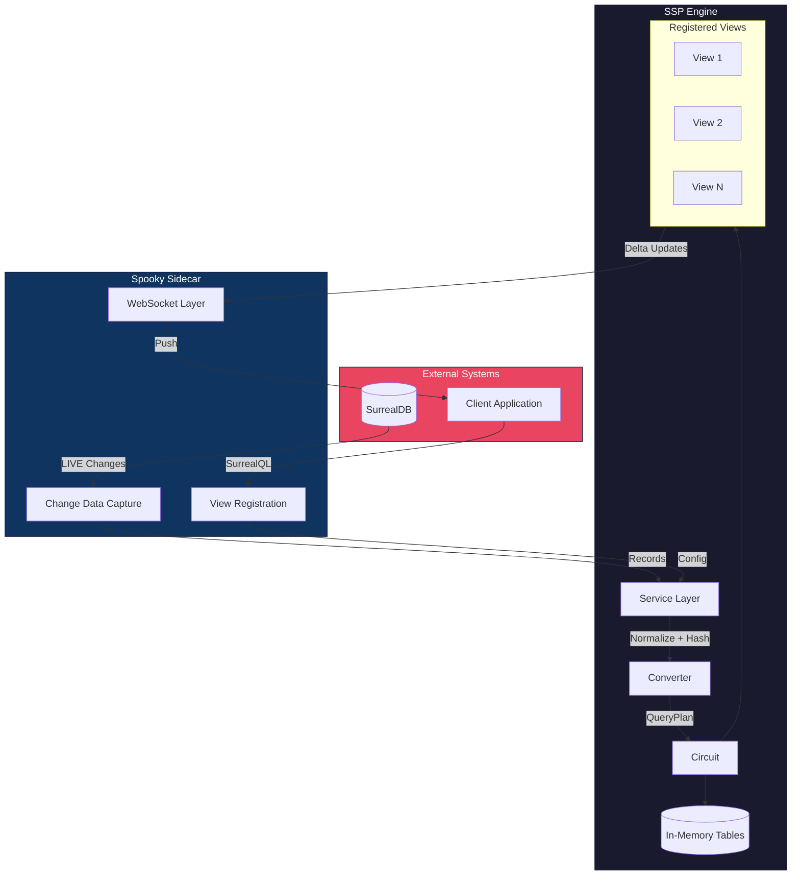
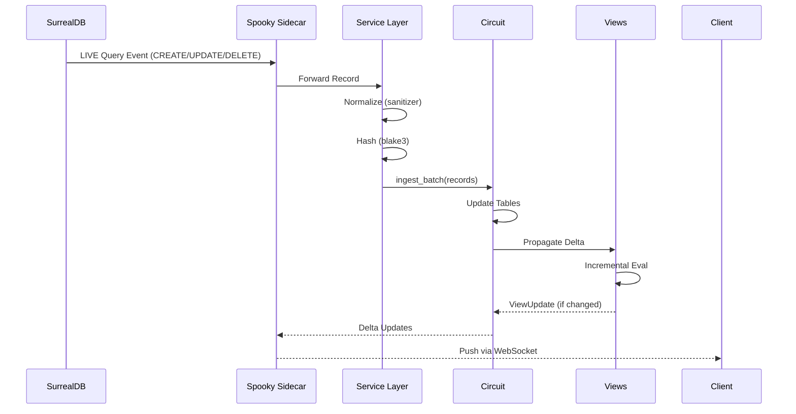
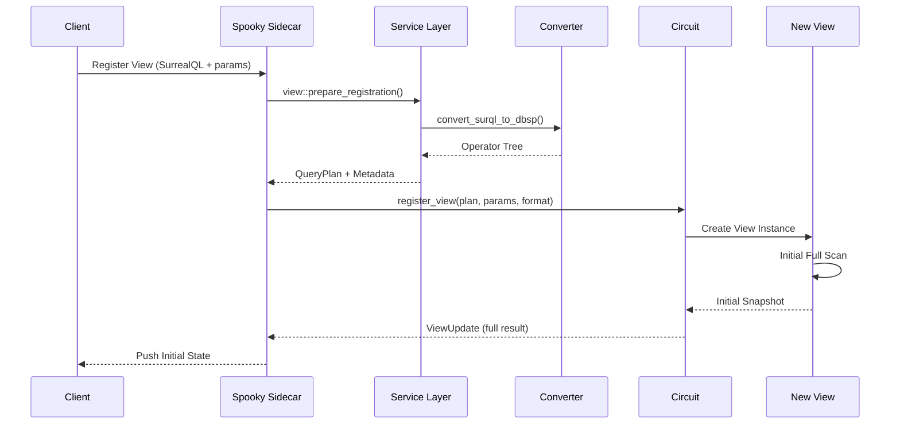
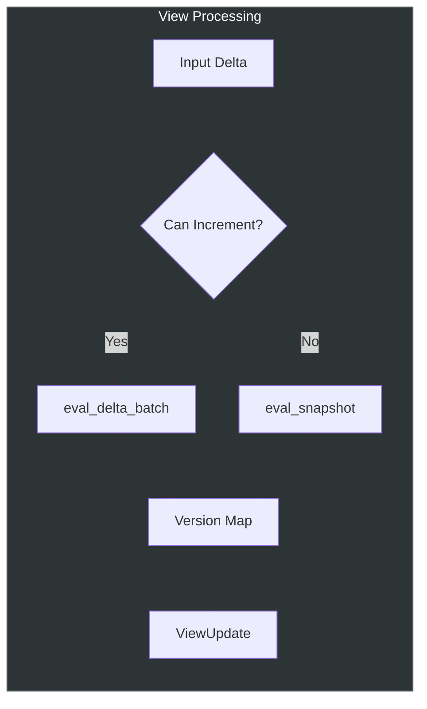
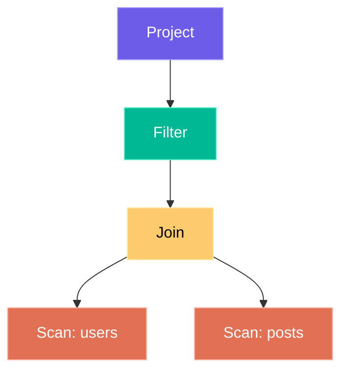
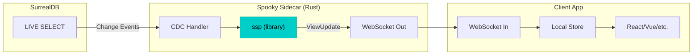

# SSP – Spooky Stream Processor

<div align="center">

**High-performance incremental materialized views for real-time applications.**

[](https://www.rust-lang.org/)
[](https://surrealdb.com/)

</div>

---

## Overview

SSP (Spooky Stream Processor) is an incremental view maintenance engine. It converts **SurrealQL queries** into internal operator graphs and maintains **materialized views** that update in real-time as data changes—pushing only deltas instead of recomputing entire query results.

SSP powers the reactive layer of the Spooky ecosystem, sitting between **SurrealDB** (or any data source) and your application via the **Spooky Sidecar**.

---

## Architecture



---

## Data Flow

### 1. Record Ingestion Pipeline



### 2. View Registration Pipeline



---

## Core Components

### Circuit

The central coordinator managing tables and views. Handles record ingestion and propagates changes to affected views.

```rust
use ssp::{Circuit, StreamProcessor};

let mut circuit = Circuit::new();

// Register a view
circuit.register_view(plan, params, Some(ViewResultFormat::Flat));

// Ingest data
let updates = circuit.ingest_batch(records, false);
```

### View

Maintains a single materialized view. Performs incremental delta evaluation when possible, falling back to full scans when necessary.



### QueryPlan & Operator Tree

A query is represented as a tree of operators:



**Supported Operators:**

| Operator | Description |
|----------|-------------|
| `Scan` | Read from a table |
| `Filter` | Apply predicates |
| `Project` | Select/transform fields |
| `Join` | Combine tables (inner, left) |
| `OrderBy` | Sort results |
| `Limit` | Restrict result count |
| `Aggregate` | SUM, COUNT, AVG, MIN, MAX |

---

## Example: Real-Time Todo App

### 1. Register a View

```json
{
  "id": "user_todos_active",
  "clientId": "client_abc123",
  "surrealQL": "SELECT * FROM todos WHERE user_id = $user_id AND completed = false ORDER BY created_at DESC LIMIT 50",
  "params": { "user_id": "user:alice" },
  "ttl": "1h",
  "lastActiveAt": "2026-01-17T16:30:00Z"
}
```

The Converter transforms this into:

```rust
QueryPlan {
    id: "user_todos_active",
    root: Operator::Limit {
        count: 50,
        input: Box::new(Operator::OrderBy {
            specs: vec![OrderSpec { field: "created_at", desc: true }],
            input: Box::new(Operator::Filter {
                predicate: Predicate::And(vec![
                    Predicate::Eq { field: "user_id", value: "$user_id" },
                    Predicate::Eq { field: "completed", value: false }
                ]),
                input: Box::new(Operator::Scan { table: "todos" })
            })
        })
    }
}
```

### 2. Ingest a New Todo

```rust
let record = json!({
    "id": "todos:xyz123",
    "user_id": "user:alice",
    "title": "Buy milk",
    "completed": false,
    "created_at": "2026-01-17T16:35:00Z"
});

// Prepare and ingest
let (spooky_value, hash) = ssp::service::ingest::prepare(record);
let updates = circuit.ingest_record("todos", "CREATE", "todos:xyz123", record, &hash, false);
```

### 3. Receive Delta Update

```json
{
  "format": "streaming",
  "view_id": "user_todos_active",
  "records": [
    { "id": "todos:xyz123", "event": "created", "version": 1 }
  ]
}
```

---

## Output Formats

| Format | Description | Use Case |
|--------|-------------|----------|
| `Flat` | `[(id, version), ...]` with result hash | Simple reconciliation |
| `Streaming` | Delta events (created/updated/deleted) | Real-time UI updates |
| `Tree` | Hierarchical structure (planned) | Nested data display |

---

## Integration with Spooky Sidecar



The Sidecar uses SSP as a library:

```rust
// In spooky-sidecar
use ssp::{Circuit, StreamProcessor, service};

let mut circuit = Circuit::new();

// On view registration request
let reg_data = service::view::prepare_registration(config)?;
circuit.register_view(reg_data.plan, reg_data.safe_params, Some(format));

// On SurrealDB LIVE event
let (value, hash) = service::ingest::prepare(record);
let updates = circuit.ingest_record(table, op, id, record, &hash, is_optimistic);

// Broadcast updates to clients
for update in updates {
    websocket.send(update).await?;
}
```

---

## Performance Optimizations

| Optimization | Impact |
|--------------|--------|
| **Incremental Delta Evaluation** | Only recomputes affected rows |
| **Dependency Graph** | O(1) view lookup by affected table |
| **FxHash (rustc-hash)** | 2-3x faster internal hashing |
| **SmolStr** | Zero-alloc for short identifiers |
| **Blake3** | Fast cryptographic hashing for record fingerprints |
| **Rayon (optional)** | Parallel batch preparation on native targets |
| **mimalloc** | Optimized allocator for non-WASM builds |

---

## WASM Support

SSP compiles to WebAssembly for browser-based processing:

```toml
[target.'cfg(target_arch = "wasm32")'.dependencies]
getrandom = { version = "0.2", features = ["js"] }
web-sys = { version = "0.3", features = ["console"] }
```

Disable parallel features for WASM:

```bash
cargo build --target wasm32-unknown-unknown --no-default-features
```

---

## Module Structure

```
ssp/
├── src/
│   ├── lib.rs           # Public API: StreamProcessor trait
│   ├── converter.rs     # SurrealQL → Operator tree
│   ├── sanitizer.rs     # Input normalization
│   ├── service.rs       # High-level ingest/view helpers
│   ├── logging.rs       # Debug utilities
│   └── engine/
│       ├── circuit.rs   # Core coordinator
│       ├── view.rs      # View logic & incremental eval
│       ├── update.rs    # Output formatting (Flat/Streaming)
│       ├── operators/   # Operator definitions
│       ├── types/       # SpookyValue, ZSet, FastMap
│       └── eval/        # Predicate evaluation, hashing
└── tests/
    ├── benchmark.rs
    └── ...
```

---

## License

MIT © Spooky Project
