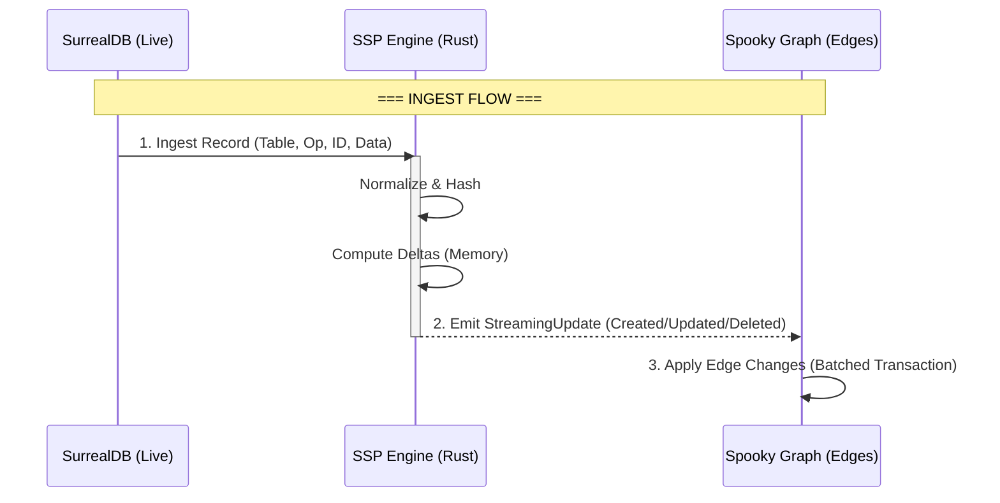

# SSP – Spooky Stream Processor

**High-performance incremental view maintenance engine for Spooky.**

---

## Overview

SSP (Spooky Stream Processor) is the core engine that powers the **Spooky Sidecar**. It maintains materialized views in real-time by processing a stream of data changes (Ingest) and outputting a stream of view updates (Deltas).

It is designed for:
1.  **Low Latency:** Microsecond-level delta computation.
2.  **Deep Reactivity:** Handles nested subqueries and joins recursively.
3.  **Efficiency:** Only emits what changed (Created, Updated, Deleted).

---

## ⚡️ Key Features

### 1. Streaming-First Architecture
Unlike traditional materialized views that rebuild or snapshot data, SSP emits **Delta Events**. This allows the consumer (Sidecar) to patch the materialized state (Graph Edges) with minimal overhead.

### 2. Deep Subquery Collection
The engine intelligently tracks dependencies across joins and subqueries.
- If `Thread -> Author -> Role` changes, SSP knows which `Thread` views need updating.
- Recursively collects "Created" events for subquery records when a main record is added.

### 3. Batched Ingestion & Zero-Copy
- **Batched Ingest:** Process multiple records at once (`ingest_batch`) to amortize dirty-checking costs.
- **Batched Output:** Returns a vector of `ViewUpdate`s that can be executed in a single DB transaction.

---

## 🔄 Data/Communication Flow



---

## 📦 Traffic Objects

### 1. Ingest Input

The engine accepts a standardized ingest payload:

```rust
circuit.ingest_record(
    table: &str,          // "thread"
    op: &str,             // "CREATE", "UPDATE"
    id: &str,             // "thread:123"
    record: Value,        // Full JSON
    hash: &str,           // Blake3 hash
    is_optimistic: bool,  // Version increment strategy
) -> Vec<ViewUpdate>
```

### 2. Streaming Output (`ViewUpdate::Streaming`)

The primary output format is a list of granular change events:

```rust
pub struct StreamingUpdate {
    pub view_id: String,     // The hash of the view query
    pub records: Vec<DeltaRecord>,
}

pub struct DeltaRecord {
    pub id: String,          // "thread:123"
    pub event: DeltaEvent,   // Created | Updated | Deleted
    pub version: u64,        // New version number
}
```

### 3. Event Semantics

| Event     | Meaning | Action in DB |
| :--- | :--- | :--- |
| `Created` | Record entered the view | `RELATE _incantation->_ref->record` |
| `Updated` | Record changed but stayed in view | `UPDATE edge SET version = N` |
| `Deleted` | Record exited the view | `DELETE edge` |

---

## 🛠 Usage Example

```rust
use ssp::{Circuit, ViewResultFormat};

// 1. Initialize Circuit
let mut circuit = Circuit::new();

// 2. Register a View (e.g. "Active Threads")
// The engine returns the INITIAL snapshot as "Created" events
let initial_update = circuit.register_view(
    plan, 
    params, 
    Some(ViewResultFormat::Streaming)
);

// 3. Ingest Data Changes
let updates = circuit.ingest_record(
    "thread",
    "UPDATE",
    "thread:123",
    json!({ "active": false }), 
    "hash_123",
    true 
);

// 4. Handle Deltas
for update in updates {
    if let ViewUpdate::Streaming(stream) = update {
        println!("View {} changed:", stream.view_id);
        for rec in stream.records {
            println!(" - {:?} {} (v{})", rec.event, rec.id, rec.version);
        }
    }
}
```

---

## 🧩 Module Structure

- **`engine/`**: Core DBSP logic.
    - `circuit.rs`: Main entry point, orchestrates ingestion.
    - `view.rs`: Recursive delta evaluation and subquery handling.
    - `update.rs`: Output formatting types.
- **`converter/`**: Transforms SurrealQL into Operator Trees.
- **`service/`**: Helpers for hashing and normalization.

---

## 🧪 Testing

The engine is tested with a comprehensive suite of unit and integration tests:

```bash
# Run core regression suite
cargo test

# Run deep subquery verification
cargo test --test improved_changes_test
```
