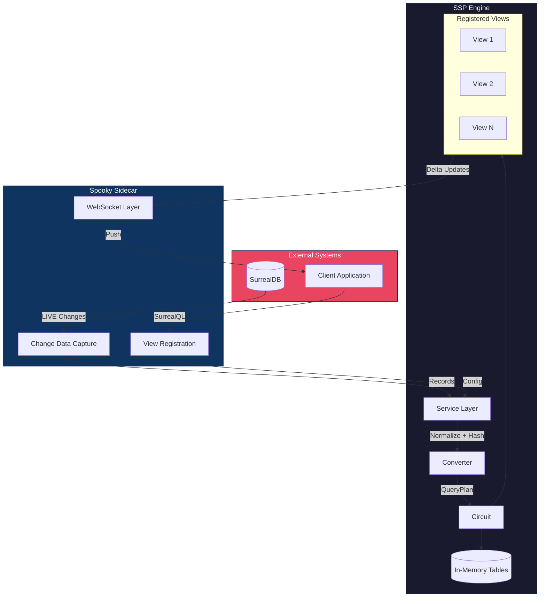
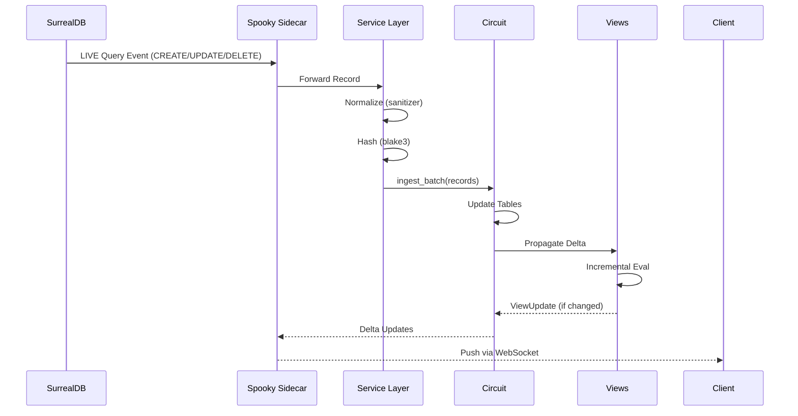
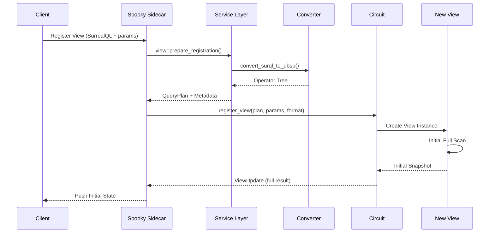
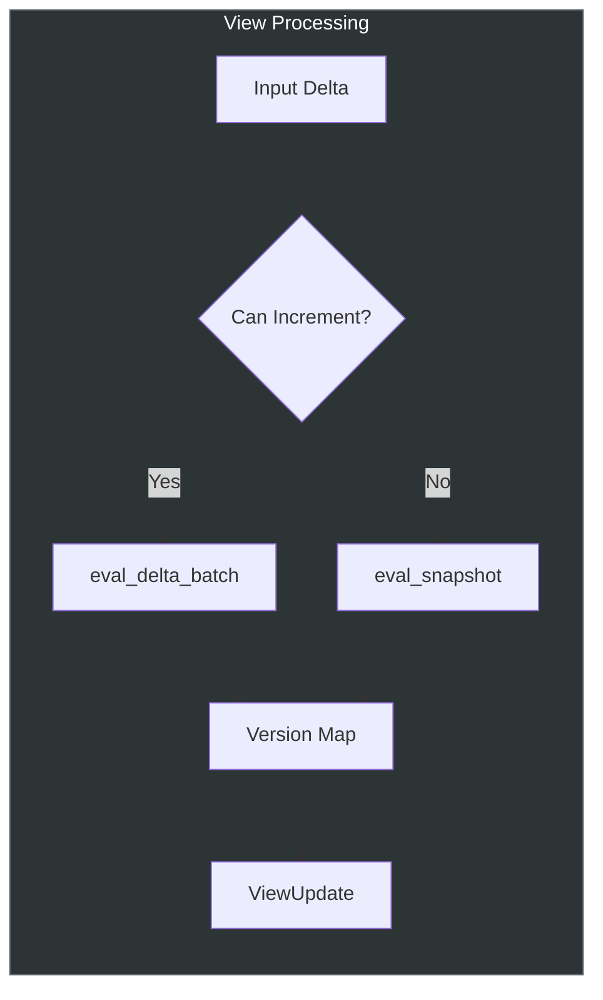
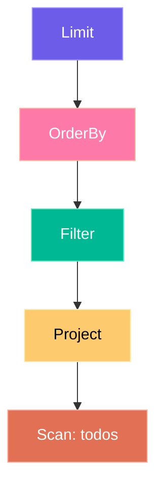
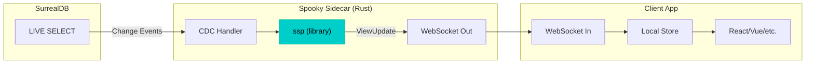

# SSP – Spooky Stream Processor

<div align="center">

**High-performance incremental materialized views for real-time applications.**

[](https://www.rust-lang.org/)
[](https://surrealdb.com/)

</div>

---

## Overview

SSP (Spooky Stream Processor) is an incremental view maintenance engine written in Rust. It converts **SurrealQL queries** into internal operator graphs and maintains **materialized views** that update in real-time as data changes—pushing only deltas instead of recomputing entire query results.

SSP powers the reactive layer of the Spooky ecosystem, sitting between **SurrealDB** (or any data source) and your application via the **Spooky Sidecar**.

---

## Features

- **Incremental Delta Evaluation** – Only recomputes affected rows when data changes
- **Multiple Output Formats** – Flat snapshots, streaming deltas, or tree structures
- **Version Tracking** – Built-in versioning for optimistic updates and conflict resolution
- **WASM Support** – Compiles to WebAssembly for browser-based processing
- **High Performance** – FxHash, SmolStr, Blake3, and optional Rayon parallelization

---

## Architecture



---

## Data Flow

### Record Ingestion Pipeline



### View Registration Pipeline



---

## Core Components

### Circuit

The central coordinator managing tables and views. Handles record ingestion and propagates changes to affected views using an optimized dependency graph for O(1) view lookup by affected table.

```rust
use ssp::{Circuit, StreamProcessor};

let mut circuit = Circuit::new();

// Register a view
circuit.register_view(plan, params, Some(ViewResultFormat::Streaming));

// Ingest data – returns updates for affected views
let updates = circuit.ingest_batch(records, false);
```

**Key Methods:**

| Method | Description |
|--------|-------------|
| `new()` | Create a new Circuit instance |
| `register_view(plan, params, format)` | Register a view and get initial snapshot |
| `unregister_view(id)` | Remove a view by ID |
| `ingest_record(table, op, id, record, hash, is_optimistic)` | Ingest a single record |
| `ingest_batch(batch, is_optimistic)` | Ingest multiple records efficiently |
| `rebuild_dependency_graph()` | Rebuild internal dependency cache (called automatically) |

### View

Maintains a single materialized view. Performs incremental delta evaluation when possible, falling back to full scans when necessary (e.g., for subquery changes or first run).



### QueryPlan & Operator Tree

A query is represented as a tree of operators parsed from SurrealQL:

```rust
#[derive(Serialize, Deserialize, Clone, Debug)]
pub struct QueryPlan {
    pub id: String,
    pub root: Operator,
}
```



**Supported Operators:**

| Operator | Description | Example |
|----------|-------------|---------|
| `Scan` | Read from a table | `SELECT * FROM todos` |
| `Filter` | Apply predicates | `WHERE completed = false` |
| `Project` | Select/transform fields | `SELECT id, title` |
| `Join` | Combine tables (inner) | `WHERE author = user.id` |
| `Limit` | Restrict result count with optional ordering | `ORDER BY created_at DESC LIMIT 50` |

**Supported Predicates:**

| Predicate | Description |
|-----------|-------------|
| `Eq` | Equality (`=`) |
| `Neq` | Not equal (`!=`) |
| `Gt` / `Gte` | Greater than / Greater or equal |
| `Lt` / `Lte` | Less than / Less or equal |
| `Prefix` | String prefix match |
| `And` / `Or` | Logical combinators |

---

## Type System

### SpookyValue

SSP uses its own optimized value type instead of `serde_json::Value` for better performance:

```rust
pub enum SpookyValue {
    Null,
    Bool(bool),
    Number(f64),
    Str(SmolStr),           // Zero-alloc for short strings
    Array(Vec<SpookyValue>),
    Object(FastMap<SmolStr, SpookyValue>),
}
```

### ZSet (Z-Set)

The fundamental data structure for incremental computation—a map from row keys to weights:

```rust
pub type RowKey = SmolStr;
pub type Weight = i64;
pub type ZSet = FastMap<RowKey, Weight>;
```

- **Weight > 0**: Record exists (created/updated)
- **Weight < 0**: Record removed (deleted)
- **Weight = 0**: No net change (auto-removed from set)

---

## Service Layer

The service layer provides high-level helpers for common operations:

### Record Ingestion

```rust
use ssp::service::ingest;

// Prepare a record (normalize + hash)
let (spooky_value, hash) = ingest::prepare(record);

// Prepare without normalization (faster, use with trusted input)
let (spooky_value, hash) = ingest::prepare_fast(record);

// Batch preparation (parallel on native, sequential on WASM)
let prepared = ingest::prepare_batch(records);
```

### View Registration

```rust
use ssp::service::view;

let config = json!({
    "id": "user_todos",
    "clientId": "client_abc",
    "surrealQL": "SELECT * FROM todos WHERE user_id = $user_id",
    "params": { "user_id": "user:alice" },
    "ttl": "1h",
    "lastActiveAt": "2025-01-17T16:30:00Z",
    "format": "streaming"  // Optional: flat, streaming, or tree
});

let reg_data = view::prepare_registration(config)?;
// reg_data.plan      - QueryPlan ready for registration
// reg_data.safe_params - Sanitized parameters
// reg_data.metadata  - Original config data
// reg_data.format    - Parsed ViewResultFormat
```

---

## Output Formats

| Format | Enum Value | Description | Use Case |
|--------|------------|-------------|----------|
| **Flat** | `ViewResultFormat::Flat` | `[(id, version), ...]` with result hash | Simple reconciliation, polling |
| **Streaming** | `ViewResultFormat::Streaming` | Delta events (created/updated/deleted) | Real-time UI updates |
| **Tree** | `ViewResultFormat::Tree` | Hierarchical structure (planned) | Nested data display |

### Flat Output

```rust
pub struct MaterializedViewUpdate {
    pub query_id: String,
    pub result_hash: String,              // Blake3 hash of result
    pub result_data: Vec<(String, u64)>,  // [(record_id, version), ...]
}
```

### Streaming Output

```rust
pub struct StreamingUpdate {
    pub view_id: String,
    pub records: Vec<DeltaRecord>,
}

pub struct DeltaRecord {
    pub id: String,
    pub event: DeltaEvent,  // Created, Updated, or Deleted
    pub version: u64,
}
```

---

## Example: Real-Time Todo App

### 1. Register a View

```json
{
  "id": "user_todos_active",
  "clientId": "client_abc123",
  "surrealQL": "SELECT * FROM todos WHERE user_id = $user_id AND completed = false ORDER BY created_at DESC LIMIT 50",
  "params": { "user_id": "user:alice" },
  "ttl": "1h",
  "lastActiveAt": "2025-01-17T16:30:00Z",
  "format": "streaming"
}
```

The Converter transforms this SurrealQL into an operator tree:

```rust
QueryPlan {
    id: "user_todos_active",
    root: Operator::Limit {
        limit: 50,
        order_by: Some(vec![OrderSpec { 
            field: Path::new("created_at"), 
            direction: "DESC" 
        }]),
        input: Box::new(Operator::Filter {
            predicate: Predicate::And { 
                predicates: vec![
                    Predicate::Eq { 
                        field: Path::new("user_id"), 
                        value: json!({"$param": "user_id"}) 
                    },
                    Predicate::Eq { 
                        field: Path::new("completed"), 
                        value: json!(false) 
                    }
                ]
            },
            input: Box::new(Operator::Scan { table: "todos".into() })
        })
    }
}
```

### 2. Ingest a New Todo

```rust
let record = json!({
    "id": "todos:xyz123",
    "user_id": "user:alice",
    "title": "Buy milk",
    "completed": false,
    "created_at": "2025-01-17T16:35:00Z"
});

// Prepare and ingest
let (spooky_value, hash) = ssp::service::ingest::prepare(record);
let updates = circuit.ingest_record(
    "todos",          // table
    "CREATE",         // operation
    "todos:xyz123",   // record ID
    spooky_value.into(),
    &hash,
    true              // is_optimistic (increment version)
);
```

### 3. Receive Streaming Delta Update

```json
{
  "format": "streaming",
  "view_id": "user_todos_active",
  "records": [
    { "id": "todos:xyz123", "event": "created", "version": 1 }
  ]
}
```

---

## Integration with Spooky Sidecar

The Sidecar uses SSP as a library to bridge SurrealDB and client applications:



### Sidecar Integration Code

```rust
// In spooky-sidecar
use ssp::{Circuit, StreamProcessor, service};

let mut circuit = Circuit::new();

// On view registration request from client
let reg_data = service::view::prepare_registration(config)?;
let initial = circuit.register_view(
    reg_data.plan, 
    reg_data.safe_params, 
    reg_data.format
);

// On SurrealDB LIVE event
let (value, hash) = service::ingest::prepare(record);
let updates = circuit.ingest_record(
    table, 
    op, 
    id, 
    value.into(), 
    &hash, 
    true  // is_optimistic
);

// Broadcast updates to clients via WebSocket
for update in updates {
    match update {
        ViewUpdate::Streaming(s) => websocket.send(s).await?,
        ViewUpdate::Flat(f) => websocket.send(f).await?,
        _ => {}
    }
}
```

---

## Performance Optimizations

| Optimization | Implementation | Impact |
|--------------|----------------|--------|
| **Incremental Delta Evaluation** | `eval_delta_batch()` | Only recomputes affected rows |
| **Dependency Graph** | `FastMap<String, Vec<usize>>` | O(1) view lookup by affected table |
| **FxHash** | `rustc-hash` crate | 2-3x faster internal hashing |
| **SmolStr** | `smol_str` crate | Zero-alloc for short identifiers (<23 bytes) |
| **Blake3** | `blake3` crate | Fast cryptographic hashing for record fingerprints |
| **Rayon** | Optional parallel feature | Parallel batch preparation on native targets |
| **mimalloc** | Global allocator | Optimized memory allocation (non-WASM) |

---

## WASM Support

SSP compiles to WebAssembly for browser-based processing:

```toml
[target.'cfg(target_arch = "wasm32")'.dependencies]
getrandom = { version = "0.2", features = ["js"] }
web-sys = { version = "0.3", features = ["console"] }
```

Build for WASM (disable parallel features):

```bash
cargo build --target wasm32-unknown-unknown --no-default-features
```

Debug logging automatically uses `web_sys::console::log_1` on WASM targets via the `debug_log!` macro.

---

## Module Structure

```
ssp/
├── src/
│   ├── lib.rs              # Public API exports & StreamProcessor trait
│   ├── converter.rs        # SurrealQL → Operator tree (nom parser)
│   ├── sanitizer.rs        # Input normalization & query sanitization
│   ├── service.rs          # High-level ingest/view helpers
│   ├── logging.rs          # debug_log! macro (WASM-aware)
│   └── engine/
│       ├── mod.rs          # Engine module exports
│       ├── circuit.rs      # Core coordinator (tables, views, dependency graph)
│       ├── view.rs         # View logic, incremental/snapshot evaluation
│       ├── update.rs       # Output formatting (Flat/Streaming/Tree)
│       ├── operators/
│       │   ├── mod.rs
│       │   ├── operator.rs # Operator enum (Scan, Filter, Join, etc.)
│       │   ├── predicate.rs # Predicate enum (Eq, Gt, And, Or, etc.)
│       │   └── projection.rs # Projection, OrderSpec, JoinCondition
│       ├── types/
│       │   ├── mod.rs
│       │   ├── spooky_value.rs # SpookyValue enum
│       │   ├── zset.rs     # FastMap, ZSet, VersionMap type aliases
│       │   └── path.rs     # Path type for field access
│       └── eval/
│           ├── mod.rs
│           └── filter.rs   # Predicate evaluation, value comparison
└── tests/
    └── ...
```

---

## Public API

### Traits

```rust
pub trait StreamProcessor: Send + Sync {
    fn ingest_record(
        &mut self,
        table: &str,
        op: &str,
        id: &str,
        record: Value,
        hash: &str,
        is_optimistic: bool,
    ) -> Vec<ViewUpdate>;

    fn ingest_batch(
        &mut self,
        batch: Vec<(String, String, String, Value, String)>,
        is_optimistic: bool,
    ) -> Vec<ViewUpdate>;

    fn register_view(
        &mut self,
        plan: QueryPlan,
        params: Option<Value>,
        format: Option<ViewResultFormat>,
    ) -> Option<ViewUpdate>;

    fn unregister_view(&mut self, id: &str);
}
```

### Re-exports

```rust
pub use engine::circuit::Circuit;
pub use engine::update::{MaterializedViewUpdate, ViewResultFormat, ViewUpdate};
pub use engine::view::QueryPlan;
```

---

## Cargo Features

| Feature | Default | Description |
|---------|---------|-------------|
| `parallel` | Yes | Enable Rayon for parallel batch processing |

```toml
# Disable parallel for WASM or single-threaded contexts
ssp = { version = "0.1", default-features = false }
```

---

## License

MIT © Spooky Project
