# SSP – Spooky Stream Processor

> **High-Performance Incremental View Maintenance for SurrealDB**

The **SSP** (Spooky Stream Processor) is a Rust-based engine that powers real-time, reactive queries in the Spooky ecosystem. It maintains materialized views incrementally, ensuring minimal latency updates when underlying data changes.

---

## ✨ Key Features

| Feature | Description |
|---------|-------------|
| **Incremental Evaluation** | Only processes deltas (changes), not full rescans |
| **WASM Compatible** | Runs in browser via `ssp-wasm` package |
| **Zero-Copy Hashing** | BLAKE3-based content hashing for change detection |
| **SQL Conversion** | Converts SurrealQL to internal query plans |
| **Streaming Updates** | Delta events (Created/Updated/Deleted) for efficient sync |
| **Persistence** | Serializable state for crash recovery |

---

## 🏗️ Architecture Overview

```mermaid
flowchart TB
    subgraph "Client Layer"
        A["🖥️ Frontend App<br/>(SolidJS / React)"]
    end

    subgraph "Sidecar Layer"
        B["🔌 spooky-sidecar<br/>(Axum REST API)"]
        C["💾 Background Saver"]
    end

    subgraph "SSP Engine"
        D["⚙️ Circuit<br/>(Core Processor)"]
        E["📊 Views<br/>(Materialized Queries)"]
        F["🗄️ Database<br/>(Tables/ZSets)"]
    end

    subgraph "Persistence Layer"
        G["📁 SurrealDB<br/>(Source of Truth)"]
        H["📄 JSON State<br/>(Local Persistence)"]
    end

    A <-->|"WebSocket/HTTP"| B
    B -->|"ingest()"| D
    B -->|"register_view()"| D
    D <--> E
    D <--> F
    D -->|"ViewUpdate"| B
    B -->|"UPSERT/UPDATE"| G
    C -->|"Debounced Save"| H
    D -->|"Serialize"| C
```



---

## 🔄 Data Flow

### Ingestion Pipeline


### View Registration Flow


---

## 📦 Module Structure

```
ssp/
├── src/
│   ├── lib.rs              # Public API & StreamProcessor trait
│   ├── converter.rs        # SurrealQL → QueryPlan (DBSP format)
│   ├── sanitizer.rs        # Input normalization
│   ├── service.rs          # Helper functions (ingest, view)
│   ├── logging.rs          # Debug logging macros
│   └── engine/
│       ├── mod.rs          # Engine re-exports
│       ├── circuit.rs      # Circuit (main processor)
│       ├── view.rs         # View (query evaluation)
│       ├── update.rs       # ViewUpdate formatting
│       ├── types/          # SpookyValue, ZSet, FastMap
│       ├── operators/      # Operator, Predicate, Projection
│       └── eval/           # Evaluation helpers
└── tests/
    └── *.rs                # Integration tests
```

---

## 🧠 Core Concepts

### Circuit

The `Circuit` is the central orchestrator that manages:
- **Database**: In-memory tables storing `SpookyValue` records
- **Views**: Registered queries with their materialized state
- **Dependency Graph**: Maps tables → affected views for efficient updates

```rust
pub struct Circuit {
    db: Database,                    // Table storage
    views: FastMap<String, View>,    // Registered views
    table_deps: FastMap<String, Vec<String>>, // table → view IDs
}
```

### View & QueryPlan

A `View` represents a registered query with its execution plan:

```rust
pub struct QueryPlan {
    pub id: String,      // Unique view identifier
    pub root: Operator,  // Query tree root
}

pub struct View {
    plan: QueryPlan,
    params: Option<SpookyValue>,
    version_map: VersionMap,  // Record ID → version
    format: ViewResultFormat,
}
```

### Operators

The query tree uses these operators:


| Operator | Description |
|----------|-------------|
| `Scan` | Read from a table |
| `Filter` | Apply predicates (eq, gt, lt, contains, etc.) |
| `Project` | Select/transform fields, run subqueries |
| `Join` | Combine two tables on a condition |
| `Limit` | Restrict result count with optional ordering |

### ZSet (Differential Dataflow)

ZSets represent changes with signed weights:

```rust
// ZSet = HashMap<RowKey, (SpookyValue, Weight)>
// Weight > 0 = insertion/update
// Weight < 0 = deletion
```

---

## 🔗 Sidecar Integration

The `spooky-sidecar` is a standalone Axum server that bridges SurrealDB and SSP:

### Endpoints

| Method | Path | Description |
|--------|------|-------------|
| `POST` | `/ingest` | Process a record change event |
| `POST` | `/view/register` | Register a new live query |
| `POST` | `/view/unregister` | Remove a registered view |
| `POST` | `/reset` | Clear all state |
| `POST` | `/save` | Force persist to disk |
| `GET` | `/version` | Get sidecar version |

### Example: Ingest Request

```json
{
  "table": "thread",
  "op": "CREATE",
  "id": "thread:abc123",
  "record": {
    "id": "thread:abc123",
    "title": "Hello World",
    "author": "user:xyz",
    "created_at": "2025-01-17T12:00:00Z"
  }
}
```

### Example: View Registration

```json
{
  "id": "my-query-id",
  "clientId": "client-session-123",
  "surrealQL": "SELECT *, (SELECT * FROM user WHERE id = $parent.author LIMIT 1)[0] AS author FROM thread ORDER BY created_at DESC LIMIT 10",
  "params": {},
  "ttl": "1h",
  "lastActiveAt": "2025-01-17T12:00:00Z"
}
```

---

## 📊 ViewUpdate Formats

SSP supports three output formats:

### 1. Flat (Default)

```json
{
  "format": "flat",
  "query_id": "my-query",
  "result_hash": "a1b2c3...",
  "result_data": [
    ["thread:abc", 1],
    ["thread:def", 2]
  ]
}
```

### 2. Tree

Same structure as Flat (future: hierarchical representation).

### 3. Streaming

Delta-only updates for minimal payload:

```json
{
  "format": "streaming",
  "view_id": "my-query",
  "records": [
    { "id": "thread:abc", "event": "created", "version": 1 },
    { "id": "thread:old", "event": "deleted", "version": 0 }
  ]
}
```

---

## 🔁 SurrealDB Sync Architecture

```mermaid
flowchart LR
    subgraph "SurrealDB"
        T["📋 Tables<br/>(thread, user, ...)"]
        I["🔮 _spooky_incantation<br/>(Materialized Results)"]
        E["➡️ included_in<br/>(Graph Edges)"]
    end

    subgraph "SSP"
        C["Circuit"]
    end

    T -->|"LIVE QUERY"| C
    C -->|"UPDATE hash, array"| I
    C -->|"RELATE/DELETE"| E
```



### The `_spooky_incantation` Table

Stores materialized view results:

```surql
DEFINE TABLE _spooky_incantation SCHEMAFULL;

DEFINE FIELD hash       ON _spooky_incantation TYPE string;
DEFINE FIELD array      ON _spooky_incantation TYPE array;    -- [(id, version), ...]
DEFINE FIELD clientId   ON _spooky_incantation TYPE string;
DEFINE FIELD surrealQL  ON _spooky_incantation TYPE string;
DEFINE FIELD params     ON _spooky_incantation TYPE object;
DEFINE FIELD ttl        ON _spooky_incantation TYPE duration;
DEFINE FIELD lastActiveAt ON _spooky_incantation TYPE datetime;
```

### Graph Edges (Streaming Mode)

For streaming updates, SSP uses graph relations:

```surql
-- Create edge from incantation → record
RELATE _spooky_incantation:query_id -> included_in -> thread:abc 
  SET version = 1;

-- Delete edge
DELETE _spooky_incantation:query_id -> included_in 
  WHERE out = thread:abc;
```

---

## ⚡ Performance Optimizations

| Optimization | Description |
|--------------|-------------|
| **FxHasher** | Fast non-cryptographic hashing via `rustc-hash` |
| **SmolStr** | Small-string optimization for identifiers |
| **BLAKE3** | SIMD-accelerated content hashing |
| **mimalloc** | High-performance memory allocator |
| **Rayon** | Parallel batch processing (optional feature) |
| **Dependency Graph** | Only evaluate views affected by changed tables |
| **Delta Evaluation** | Incremental updates, not full rescans |

---

## 🚀 Usage Example

```rust
use ssp::{Circuit, StreamProcessor, QueryPlan};
use serde_json::json;

// Create processor
let mut circuit = Circuit::new();

// Register a view
let plan = QueryPlan {
    id: "active-threads".to_string(),
    root: serde_json::from_value(json!({
        "op": "filter",
        "predicate": { "type": "eq", "field": "status", "value": "active" },
        "input": { "op": "scan", "table": "thread" }
    })).unwrap(),
};
circuit.register_view(plan, None, None);

// Ingest a record
let updates = circuit.ingest_record(
    "thread",
    "CREATE",
    "thread:123",
    json!({ "id": "thread:123", "title": "Test", "status": "active" }),
    "hash123",
    true,  // is_optimistic
);

// Process updates
for update in updates {
    println!("{:?}", update);
}
```

---

## 🧪 Testing

```bash
# Run all tests
cargo test

# Run benchmarks
cargo test --release real_world_benchmark -- --nocapture
```

---

## 📄 License

Part of the Spooky Framework. See root LICENSE file.
