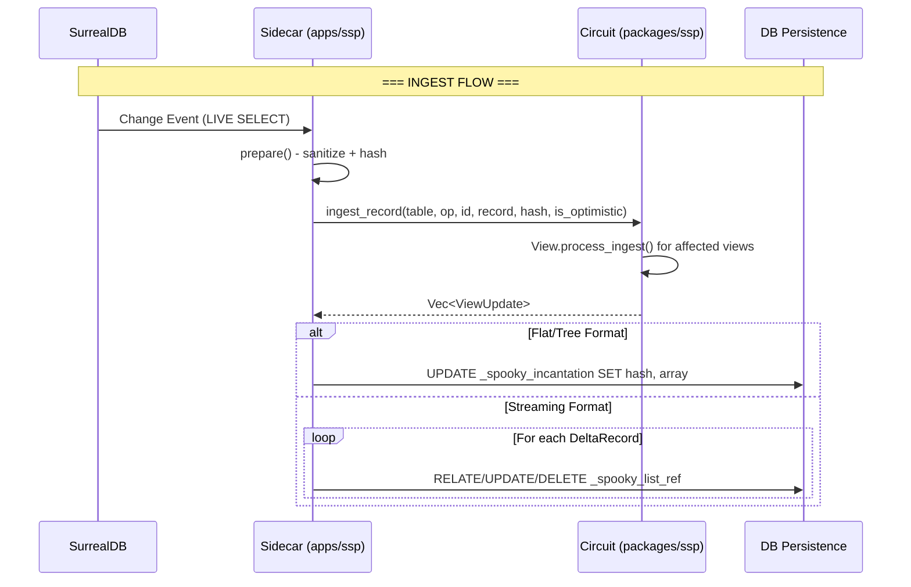

# SSP – Spooky Stream Processor

**High-performance incremental materialized views for real-time applications.**

---

## Overview

SSP (Spooky Stream Processor) is an incremental view maintenance engine that powers the reactive layer between **SurrealDB** and your application via the **Spooky Sidecar**.

```
SurrealDB  ──LIVE──►  Sidecar  ──ingest──►  SSP Circuit  ──ViewUpdate──►  DB / Client
```

---

## Communication Flow

### The Full Pipeline



---

## Traffic Objects

### 1. IngestRequest (Sidecar Input)

What the sidecar receives from SurrealDB:

```rust
struct IngestRequest {
    table: String,        // "thread", "user", "comment"
    op: String,           // "CREATE", "UPDATE", "DELETE"
    id: String,           // "thread:abc123"
    record: Value,        // Full JSON record
}
```

### 2. Circuit.ingest_record() Parameters

```rust
circuit.ingest_record(
    table: &str,          // Table name
    op: &str,             // Operation type
    id: &str,             // Record ID (table:key format)
    record: Value,        // JSON record data
    hash: &str,           // Blake3 hash of record
    is_optimistic: bool,  // true = increment versions, false = keep versions
) -> Vec<ViewUpdate>
```

### 3. ViewUpdate (Engine Output)

The engine returns one of three formats:

#### Flat Format
```rust
ViewUpdate::Flat(MaterializedViewUpdate {
    query_id: "thread_list",
    result_hash: "d4a0562e39718e02...",
    result_data: [
        ("thread:abc123", 1),  // (record_id, version)
        ("user:xyz789", 1),
    ],
})
```

#### Streaming Format
```rust
ViewUpdate::Streaming(StreamingUpdate {
    view_id: "thread_list",
    records: [
        DeltaRecord { id: "thread:abc123", event: Created, version: 1 },
        DeltaRecord { id: "user:xyz789", event: Updated, version: 2 },
        DeltaRecord { id: "comment:old", event: Deleted, version: 0 },
    ],
})
```

### 4. DeltaEvent Types

| Event | Meaning | DB Operation |
|-------|---------|--------------|
| `Created` | Record added to view | `RELATE $from->_spooky_list_ref->$to SET version` |
| `Updated` | Record content changed | `UPDATE $from->_spooky_list_ref SET version WHERE out = $to` |
| `Deleted` | Record removed from view | `DELETE $from->_spooky_list_ref WHERE out = $to` |

### 5. DB Persistence (Sidecar Output)

#### For Flat/Tree:
```sql
UPDATE <record>$id SET hash = <string>$hash, array = $array
-- Example:
UPDATE _spooky_incantation:thread_list SET 
  hash = "d4a0562e39718e02...", 
  array = [["thread:abc123", 1], ["user:xyz789", 1]]
```

#### For Streaming (Graph Edges):
```sql
-- Created
RELATE _spooky_incantation:thread_list->_spooky_list_ref->thread:abc123 
  SET version = 1, clientId = $clientId

-- Updated  
UPDATE _spooky_incantation:thread_list->_spooky_list_ref 
  SET version = 2 WHERE out = thread:abc123

-- Deleted
DELETE _spooky_incantation:thread_list->_spooky_list_ref 
  WHERE out = comment:old
```

---

## Debug Logs

SSP outputs debug logs prefixed with `[SSP DEBUG]`. Here's what each log means:

### Ingestion Logs

```
[SSP DEBUG] DEBUG: Changed tables: ["thread", "user"]
```
Tables affected by the current batch ingest.

### View Processing Logs

```
[SSP DEBUG] DEBUG VIEW: id=thread_list is_first_run=true has_subquery_changes=false is_streaming=true
```
| Field | Meaning |
|-------|---------|
| `id` | View identifier |
| `is_first_run` | First time evaluating (full scan) |
| `has_subquery_changes` | Subquery tables have changes (needs full scan) |
| `is_streaming` | Using streaming format |

```
[SSP DEBUG] DEBUG VIEW: id=thread_list view_delta_empty=false has_cached_updates=true is_optimistic=true updated_ids_len=3
```
| Field | Meaning |
|-------|---------|
| `view_delta_empty` | Whether the main delta is empty |
| `has_cached_updates` | Cached records need version updates |
| `is_optimistic` | Versions will be incremented |
| `updated_ids_len` | Number of records being updated |

### Version Updates

```
[SSP DEBUG] DEBUG VIEW: Incrementing version for id=thread:abc123 old=1 new=2
```
Version bump when `is_optimistic=true`.

### Subquery Detection

```
[SSP DEBUG] DEBUG has_changes: view=thread_list subquery_tables=["user"] delta_tables=["thread"]
```
Checking if subquery tables were affected.

```
[SSP DEBUG] DEBUG has_changes: view=thread_list NO CHANGES FOUND
```
Subqueries unaffected, can use delta evaluation.

### Streaming Output

```
[SSP DEBUG] DEBUG STREAMING_EMIT: view=thread_list delta_records_count=2 records=[("thread:abc123", Created), ("user:xyz789", Created)]
```
Final streaming update being emitted.

### Updated Record Detection

```
[SSP DEBUG] DEBUG get_updated_records_streaming: view=thread_list table=thread found versioned record=thread:abc123
```
Found a cached record that needs version update.

---

## Output Formats

| Format | Payload | Use Case |
|--------|---------|----------|
| **Flat** | `[(id, version), ...]` + hash | Simple reconciliation, full state |
| **Streaming** | `[{id, event, version}, ...]` | Real-time UI, minimal bandwidth |
| **Tree** | Hierarchical (planned) | Nested data structures |

---

## Key Types Reference

### QueryPlan
```rust
pub struct QueryPlan {
    pub id: String,       // Unique view identifier
    pub root: Operator,   // Operator tree root
}
```

### Operator (subset)
```rust
pub enum Operator {
    Scan { table: String },
    Filter { input: Box<Operator>, predicate: Predicate },
    Project { input: Box<Operator>, projections: Vec<Projection> },
    Limit { input: Box<Operator>, limit: usize, order_by: Option<...> },
    // ... more operators
}
```

### ViewResultFormat
```rust
pub enum ViewResultFormat {
    Flat,       // Default - full snapshot
    Tree,       // Hierarchical
    Streaming,  // Delta events
}
```

---

## Version Semantics

| `is_optimistic` | Behavior | Use Case |
|-----------------|----------|----------|
| `true` | Increment versions on changes | Local mutations (client-side) |
| `false` | Keep versions as-is | Remote sync (server authority) |

---

## Module Structure

```
ssp/
├── src/
│   ├── lib.rs            # StreamProcessor trait, public API
│   ├── converter.rs      # SurrealQL → Operator tree
│   ├── sanitizer.rs      # Input normalization
│   ├── service.rs        # High-level helpers (prepare, register)
│   └── engine/
│       ├── circuit.rs    # Core coordinator (Database + Views)
│       ├── view.rs       # View logic, delta evaluation
│       ├── update.rs     # ViewUpdate, DeltaEvent, formatters
│       ├── operators/    # Operator definitions
│       └── types/        # SpookyValue, ZSet, FastMap
└── tests/
    ├── e2e_communication_test.rs   # Full pipeline validation
    ├── streaming_subquery_edge_test.rs
    └── ...
```

---

## Quick Usage

```rust
use ssp::{Circuit, StreamProcessor};
use ssp::engine::update::ViewResultFormat;

// Create circuit
let mut circuit = Circuit::new();

// Register a streaming view
circuit.register_view(plan, params, Some(ViewResultFormat::Streaming));

// Ingest changes
let updates = circuit.ingest_record(
    "thread",           // table
    "CREATE",           // op
    "thread:abc123",    // id
    record,             // JSON
    &hash,              // blake3 hash
    true,               // is_optimistic
);

// Process updates
for update in updates {
    match update {
        ViewUpdate::Flat(m) => {
            // UPDATE _spooky_incantation SET hash, array
        }
        ViewUpdate::Streaming(s) => {
            for rec in s.records {
                match rec.event {
                    DeltaEvent::Created => { /* RELATE edge */ }
                    DeltaEvent::Updated => { /* UPDATE edge */ }
                    DeltaEvent::Deleted => { /* DELETE edge */ }
                }
            }
        }
        _ => {}
    }
}
```

---

## Testing

```bash
# Run all tests
cargo test

# Run E2E communication test with verbose output
cargo test --test e2e_communication_test -- --nocapture

# Run streaming edge tests
cargo test --test streaming_subquery_edge_test -- --nocapture
```

---

## License

MIT © Spooky Project
